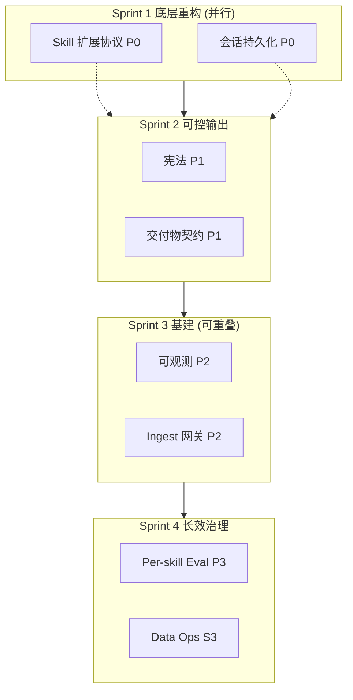
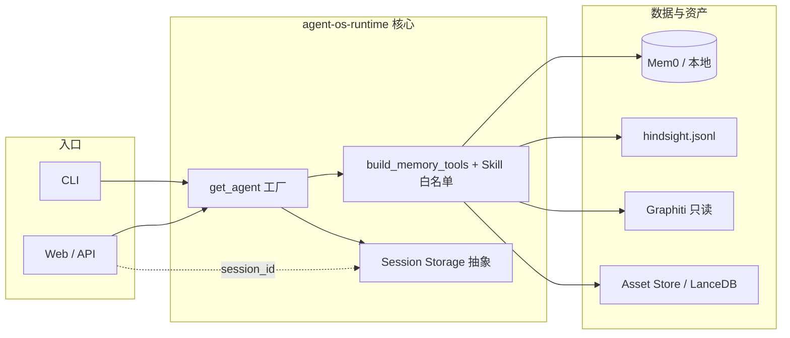
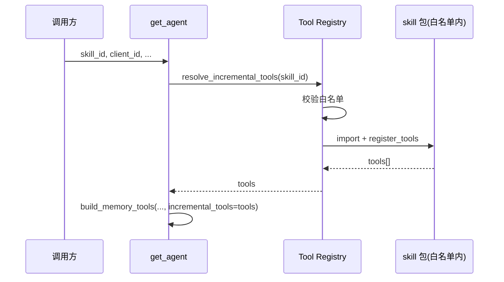
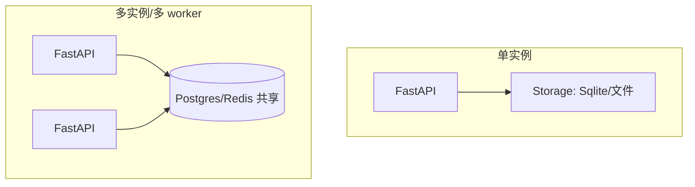
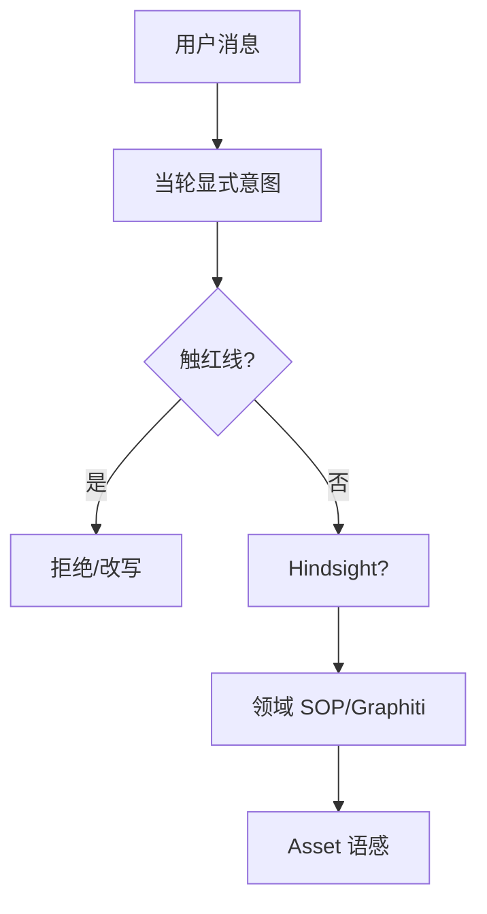
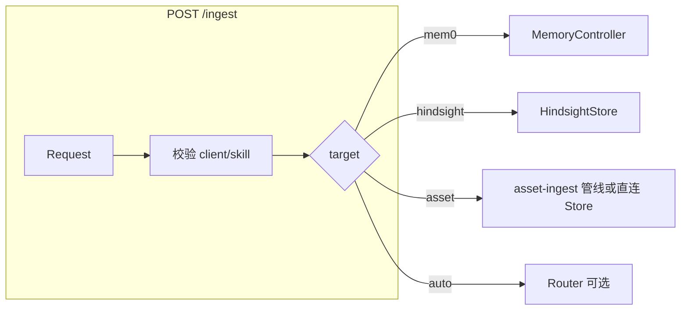

# Agent OS 路线图（定版）— 实现流程与设计图

本文档是 **agent-os-runtime** 在「CLI + 最终 Web/API 对外、持续新增 Skill、商业/运营向交付」目标下的**定版**实施蓝图，与 [ENGINEERING.md](ENGINEERING.md) 中的运行时边界一致，**不**覆盖账号/计费/多租户控制台等完整商业化（见 ENGINEERING §1.2）。

---

## 1. 目标与范围

| 目标 | 说明 |
|------|------|
| **可插拔 Skill** | 新增/迭代 Skill 时**不污染**核心对话工厂逻辑；通过**目录/注册表/白名单**完成工具挂载。 |
| **多入口一致** | 本地 CLI、FastAPI 使用同一套 `get_agent` / 记忆与检索契约。 |
| **生产可用** | Web 抗进程重启、多机可扩展的会话与存储抽象；ingest/排障/备份可运营。 |
| **可控输出** | 顶层「宪法」约束记忆冲突；关键交付物可结构化、可测。 |
| **非目标** | 系统外权限、多模态、通用贾维斯；鉴权/限流以 **API 网关或 BFF** 为主，本仓库**仅**约定边界与钩子。 |

---

## 2. 定版执行表（Sprint + 优先级 + DoD）

*表述已按可验收、可工程落地微调；Sprint 1 内两项 P0 **推荐并行**；Sprint 3 内两项 P2 **可重叠**。*

| 实施阶段 (Sprint) | 优先级 | 模块 | 核心实施方案 | DoD（完成定义） |
|:--|:--|:--|:--|:--|
| **Sprint 1** 底层重构 *(可并行)* | **P0** | **1. Skill 扩展协议** (Tool Registry) | 明确 **允许加载的 skill 根目录白名单**（如仅 `agent_os.agent.skills.*` 或 `AGENT_OS_SKILLS_ROOT` 下子包）。`get_agent` **仅**做「从注册表/扫描结果组装 `incremental_tools`」，**不**写入各 Skill 业务代码。动态 import 必须 **importlib + 路径校验**，禁止从任意路径加载。 | 新增一个**测试用 Skill 包**（如 `sample_skill`），**不修改 `factory.py` 内与业务相关的分支**即可注册运行（允许**集中一行**的「从 env 读 skills 包列表」等**纯框架**改动）；对非白名单路径/模块尝试加载时 **明确报错** 并拒绝执行。 |
| **Sprint 1** *(可并行)* | **P0** | **2. 会话持久化** (Session Storage) | 按**当前 Agno 主版本**文档接入 **Storage** 抽象；单机可用 Sqlite/本地，**接口层**抽象为可替换为 **Postgres/Redis**（多机/多 worker 时共享后端的唯一入口）。Web/FastAPI **全链路**使用同一 `session_id`（含 F5 与重连策略）。 | Web Demo 下：**(a)** 同一 `session_id` 在 **F5 刷新** 后仍连续对话；**(b)** **重启 Python 进程** 后，仍能从**共享存储**恢复**最近 N 条**（N 在配置中声明）；单 worker 下 Sqlite/文件路径需文档化。 |
| **Sprint 2** 可控输出 | **P1** | **3. 系统「宪法」** (Prompt Guardrails) | 在 `system` 最前或固定片段中注入**冲突解决序**：**硬合规/不编造/未授权信息** 等 **红线** → **当轮显式用户指令** → **Hindsight 教训** → **领域规则/SOP** → **Asset 案例语感**（顺序可经产品再确认，但须**写死、可测**）。 | 边界用例自动化或人工用例表：**(1)** 用户要求违反硬合规/编造事实 → 拒绝；**(2)** 用户要求与**纸面 SOP** 冲突但不触红线 → 从用户；**(3)** 可引用条款见测试文档。 |
| **Sprint 2** | **P1** | **4. 交付物契约** (Output Schema) | 对「策划/脚本」等 Skill 使用 **Pydantic / `response_model`（以 Agno 能力为准）** 输出 **强结构块**（如 `title`、`outline`）；**正文长文**用独立字段（Markdown 字符串）或**第二轮**扩写，避免**单段超长 JSON 嵌套**导致截断/解析失败。 | 至少一个**策划类** Skill 在压测/回归下 **连续多次** 返回 **可解析的 JSON**（含约定字段），**无** 解析器异常；超长正文有「提纲 JSON + 正文 API」的**备选**说明写在 ENGINEERING/本文件。 |
| **Sprint 2.5** 认知稳定性 | **P1** | **4.5 运行时上下文 + 记忆治理** (Ephemeral Metadata / Memory Policy / Temporal Grounding) | 每轮注入**临时环境元数据**（时间、入口、skill，禁止落库）；对 Mem0/Hindsight 写入增加 **Memory Policy**（工具描述 + 服务端 gate）；所有记忆写入带 **recorded_at/source**，检索渲染带时间，冲突时优先较新资料。 | 单测覆盖：临时元数据在 prompt 且不落库；玩笑/一次性/模糊内容被拒写；Hindsight/Mem0 本地 metadata 带时间；`retrieve_ordered_context` 输出含 `[记录于 ...]`。 |
| **Sprint 2.5** 长会话 | **P1/P2** | **4.6 Task-aware Working Memory** (Task Boundary + Task Summary) | 在同一 `session_id` 内自动维护 `task_id` 与当前 task 摘要：**task 不跨 session**，跨 session 连续性交给 Mem0/Hindsight。生产用户无感；debug 可查看/手动切 task。边界判断默认保守：低置信只记 candidate，高置信 confirmed 后才切；允许在最近 K 条内回溯到 candidate 边界并重分配 `task_id`，但不改原始消息。 | `task_id` 自动生成；`summary(session_id, task_id)` 固定容量覆盖更新；上下文 = 当前 task summary + 当前 task 最近原文 + 短 task index；候选/确认/回溯写 audit；默认不自动写长期记忆。 |
| **Sprint 3** 基建补齐 *(可重叠)* | **P2** | **5. 可观测性** (Observability) | 先 **轻量**：Request/Correlation ID、会话 id、**工具调用序列**、耗时、**粗算 Token**（与模型/分词器约定一致，仅作趋势）；再按需接 Langfuse/Phoenix 等。 | 单次请求在日志或调试端可看到：**session_id、模型 id、工具列表、总耗时、token 粗算**；格式稳定可 grep。 |
| **Sprint 3** *(可重叠)* | **P2** | **6. 数据摄入网关** (`POST /ingest`) | 提供 **HTTP 路由**（可挂在现有 FastAPI 或独立服务）作为「唯一推荐入口」：接收文本 + **元数据**。**v1 必须支持显式** `target`（`mem0_profile` / `hindsight` / `asset_store` 等）以保证验收；**可选** LLM/规则**路由器**做自动分发（准确率用**固定测试集**回归，不承诺任意文本 100%）。**核心仓不写爬虫**；跨仓只走 env/HTTP/文件。 | **Postman/脚本** 用 **3 条**带 `target` 的样例，**分别**写入预配置的三类存储成功并返回 200/约定 JSON；**自动路由**若存在，则**同一测试集**可回归。生产前 **BFF/网关鉴权+限流** 在部署层落实（本仓库**文档**中列出检查项即可）。 |
| **Sprint 4** 长效治理 | **P3** | **7. Skill 专项评测** | 基于现有 **`agent-os-runtime eval` / pytest** 框架，按 **skill_id** **拆分 fixture** 与门禁，**不** 引入「两套不同打分引擎」；**隔离** 修改公共层时对单 Skill 的回归。 | `pytest` 中可按示例 skill 拆分独立目录或 marker，改 A 用例不依赖 B 的数据；CI 中可**选择性**只跑某 skill 集。 |
| **Sprint 4** | **P3** | **8. 数据面运维 SOP** | 本地/文件类：**LanceDB 目录、Hindsight JSONL、Session Sqlite/本地文件** 等**可 tar 带时间戳**；Mem0 等 **SaaS** 以**官方**导出/备份能力为准，无则 **SOP 文档化**人工导出，**不**写死假接口。 | 存在可执行 `backup` 脚本或 documented 命令，执行后在约定目录产生**带时间戳**的归档；Mem0 有**明确**的「有 API / 无 API 时怎么办」的 README 段落。 |
| **后续飞轮** | **P2/P3** | **9. 程序性记忆候选** (Procedural Memory via Forge) | 长任务高满意度后可产出**候选 SOP**，但必须进入 `pending_review`，经人工确认或评测门禁后才允许进入 Graphiti / Forge 产物。**禁止**把单次会话摘要自动写入干净知识库。 | 仅记录候选与审阅流程；默认不自动写 Graphiti，不污染已整理知识库。 |

---

## 3. 总览：阶段依赖与并行关系

*说明：Sprint 1 两项不互为硬依赖，但**会话持久化**会改变 Web 集成方式，Skill 包开发应在同一约定下联调。Sprint 3 中 **5 与 6 建议重叠**，便于排障 inges。*

---

## 4. 系统上下文（定版后概念图）

---

## 5. Skill 扩展协议：实现方法（P0-1）

| 步骤 | 方法 |
|------|------|
| 约定目录 | 每个 Skill 一个 Python 子包，入口函数固定签名，如 `register_tools(skill_id) -> list[Tool]` 或由 manifest `skill_id` 映射到 `agent_os.data.skill_manifests` + `AGENT_OS_MANIFEST_DIR`。 |
| 白名单 | 仅允许从 **配置枚举的包前缀** 或 **env: `AGENT_OS_LOADABLE_SKILL_PACKAGES`（模块名列表）** 加载；`importlib.import_module` 前校验。 |
| 与工厂集成 | `get_agent` 内**仅**调用 `collect_incremental_tools(eff_skill_id, settings)`，内部完成白名单 + import；**禁止**在 factory 中写 `if skill == "x": ...`。 |
| 测试 | 增加 `sample_skill` 或 `test_skill` 包与最小 manifest；单测里模拟「非法模块名」import 失败。 |

---

## 6. 会话持久化：实现方法（P0-2）

| 步骤 | 方法 |
|------|------|
| 查 Agno 当前 API | 以发布的 **Session / Storage / run** 方式为准，示例名（如 `SqliteAgentStorage`）**不**写死在本文档，实现时**对照文档链接**替换。 |
| 单机 | 本地 Sqlite/文件，路径由 `AGENT_OS_SESSION_DB_PATH` 等 env 管理。 |
| 多机 | 同一抽象后端换 **Postgres / Redis**（或 Agno 支持的 adapter），**禁止**多 worker 各写各的本地盘。 |
| Web | 从 Cookie/Header/Body 稳定读取 `session_id`；F5 后前端**必须**用同一 `session_id` 调后端。 |
| DoD 量化 | 配置项 `SESSION_HISTORY_MAX_MESSAGES` 或等效，**最近 N 条**可回放在文档中写明。 |

---

## 7. 宪法 + 交付物：实现方法（P1-3 / P1-4）

| 项目 | 方法 |
|------|------|
| 宪法 | 在 `get_agent` 的 `instructions` 中 **prepend** 固定段落（或 manifest `constitutional_prompt` 引用），**顺序表**以表格/列表形式可测试；与 `retrieve_ordered_context` 顺序**互补**（检索顺序 vs 使用优先级）。 |
| 验收 | 维护 `docs/examples/constitutional_test_cases.md` 或 `tests/constitutional/`，每条：输入 / 预期行为。 |
| 交付物 | Skill manifest 增加 `output_mode: structured_v1` + `output_schema` 版本；实现 **(1)** 单轮 JSON 提纲 **(2)** 可选二轮 `expand_body` 工具或分接口，**避免** 单 JSON 塞 1 万字。 |

*上图仅为 **认知顺序**示意；实际以文字「宪法」为准。*

---

## 8. 可观测 + Ingest：实现方法（P2-5 / P2-6）

| 项目 | 方法 |
|------|------|
| 可观测 | 使用 **structlog/标准 logging** + `request_id` middleware；在 `agent.run` 包装层记录**开始/结束/异常**、工具名列表；Token 用 **tokenizer 粗算或 API usage 字段**（以 SDK 为准）。 |
| Ingest v1 | `POST /ingest` body: `{ "text", "client_id", "user_id?", "skill_id", "target": "mem0|hindsight|asset" }` + 各目标所需子字段。 |
| Ingest v2 路由 | 可选 `target=auto` + 内部 **分类器**（先规则关键词，后小模型）；**仅**在测试集上锁准确率再默认开启。 |
| 安全 | 对外部署时 **必须** 经网关做鉴权与限流；本仓库在 OPERATIONS/本文 **Checklist** 中列出。 |

---

## 9. 评测 + 数据运维：实现方法（P3-7 / P3-8）

| 项目 | 方法 |
|------|------|
| Per-skill eval | 外部 skill pack 可在自己的仓库或 `tests/skill_examples/<skill_id>/` 下放独立 `cases/*.json` + 可选 `golden_rules`；pytest marker 由 skill pack 自行声明。 |
| 备份 | 脚本 `scripts/backup_data.sh`（或 `.ps1`）打包 `data/` 下 lance、jsonl、session db；**排除**秘密 `.env`；Mem0 链至官方文档。 |

---

## 10. 实现顺序建议（时间线）

| 周次（参考） | 动作 |
|--------------|------|
| W1–W2 | Sprint 1：Skill 白名单 + `sample_skill`；Storage 抽象 + Web 联调 F5+重启。 |
| W3–W4 | Sprint 2：宪法文案 + 测试用例；一个 Skill 上 `response_model` / 分步正文。 |
| W5–W6 | Sprint 3：日志与 ID；`POST /ingest` 显式 target 打通 + 单测/脚本验收。 |
| 持续 | Sprint 4：拆 eval、backup cron、文档。 |

---

## 11. 与现有代码的落点（索引）

| 能力 | 主要落点（现状或规划） |
|------|------------------------|
| 工厂 | `agent_os.agent.factory` |
| 会话落库 (Agno `db`) | `agent_os.agent.session_db`（`create_session_db`）、`Settings` 中 `AGENT_OS_ENABLE_SESSION_DB` 等；Web：`GET /api/session/messages` |
| 宪法 + 结构化交付 | `agent_os.agent.constitutional`；`manifest_output` + `planning_draft`（`structured_v1`）；验收表 `docs/examples/constitutional_test_cases.md` |
| 可观测 + 摄入网关 | `agent_os.observability`；`ingest_gateway`；Web：`AGENT_OS_OBS`、`POST /ingest`；样例 `docs/examples/ingest_post_samples.md` |
| Per-skill eval + 备份 | 外部 skill pack fixtures + markers；`backup_data_core` / `scripts/backup_data.py`；`docs/DATA_BACKUP.md` |
| 平台工具 + incremental | `agent_os.agent.tools` + `agent_os.agent.skills` |
| 记忆 | `agent_os.memory.*`、`MemoryController` |
| 知识/案例 | `agent_os.knowledge.*`、Asset Store 文档 [ASSET_STORE.md](ASSET_STORE.md) |
| Web 示例 | `examples/web_chat_fastapi.py` |
| 配置 | `agent_os.config.Settings` |
| 变更记录 | [CHANGELOG.md](CHANGELOG.md) |

---

## 12. 变更与维护

- 本文件为 **定版设计图**；若 Sprint 内容或 DoD 变更，需更新本文件并视情况更新 [CHANGELOG.md](CHANGELOG.md) 与 [ENGINEERING.md](ENGINEERING.md) 引用。
- Agno/第三方 API 以**实现当时版本文档**为准，表内类名仅作**意图**，实现前须核对。

---

*文档版本：定版 v1.0 | 与 agent-os-runtime 仓库同步维护*
