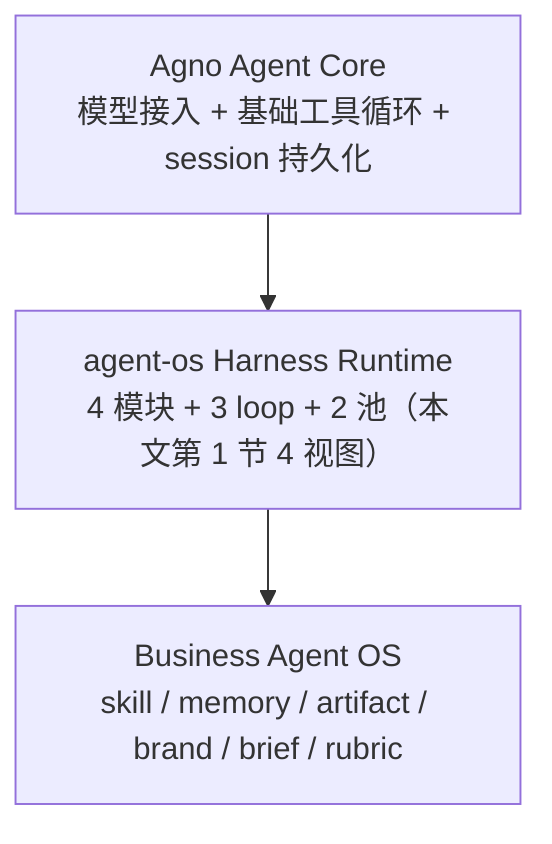
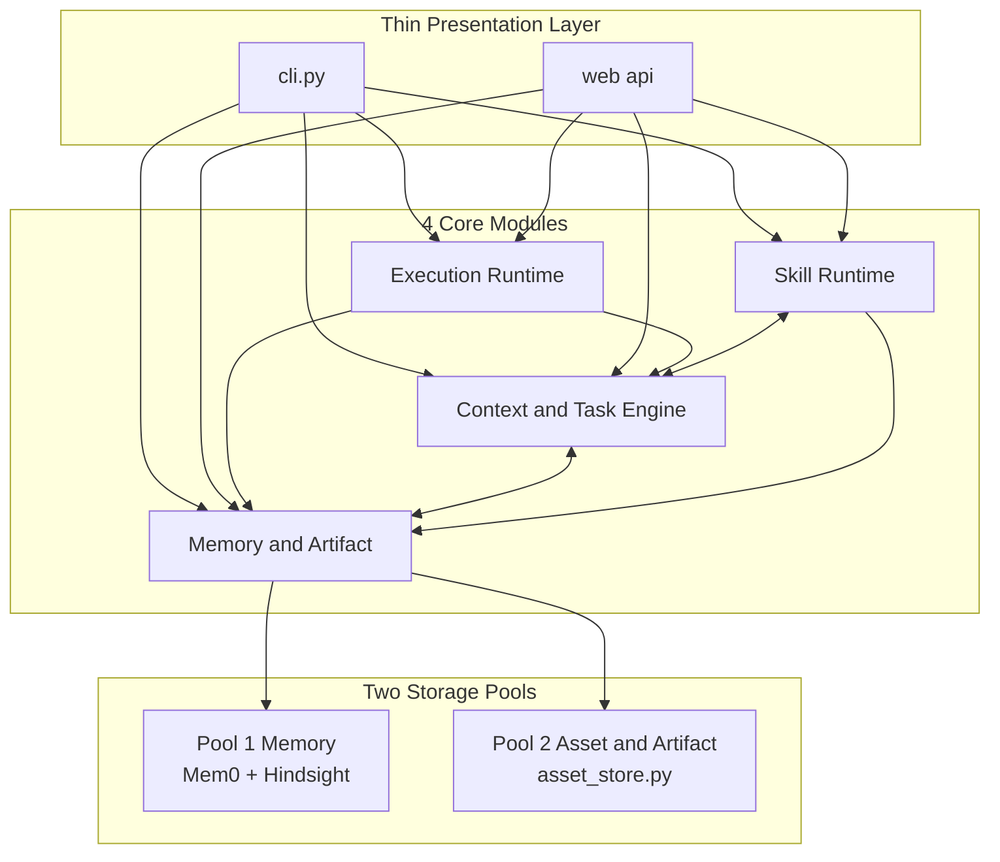
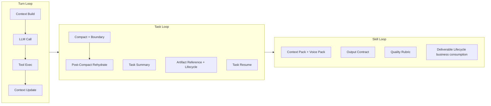
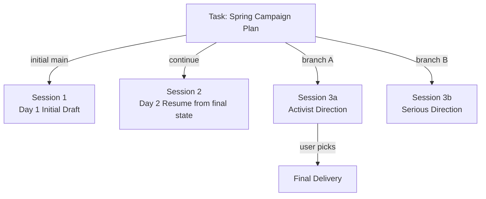
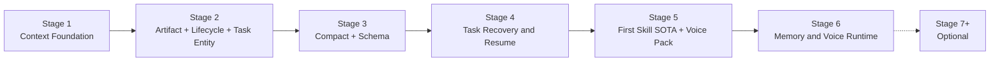

# Agent OS Runtime — Architecture Spec

> **本文定位**：`agent-os-runtime` 的稳定架构总纲。它沉淀了 7 轮迭代、25+ 轮挑刺后**仍屹立不倒**的核心架构判断，是对外可亮相的设计图骨架。
>
> 阶段路线骨架 也归本文（第 4 节）。**每个 stage 的 battle 细节、GC 字段级断言、过程性辩论**等高频变更内容**不在本文**——Stage 2 battle 排序见 [OPEN_DECISIONS.md](OPEN_DECISIONS.md) D，Stage 4 battle 排序见 [OPEN_DECISIONS.md](OPEN_DECISIONS.md) F；GC 字段级断言见 [GC_SPEC.md](GC_SPEC.md)（Stage 2 GC1-3 + Stage 3 GC4-5 已落地，后续 stage 增量追加）；7 轮迭代过程见 [archive/EFFECT_FIRST_STAGE_PLAN_V2.md](archive/EFFECT_FIRST_STAGE_PLAN_V2.md)（已冻结作历史，新人无需阅读）。
>
> **未稳定 / 待回答**的问题归 [OPEN_DECISIONS.md](OPEN_DECISIONS.md)（工程验证 + 总设计师决策 + Stage 2 Battle 排序 + Stage 3 执行状态 + Stage 4 Battle 排序）。
>
> **借鉴依据 + 源码导航**归 [CLAUDE_CODE_REFERENCE_INDEX.md](CLAUDE_CODE_REFERENCE_INDEX.md)（14 项能力差距矩阵 + 7 个能力域源码路径 + Reference Check 模板）。
>
> **修订门槛（关键）**：本文的架构层修订**仅当伴随 PoC 代码或 GC 失败 trace** 时才动。对架构层的口头挑刺（来自任何审计角色，包括 LLM）**默认不触发本文修订**——具体见第 6 节。

本文是 agent-os 架构的**唯一权威**——4 视图 / 6 不变量 / 工程规则 / 6+1 stage 路线 / 反模式抗体清单全部归本文。借鉴判断与差距矩阵的细节版归 [CLAUDE_CODE_REFERENCE_INDEX.md](CLAUDE_CODE_REFERENCE_INDEX.md)；待决策项归 [OPEN_DECISIONS.md](OPEN_DECISIONS.md)。

---

## 0. 项目背景与对标

### 0.1 项目目标

`agent-os-runtime` 是基于 [Agno](https://github.com/agno-agi/agno) 的**个人级 SOTA Agent 底层操作系统**——主要服务文科类任务（商业、运营、写作、策划等的问答 / 策划 / 脚本 / 文案 / 关键业务洞察的规划、撰写、修改），具体能力由插入的 skill 决定。

设计基线：

- **不复刻 Claude Code**——Claude Code 是参考对象，不是目标架构。
- **不做 coding agent**——LSP / git diff / shell 安全等 coding 工具链与业务主线无关。
- **不做企业平台**——多租户 / 计费 / 审批流 / 大型 A/B 平台等永远不做或推到 Stage 7+ 可选项。
- **目标是个人级"SOTA 体感"**——一个 skill 在一个长任务里让用户感受到"懂业务的搭档"。

### 0.2 核心判断（与 Claude Code 不对称对标）

Claude Code 与 `agent-os` 不能严格同构对标：

- **Claude Code = LLM-native coding harness**——模型承担大量任务策略判断；Harness 负责 query loop、message normalization、tool execution、context compact、transcript recovery、permission 与 UI 控制面。
- **agent-os = Agno-based business agent runtime**——Agno 提供 Agent Core 与基础工具调用循环；`agent-os` 在 Agno 外侧自建 Harness Runtime（Memory V2 / ContextBuilder / skill manifest / 业务记忆 / 商业交付逻辑）。

**正确对标方式**：拆出 Claude Code 成熟的运行时治理能力——把 Harness 工程能力转译进 Agno 外围的 Harness Runtime 层，**不照搬** coding 外壳、IDE 形态、代码工具链。具体借鉴依据 / 14 项能力差距矩阵 / 7 个能力域源码导航 / Reference Check 模板见 [CLAUDE_CODE_REFERENCE_INDEX.md](CLAUDE_CODE_REFERENCE_INDEX.md)。

### 0.3 三层架构

agent-os 整体路线可概括为三层：



- **第一层（Agno）**：保留 Agno 作为 Agent Core，负责模型接入、基础工具循环、session 持久化。**不重写 Agno**。
- **第二层（Harness Runtime）**：自建 Harness 层，补齐 Claude Code 已验证的 context 生命周期、tool result 管理、compact、resume、commands 与 observability。本文第 1 节 4 视图（模块 / Loop / 资料层 / Task 实体）描述这一层。
- **第三层（Business Agent OS）**：发展业务护城河——围绕 skill、memory、artifact、brand、brief、quality rubric 与 feedback learning 做商业场景能力。本文 Stage 5 起聚焦此层。

## 0.4 哲学锚点

> **个人级 SOTA Agent OS：让用户用一个 skill 在一个长任务里感受到"懂业务的搭档"。**

这一句话决定了一切取舍：

- 不追求"企业级平台覆盖度"——多租户、配额、审批流、Skill Router、Multi-Skill Composition 等**永远不做**或推到 Stage 7+ 可选项。
- 不追求"路线图美学"——stage 顺序按依赖递进而非主题分类。
- 不追求"全自动化"——任何不可逆决策（删除资料、修改 voice、合并 memory）必须用户显式触发。
- **追求每个 stage 都有用户可感知的体感升级**——没有体感的 stage 不存在；GC 是工程基线（CI 脚手架），**不是产品交付**。

## 1. 核心架构（4 视图）

本文把架构沿 4 个维度同时展开：空间（模块）、时间（loop）、语义（资料层）、业务（task 实体）。任何架构表述必须落到这 4 视图中的至少一个视图。

### 1.1 模块视图（空间维度）



**4 核心模块**（业务实现的归属）：

- **Execution Runtime（ER）**：每一轮 agent 怎么跑——agno `Agent.run` 外壳、context build 前置、tool execution、tool result lifecycle、post-run update、SubAgent 生命周期。
- **Context & Task Engine（CTE）**：长任务怎么不断线——ContextBuilder、context diagnostics / budget / self-heal、compact、compact boundary、rehydration、task summary、task identity、attention anchor、working memory。
- **Memory & Artifact（MA）**：什么东西应该长期沉淀、什么是任务级引用——Memory（跨任务经验）、Asset（跨任务资产）、Artifact（任务级素材与产物）。详见 1.3。
- **Skill Runtime（SR）**：业务能力如何变专业——manifest、context pack、output contract、quality rubric、brief extractor、deliverable lifecycle 业务消费、feedback-to-signal、voice pack。

**Thin Presentation Layer（cli.py + web/api，关键澄清）**：

- 表现层是**普通的 controller / dispatcher**，不是模块，也不假装"不存在"。它的代码物理位置就是 `cli.py` 与 `web/api`。
- 表现层只做：CLI 解析、参数校验、JSON / Markdown 渲染、**调用 Loop 主导模块的高层 API**、把返回值转成用户可见输出。
- **不写业务**：不操作 DB、不组合跨模块业务、不持有任何配置态。
- **CLI / Web 等价分级（强制）**：
  - **L1（必须完全等价）**：状态查看、trace、diagnostics、`/task resume`——任一端可触发并显示等同信息。
  - **L2（CLI-first 但 Web 可见）**：交互命令（`/compact`、`/skill switch`、`/voice load`）——CLI 立即可用，Web 可见状态并显式标注"暂不支持操作的原因"。
  - **L3（永远禁止）**：在表现层做不可见副作用（自动写 DB、自动触发 compact 等）。

> 历史注：本层早期曾用 "Operator & Observability Surface" 命名，措辞引起反复误读，已统一为普通表现层；不再使用 Surface 一词。

**跨模块编排归属规则（强制，与 1.2 Loop 视图桥接）**：

涉及多个模块的事务（如 `/task resume` 涉及 MA + SR + CTE + ER），**编排责任归该事务所属 Loop 的主导模块**——不存在独立的 Orchestrator / WorkflowService 模块：

| Loop 层级 | 主导模块 | 典型事务（编排责任在主导模块） |
| --- | --- | --- |
| **Turn 级** | **ER** | context build → LLM call → tool exec → context update |
| **Task 级** | **CTE** | `/compact`、`/task resume`、`/task branch`、artifact lifecycle 联动、rehydration |
| **Skill 级** | **SR** | context pack 装配（拉 voice + asset + memory）、brief 提取 + 入档、rubric 评测 → feedback signal |

**调用链规则**：

- 表现层只调主导模块的**单个高层 API**（如 `CTE.resume_task(task_id)`），由主导模块内部对其他模块 fan-out。
- 主导模块对其他模块的调用是**模块 → 模块的常规协作**，沿 1.1 模块视图箭头走（如 CTE → MA 拉 final state、CTE → SR 拉 voice pack、CTE → ER 启动新 session）。
- **不允许的反模式**：表现层逐一调用 4 个模块自行拼装；非主导模块跨 Loop 反向调用主导模块（如 SR 直接调 `CTE.compact()`）。

**模块协作通过接口 / 依赖注入实现（避免 circular import）**：

- 模块间协作走 **Python Protocol / 抽象接口**，主导模块**持有**其他模块的接口实例（构造时由 DI 容器或上层启动器注入），**不直接 `import` 其他模块的具体类**。
- 这是**反 WorkflowService / Orchestrator 处方的核心抗体**——任何"模块互相 import 必产生循环依赖、所以需要新增 Orchestrator 层"的论证都基于错误前提：通过 Protocol + 构造注入即可解决，**4 模块仍是平级领域服务、但由 Loop 主导模块承担编排责任**。
- 不存在独立 Orchestrator 模块、不存在 WorkflowService 层、不存在 UseCase 层——任何要求新增此类层的提议默认拒绝，除非伴随 PoC 代码证明 Protocol + DI 不可解。

**LLM client 是模块平等共享基础设施**：

- LLM client（litellm 等）是模块平等共享的基础设施，**不归任何模块独占**。任何模块在自己 Loop 内可直接调用 LLM 完成内部任务——CTE 在 compact 时直接调 LLM、SR 在 brief 提取时直接调 LLM、MA 在生成 artifact digest 时直接调 LLM（见 1.3）。
- ER 是 Turn Loop 的 orchestrator，**不是 LLM 物理入口**——把 LLM 调用抽象为 ER 专属会引发"任何 LLM 调用都要走 ER"的 deadlock 误读，必须明确避免。

这条规则是 1.1（模块视图）与 1.2（Loop 视图）的桥接——空间归属与时间归属在编排时融合为一条决策树。

### 1.2 Loop 视图（时间维度）



**3 个咬合 loop（架构灵魂）**：

- **Turn Loop**：每一轮不乱跑、不爆 prompt。归 ER。
- **Task Loop**：长任务 compact、summary、artifact lifecycle、resume 接得上。归 CTE + MA。
- **Skill Loop**：业务 skill 把 Task Loop 用到真实场景里，产出专业感。归 SR + CTE + MA。

**关键依赖律**：Skill Loop 必须站在稳定的 Task Loop 之上；Task Loop 必须站在稳定的 Turn Loop 之上。这条依赖律决定了 6+1 stage 顺序（见第 4 节）。

**Turn / Task Loop Safepoint 规则（强制，防状态撕裂）**：

CTE 触发的 Task 级事务（`/compact` / `/task resume` / `/task branch` / rehydration）**必须在 Turn 边界**（两次 turn 之间）执行，**绝不打断 ER 内 in-flight 的 LLM call / tool call**。预算告警与 compact 执行解耦——

- ER 在每个 turn 边界探测预算（context build 前 / post-run update 后）；超阈值时仅设置 `compact_pending=true` 标志，**不在 turn 内同步触发 compact**。
- 下一个 turn 开始前，CTE 检查 `compact_pending`，决定是否执行 compact——执行时 ER 暂不启动新 turn，等 compact 完成后再恢复 Turn Loop。
- 用户显式 `/compact` 同样落在 turn 边界（即使用户在 turn 进行中输入命令，命令也排队到当前 turn 完成后执行）。

这条规则把"预算归 ER、压缩归 CTE"的跨 Loop 协作收敛到**唯一安全停顿点：turn 边界**——避免"LLM 推理到一半被 compact 抢占" / "tool 调用结果还没回来上下文已被压缩"等竞态。

### 1.3 资料层视图（语义维度）

资料分**三层概念**，底层落到**两个存储池**——三层的边界存在于 prompt 标签、召回策略、用户体感上，不存在于物理表里：

| 层 | 范围 | 写入触发 | prompt 形态 | 默认召回 | 典型例子 |
| --- | --- | --- | --- | --- | --- |
| **Memory** | 跨任务**经验** | candidate review 后人工 pin | `<memory>` | 跨 task | "客户偏好简洁开头" |
| **Asset** | 跨任务**资产** | `/asset ingest` 显式入库 / artifact promote | `<asset ref>` | 跨 task | 品牌手册、客户画像 |
| **Artifact** | 任务级**素材与产物** | 任务内自动 / 用户上传 / agent 产出 | `<artifact ref>` | 默认本 task；显式查询可穿透 | tool 长结果、改稿版本 |

**底层两池（避免多态反模式）**：

- **池 1：Memory 池**——沿用 Mem0 + Hindsight 现状（短规则、双时态、合并 / 升降权机制）。SQLite + 轻量向量。
- **池 2：Asset / Artifact 池**——Stage 2 v0 已落地 SQLite 原文层（`artifact_store.py`），承载 artifact 全文与最小字段集；更复杂的跨 task asset 化与 chunk 索引层仍按本文两亚层设计演进。Asset 与 Artifact **同池区分字段**（`kind`、`pinned_for_workspace`、`subkind` / `category`、`status`、`task_id`）。**池 2 内部还有两亚层**（关键：避免 vector 引擎被高频写打爆）：

> **Stage 2 v0 实现注记（不改变架构结论）**：当前 `ArtifactStore`（`../src/agent_os/knowledge/artifact_store.py`）的 DB schema **未预留** `subkind` / `previous_subkind_history` 等业务 lifecycle 字段；仅保留 `task_id` / `session_id` / `status` / `digest_status` / `stable_key` 等运行时字段，并通过 `<artifact ref>` + digest fallback 完成 prompt replacement。`/artifact finalize` 的业务字段集（`final_at` / `final_session_id` / `final_by` / 多 final 策略）与 `subkind` 的开放 string 仍归 Stage 5 通过迁移引入（见 [OPEN_DECISIONS.md](OPEN_DECISIONS.md) A2）。

| 亚层 | 引擎 | 承担职责 | 写入触发 |
| --- | --- | --- | --- |
| **原文 / 元信息层** | SQLite + 文件存储 | 精确 ID 查找、字段更新、高频写、原文 inline 取用 | 所有 asset / artifact 必入此层 |
| **chunk 索引层** | LanceDB | 语义检索、跨 task 召回 | **lazy 建立**——asset 入库 / artifact promote 时建；草稿 / tool 长结果默认 `embedding_status: skipped` |

**亚层使用规则**：

- **精确 ID 路径绕开 chunk 索引层**——`/task resume` 拉 `current_deliverable` 全文 inline、`/artifact show <id>` 取原文，全部走原文层 SQLite 精确查找，**不进 LanceDB**。
- **同 session 内 artifact 改稿原地 update**（草稿 v1 → v2 → v3 全在原文层 update，chunk 索引层无变化），**但跨 branch 修改触发写时复制（CoW）**——见下方 CoW 规则。
- **chunk 建立时机**：asset 显式 `/asset ingest` 入库时建；artifact 显式 `/artifact promote --to-asset` 升 asset 时建；用户显式 `/asset reindex` 触发时建。**不存在自动定时建索引**。
- **未建 chunk 的 artifact 无法跨 task 语义召回**——这是工程现实主义换来的：草稿期不需要被搜索；真要被搜索，先 promote。

**Branch 写时复制（CoW）规则（强制，防 phantom edit）**：

artifact 跨 branch 共享 ID 时，原地 update 会引发跨分支污染（branch A 修改 artifact 1001 后，branch B 拉 deliverable 拉到被 A 改过的内容，违反 1.4 分支隔离意图）。规则：

- **artifact 写入时记录 `originating_session_id`**——创建它的那个 session 的 ID。
- **修改触发条件**：
  - 当前 session ID **==** `originating_session_id`：可原地 update（v1 → v2 → v3 单线场景，保留高频改稿不打爆 LanceDB 的工程优化）。
  - 当前 session ID **!=** `originating_session_id`（跨 branch 后修改）：**强制触发 CoW**——复制为新 artifact ID + 新 `originating_session_id` = 当前 session ID；自动更新当前 session 的 CompactSummary（或合成时的等价投影）的 `current_artifact_refs` 指向新 ID；旧 ID 保留作其他分支引用。
- **trace 标记**：CoW 触发时记录 `cow_from=<old_id>`，便于追溯源版本。
- **digest 重建**：CoW 产生的新 artifact 走 §1.3 写时附加不变量——digest 字段初始 `null` + `digest_status: pending`，异步重建。
- **chunk 索引重建不立即触发**——CoW 产生的新 artifact 仍是 artifact（默认 `embedding_status: skipped`），仅在 promote 时建 chunk。
- **写操作原子性（强制）**：CoW 的两步操作（artifact 复制为新 ID + 当前 session 的 `current_artifact_refs` 指针更新）**必须在同一 SQLite 事务**——任一步失败整体回滚，避免"新 ID 已写但 summary 仍指向旧 ID"或反之的 inconsistent state。事务边界覆盖到指针写回为止；digest / chunk 的异步重建不在该事务内（它们是最终一致字段，见 §1.3 写时附加不变量）。

**为什么不每次修改都生成新 ID**：那会让 v1 → v2 → v3 单线连续改稿场景下 LanceDB / SQLite 无谓膨胀；分支边界（不同 session）才是真正需要隔离的边界。这条规则在"单 session 工程优化"和"跨 branch 状态隔离"之间精准切线。

**写后失效不变量（异构存储同步底线，强制）**：

- 池 2 中 `embedding_status == built` 的资料发生 update / delete 时，**必须同步将 `embedding_status` 置为 `stale`**（或同步删除 chunk 索引层条目，由实现选择，但状态必须显式）。
- `stale` 状态的资料**不参与跨 task 语义召回**（仅走原文层精确查找路径），直到用户显式 `/asset reindex` 或下次 ingest / promote 重建索引。
- **绝不允许 SQLite 原文层与 LanceDB 索引层出现版本不一致**——这是数据库异构存储同步的底线，违反则跨 task 召回必返回旧版资料、引发 LLM 幻觉。

**写时附加不变量（digest 生成，强制最终一致）**：

- artifact / asset 在原文层写入时**必须最终携带短摘要 `digest` 字段**（200 字以内），存原文层 SQLite。digest 由 MA 调 LLM client 异步生成，**不与原文写入同事务**——原文写入立即提交，digest 字段初始为 `null` + `digest_status: pending`。
- 后台异步任务（事件驱动 / 队列 / 简单 background task）触发 LLM 生成 digest 后 `UPDATE artifact SET digest = ..., digest_status = built`。
- prompt 装配时**遇 `digest_status: pending` 临时降级**——截取原文前 200 字符代替 digest，**永不阻塞主循环**；trace 中标 `digest_fallback=true`。
- digest 服务于 prompt 装配时的 ref + digest 引用——绝大多数场景下（非 pending 时）取 ref 都可 O(1) 读 digest，**永不引发即时 LLM 调用**。
- 长 deliverable 的 digest 既作 background ref 时的简短引用，也作 §3.3 resume 装配降级链 `digest+tail_n` 中的全局梗概锚点（同字段两用途，零额外成本）。
- digest 不需要等 promote / chunk 建立——所有原文层资料一律最终携带 digest。

**为什么强制异步而非强制同步**：把不可靠的外部网络调用（LLM API）绑定到核心数据库写入事务会引发**可用性灾难**——LLM 限流 / 网络波动 / 提供商宕机时原文写入会被传导失败。语义上 digest 是必选字段（最终一致），工程上是异步生成（写入不阻塞），两者不矛盾。

**为什么不一池**：把 50 字的 Memory 和 5 万字的 Asset chunk 塞进同一个 vector 空间，召回"品牌红线"会返回混排结果，权重无法统一计算。三层一池是数据库多态反模式。**池 2 内部分两亚层**则是另一个反模式的避让——把高频改的草稿与重型语义索引解耦，避免 vector 引擎被高频写打爆。

**升降通道**：

- **Artifact → Asset**：池 2 内同池字段更新（`kind=artifact` 改 `kind=asset` + `pinned_for_workspace=true`）。**不复制数据、不新建文件**。**promote 同时触发 chunk 索引层建立**（artifact 期 `embedding_status: skipped` → 升 asset 后变 `built`）。
- **任意 → Memory candidate**：跨池路径——Asset / Artifact 使用日志中提炼短规则进池 1，**资料本身不变 memory**。
- **三者在 prompt 中永不互替**：分别以 `<memory>` / `<asset ref>` / `<artifact ref>` 出现，便于 attention 管理与 trace 归因。

**召回作用域规则（多级隔离，强制）**：

| 隔离级别 | 默认召回范围 | 越界条件 | trace 标记 |
| --- | --- | --- | --- |
| **branch session 级**（最严） | 当前 session 及其**祖先 session 链** | 永不自动跨分支召回 | `branch_isolated=true` |
| **task 级** | 当前 task 内全部 active artifact（含归属本 task 的所有 session） | 用户显式查询时可越界 | `cross_task_hit=true` |
| **archived** | 默认排除 | `--include-archived` 显式打开 | `include_archived=true` |

**关键不变量**：

- **branch session 间默认互不召回**——分支 A 修改的 artifact_v2 对分支 B 不可见，避免"分支资源量子纠缠"（v1 + v2 同时出现导致 agent 混乱）。仅当前 session 及其祖先链的 artifact 参与召回。
- **跨 task 召回必带 prompt 装配层硬隔离**——cross_task 命中的 artifact 在 prompt 中**必带显式标签**：`<artifact ref task_id="X" cross_task=true>...</artifact>` 加风险提示文本（如"This artifact comes from a different task; verify relevance before using its specific facts/numbers"）。**仅在 trace 中打标签不够**——LLM attention 易被具体数字锚定，必须在 prompt 装配层做硬隔离。
- **权重略低不替代标签**——具体权重公式见 [OPEN_DECISIONS.md](OPEN_DECISIONS.md) A3，但**任何权重选择都不豁免标签强制规则**。

这避免"昨天 task 的内容今天彻底消失"的反人类体感，同时避免跨 task 召回引发的资料串味与幻觉。Memory 池的召回策略由 Mem0 / Hindsight 自有机制决定，与池 2 不交叉。

### 1.4 Task 实体视图（业务维度）

**Task 是有语义的轻量实体——不是 Session 别名，也不是幽灵抽象**。

早期方案曾把 task 收敛为 `task_id = session_id` 别名（试图避免"幽灵 Task 实体"），但这违背了真实业务场景：

- 周一写初稿 Session A → 周二想分活泼 / 严谨两个方向，无法分叉；
- 大型策划案半个月 300 轮压在一个巨无霸 session 上，DB 单行越来越大、锁风险越来越高；
- `/task resume` 含混为"唤醒旧 session"——但旧 session 一旦聊到爆 token 就崩了。

修正后的设计：



**task_table 极简 schema（5 字段）**：

| 字段 | 类型 | 说明 |
| --- | --- | --- |
| `task_id` | str | 业务实体 id |
| `name` | str | 用户可见的任务名（"春季宣发方案"） |
| `status` | enum | `active` / `archived` |
| `created_at` | datetime | 创建时间 |
| `current_main_session_id` | str | 当前主线 session id（resume 默认从这个继续） |

**字段集判定（已实测确认，Stage 2 v0 不扩展）**：

- **不加 `tag`**：真实任务出现分类痛点前不加（否则是先建字段后启用的治理诱惑）；若未来需要，加作为增量字段迁移（见 [OPEN_DECISIONS.md](OPEN_DECISIONS.md) A4）。
- **不加 `parent_task_id`（task 树）**：治理复杂度过高，超出个人级主线；如未来真有硬证据再开（见 [OPEN_DECISIONS.md](OPEN_DECISIONS.md) B4）。
- **不加 `due_date`**：agent 不催办，deadline 属用户外部流程；如未来真有硬证据再开（见 [OPEN_DECISIONS.md](OPEN_DECISIONS.md) B4）。
- **永远不加 `participants`**：多人协作超出个人级范围（见 §3.6 反模式清单）。

**关键命令语义**：

- `/task new <name>`：创建 task，开第 1 个 session 作为主线。
- `/task resume <task_id>`：拉**当前主线 session**（即 `current_main_session_id` 指向的 session）的 final state（CompactSummary 全字段 + current deliverable 全文 inline + voice pack）→ **开新 session** 续写；同时把新 session 设为 `current_main_session_id`。**不是唤醒旧 session，是基于 final state 开新 session**——这是抗爆抗造的工业级方案。
- `/task resume <task_id> --from <session_id>`：从指定 session 的 final state 开新主线 session（覆盖默认行为，用于回到过去某个分支重启）。
- `/task branch <task_id> --from <session_id>`：从指定 session 的 final state 开**新分支 session**（主线 `current_main_session_id` 不变，分支并行）。
- `/task archive <task_id>`：软归档（status=archived），不参与召回。
- `/artifact finalize <artifact_id>`（**预留命令名，Stage 5 实现**）：把指定 artifact 标记为当前 task 的 final deliverable——锁定为只读 + 在召回中标 `final=true` + 在 prompt 装配中作为 deliverable 锚点。具体业务字段（subkind / final_at / final_session_id 等）见 [OPEN_DECISIONS.md](OPEN_DECISIONS.md) A2。1.4 在此预留命令名是为了让 1.4 分叉图中"Final Delivery"节点有显式系统命令承接，避免交付物状态散落在各处。

**resume / branch 装配采用实时合成（强制，不预埋 seed）**：

`/task resume` / `/task branch` 开新 session 时**不向新 session 预埋任何 seed summary**——新 session 的 `session_summary` 字段仍由 agno 原生机制管理（compact 时才生成）。

任何场景下需要"task 的 final state"时（resume / branch 装 prompt、`/task summary show` 查询等），**实时合成**而非读预埋字段：

```text
resume_final_state(target_session) =
    最近一次 CompactSummary（source session 自己的；
        若 source 自己未 compact，则向上追溯至 parent session 的 CompactSummary）
  + uncompacted tail history（source session 在最近 compact 后的 turn 序列，
        按预算裁剪，配合 §3.3 降级链）
  + current_deliverable 全文 inline
  + voice_pack
  + pinned_refs 强制 inline 内容
```

**关键不变量**：

- **不预埋 seed**——预埋数据是数据不一致的温床；新 session 在第一次 compact 前不持有任何"伪造"的 summary 副本，避免 stale seed 漏洞（用户在新 session 聊几句但未 compact 即退出，下次 resume 拉到过期 seed + 漏掉新 turns）。
- **每次 resume 都重新计算 final state**——这是 system-state 派生原则的延伸（§3.2）：summary 投影是从 source session 当下状态派生的，不是预埋的副本。
- **向上追溯链可解**——若 source session 自己从未 compact 过（短 session 提前 resume），合成函数沿 task ⊃ session 1:N 关系上溯到 parent session 找最近 CompactSummary；若整条链都没 compact 过（task 才开第一轮就 resume），降级为"仅 uncompacted history + current_deliverable"装配。
- **phantom update 漏洞由实时合成天然解决**——空 summary 不存在，因为合成函数永远从真实事件（CompactSummary 历史 + uncompacted turns）派生，不依赖任何字段是否被预先填充。
- **tail history 装配采用纯文本投影（强制，防跨 session 物理拷贝崩溃）**——uncompacted tail history 进新 session prompt 时**必须先经投影清洗**：剥离未配对的 ToolCall / tool_response、转成 plain user/assistant 文本表述（如 `[Previous turn N: User asked X, Agent responded Y]`），**绝不直接物理拷贝 agno 原生 message 结构**。原因：agno 的 ToolCall message 携带 `tool_call_id` 等内部状态，跨 session 直接 inline 会因未配对而触发 LLM API 校验失败；纯文本投影同时去除工具调用噪音，让 LLM 把 tail 作为"过去发生的事实"读，而不是"待执行的工具序列"。

**Summary 在 task ⊃ session 1:N 关系下的归属规则（关键，避免状态树坍塌）**：

每个 Session 持有自己独立的 `session_summary`（沿用 agno 原生能力，schema 化为 §3.2 `CompactSummary`）。**Task 不持有独立 summary 副本**——所谓"task 的 final state"是 `current_main_session_id` 指向的那个 session 的 summary 的**语义投影**，不是新存储实体。

| 视角 | 数据归属 | 物理位置 |
| --- | --- | --- |
| 单个 session 的 summary | session 自己 | agno session 表 |
| task 的"当前 final state" | `task.current_main_session.session_summary` 的投影 | 不存副本 |
| 历史主线 final state | 历次主线 session 各自的 session_summary | 各 session 自留 |
| 分支 session 的 summary | 各分支 session 自己 | 各 session 自留 |

**关键隔离规则**：

- **同 task 不同 session 的 compact 完全互不污染**——3a（活泼版）触发 compact 只更新 3a 自己的 session_summary，3b（严谨版）拉 resume 时仍取 3b 自己的 summary。
- **`/task branch` 开新 session 时通过 §1.4「resume / branch 装配采用实时合成」方案初始化首轮 prompt**（即合成 source session 的 final state，而非持久化 seed 副本）——之后两个 session 各自演化，互不影响。
- **task 级跨 session 经验**（如"这个 task 试过 3 种风格都不行"）属于 Stage 4 引入的 `task_history`（历次主线 session 的 CompactSummary 快照序列），存储位置仍归各 session，task 只持引用列表。

**关键不变量**：

- **一个 Task 挂 N 个 Session**（隔天 resume / 分叉对照都是新 session）。
- **每个 Session 仍是 agno session**（不重新发明 session 持久化层）。
- **summary 物理归 session、语义投影归 task**——task 是容器，不是单例 summary 持有者。
- **conversation history 归 session**（同 task 多 session 可拥有不同 history）。
- **不做自动 task boundary 检测**——开新 task 必须用户显式 `/task new`。
- **不引入 `task_entity_enabled` boolean**——task 实体一定存在，不可关闭。

## 2. 架构不变量

每条不变量对应一个稳定的 GC 防退化锚点，跨 stage 持续验证：

1. **Turn Loop 稳定**：任意一轮 agent 跑完后，prompt 字符 / token 都在预算内，不爆上下文。
2. **长内容必被 artifact 化**：长素材 / 长产物 / tool 长结果不再直接塞 prompt，必以 `<artifact ref>` 引用。
3. **长会话可被 compact 并恢复目标**：compact 后系统能恢复 goal / constraints / current_artifact_refs / last_user_instruction，不漂移。
4. **Task 跨会话不死**：用户离开后 `/task resume` **两轮以内**让 agent 回到中断时的工作面，且支持 `/task branch` 分叉对照。
5. **Skill 是业务配方而非 prompt**：skill 必含 context pack（含 voice pack）+ output contract + quality rubric + brief + deliverable lifecycle 消费 + feedback signal。
6. **经验沉淀显式可解释**：Memory candidate 与 Voice Runtime 必须用户确认才生效；prompt 中每条注入资料带可追溯字段。

## 3. 关键工程规则

### 3.1 5 个核心 boolean（状态归各模块拥有，表现层只查看 / 转发）

- `artifact_enabled`（归 MA，默认 on）
- `asset_enabled`（归 MA，默认 on；off 时 Asset Store 不参与召回，已入库 asset 不丢失）
- `compact_enabled`（归 CTE，默认 on）
- `rehydration_enabled`（归 CTE，默认 on，跟随 compact）
- `auto_compact_enabled`（归 CTE，默认 **off**，仅 suggestion mode）

**没有 `task_entity_enabled`**——task 实体一定存在；没有"关闭 task 概念"的退化路径。

### 3.2 CompactSummary 结构化 schema（强制，禁止散文式自由总结）

schema 显式分**三层**（避免业务字段污染通用契约）：

```text
CompactSummary:
  schema_version: "v1"

  # ── Layer 1: core ── 通用生命周期字段，CTE 解析与维护
  core:
    # ── system-state（代码维护，禁 LLM 生成）
    current_artifact_refs: list[str]     # 当前产物 / 关键素材的 artifact id
    pinned_refs:           list[str] | null  # 用户/agent pin 住的 memory/asset id 列表
                                              # 冷启动 resume 时强制 inline，避免向量召回不命中
                                              # 填充与取消 pin 策略见 OPEN_DECISIONS A8

    # ── LLM-generated state（compact LLM 在 JSON mode 中产出）
    goal:                  str           # 当前任务目标（一句话）
    constraints:           list[str]     # 关键约束（字数、deadline、合规红线等通用约束）
    progress:              list[str]     # 已完成的关键节点
    pending:               list[str]     # 未完成事项 / 决策点
    last_user_instruction: str           # 用户最近一次明确指令
    open_questions:        list[str]     # 仍需用户回答的问题

  # ── Layer 2: business_writing_pack ── 文档创作类 skill 共用，SR 解析
  # 当前所有 skill（商业 / 运营 / 写作 / 策划）共享此层；Stage 5 起填充
  business_writing_pack: dict | null
    # 典型字段（由 SR.business_writing 模块定义，CTE 不解析）：
    # brand_voice, audience, deliverable_kind, tone_constraints ...

  # ── Layer 3: skill_state ── 不透明扩展位，由对应 skill 的 SR 实现自解析
  # 异类 skill（如未来的"数据清洗"）走这条；business 类 skill 也可补充自有状态
  skill_state: dict | null
```

**system-state vs LLM-generated state 强制区分**：

core 内**两类字段维护方式不同**——这是 schema 契约层面的硬约束，不是工程偏好：

| 子类 | 字段 | 维护方 | 何时更新 |
| --- | --- | --- | --- |
| **system-state** | `current_artifact_refs` / `pinned_refs` | **CTE / MA 代码层** | artifact 产生 / 消失 / pin 时同步 append / remove；与 compact LLM 调用解耦 |
| **LLM-generated** | `goal` / `constraints` / `progress` / `pending` / `last_user_instruction` / `open_questions` | compact LLM | compact 触发时 LLM 在 JSON mode 中产出 |

**为什么强制分离**：

- LLM 在 JSON mode 中输出 ID 列表（`current_artifact_refs`）极易幻觉编造不存在的 ID 或漏掉关键 ID——一旦 ID 指针断开，下次 `/task resume` 时 `current_deliverable` 全文 inline 会找不到 artifact，引发系统级失败。
- 强状态（指针 / id）属于"运行时事实"，必须由代码层从真实事件（artifact 创建 / 删除）派生；弱状态（goal / progress）属于"语义压缩"，由 LLM 在 compact 时归纳。

**实现规则**：

- compact LLM 调用的 JSON Schema **不包含** system-state 字段——LLM 不被允许写 `current_artifact_refs` / `pinned_refs`。
- compact 完成后，CTE 把 LLM 产出的 LLM-generated 字段**合并**到 system-state（保持代码维护的 system-state 不被覆盖）。
- 任何 stage GC 校验 `current_artifact_refs` 时断言"指针都能解到真实 artifact"——若失败说明 system-state 维护逻辑有 bug，不是 LLM 问题。

**层级解析归属**：

| 层 | 归谁解析 | CTE 行为 | 何时填充 |
| --- | --- | --- | --- |
| `core` | CTE | 完整解析 + 字段级断言 + compact 优化 | Stage 3 起 |
| `business_writing_pack` | SR.business_writing | CTE 仅持久化、透传，不解析字段 | Stage 5 起 |
| `skill_state` | 对应 skill 的 SR 实现 | CTE 仅持久化、透传，不解析字段 | 按需，默认 null |

**Schema 合成注册接口（CTE ↔ SR 契约）**：

CTE 在调用 compact LLM 时使用 structured output / JSON mode，**LLM 必须接收完整 JSON Schema**——这是 OpenAI / Anthropic API 的硬约束。但 `business_writing_pack` / `skill_state` 的 schema 不在 CTE 视野，怎么办？

**机制**：SR 通过 schema fragment 注册接口向 CTE 暴露自己解析的层的 schema，CTE 在 compact 调用前**合成**完整 JSON Schema：

```python
# CTE 层（Stage 3 已落地的契约签名）
class SkillSchemaProvider(Protocol):
    def get_compact_schema_fragment(self) -> Type[BaseModel]: ...

# 装配时：
core_schema = CompactSummaryCore  # CTE 自有
biz_schema = sr.business_writing.get_compact_schema_fragment()  # 注册自 SR
skill_state_schema = active_skill.get_compact_schema_fragment() if active_skill else None
full_schema = compose(core_schema, biz_schema, skill_state_schema)  # 拼接
llm.complete(prompt, response_format=full_schema)
```

**契约要点**：

- **谁懂业务字段，谁就负责 schema fragment**——SR.business_writing 维护 `business_writing_pack` 的 Pydantic / JSON Schema 定义；异类 skill 维护自己的 `skill_state` schema。
- **CTE 不解析字段**——只接收 fragment 接口实例、合成完整 schema 喂 LLM、保存 LLM 产出原文。运行时只在 SR 装配 prompt 时解析。
- **不存在"控制权反转到 SR 主导 compact"**——compact 仍归 CTE（Task Loop 主导），SR 只通过 schema 注册接口向 CTE 提供 schema 片段。这避免了"SR 反向调 CTE"的循环依赖。
- **Stage 3 已验证的边界**：首版强制 single-skill-active（不做多 skill 同时活跃合成）；接口签名固定为 `get_compact_schema_fragment() -> Type[BaseModel]`，schema 版本由 `schema_version` 字段承载；多 skill 合成与缓存策略作为参数级扩展留在 [OPEN_DECISIONS.md](OPEN_DECISIONS.md) A7。

**关键工程规则**：

- compact LLM 调用使用 structured output / JSON mode 强约束输出格式；CTE 仅校验 `core` 字段齐全，`business_writing_pack` / `skill_state` 是否合规由对应 SR 在装配时检查。
- compact 时 CTE 把 `business_writing_pack` / `skill_state` 作为**不透明 dict 透传**——压缩 / 重写 LLM prompt 时把它们整体作为"这是 skill 自有状态，不要改字段、不要省略"的硬约束传入。
- **Layer 2 / Layer 3 size 约束（强制契约）**：`business_writing_pack` / `skill_state` 字段**语义不透明、size 必须透明**——CTE 在 compact 入口、resume 装配、prompt 装配三处对两层各自的序列化体积做硬校验，超阈值时**强制触发 SR 自压缩 / 警告 / 截断**（阈值与降级策略属参数级，见 [OPEN_DECISIONS.md](OPEN_DECISIONS.md) A7）。SR 不能借"不透明"为由绕开预算审计——CTE 不解析字段语义，但守住总预算是 CTE 的本职职责。这条规则避免"Skill 开发者随手塞 50KB 数据进 `skill_state`，CTE 透传不告警，prompt 装配时整体爆预算"的全盘破产。
- task summary（Stage 4）复用同一 schema 并扩展 `task_history`（`CompactSummary` 快照序列）+ `cross_run_lessons`，**沿用三层结构**。
- `/task resume` 的装配从各层字段映射：
  - `core.goal` → attention anchor
  - `core.constraints` → working memory 顶部硬约束
  - `core.current_artifact_refs` → artifact ref 注入（系统状态指针，不依赖 LLM 召回）
  - `core.pinned_refs` → memory / asset 强制 inline（冷启动 Turn 1 不依赖向量召回）
  - `core.last_user_instruction` → 最近指令保留段
  - `business_writing_pack` 全字段 → SR.business_writing 装配 voice pack 注入点
  - `skill_state` 全字段 → 对应 skill 的 SR 实现自定义装配

**为什么保留 skill_state 扩展位**：

- 当前所有 skill 都偏文档创作，`business_writing_pack` 横向通用——理论上可以暂不预留 `skill_state`。
- 但**预留 nullable 字段是零成本的**，晚加要改 `schema_version` 并迁移历史 task 数据。
- 真正的好处是**架构契约的纯洁性**：CTE 不需要"未来某天再决定异类 skill 怎么塞字段"——任何 skill 都有明确扩展位，CTE 永远只解析 `core`。这避免了"业务字段污染通用底座"的反复来回。

### 3.3 Resume 装配的 inline 规则（关键工程细节）

`/task resume` 是冷启动场景（session history 已断），与 in-session compact rehydration **不同**：

| 数据 | inline 强度 | 说明 |
| --- | --- | --- |
| `CompactSummary` 全字段 | **必 inline 全字段** | 不退化为摘要 |
| `current_deliverable` 全文 | **必 inline 全文** | 没有它 agent 续写时会丢前段 |
| `last_user_instruction` | **必 inline** | 原文 |
| `voice_pack` | **必 inline** | dos / donts / description 全字段 |
| `core.pinned_refs` 指向的 memory / asset | **必 inline 全文** | 用户已显式 pin，冷启动 Turn 1 不依赖向量召回 |
| 其他 active artifact | **ref 即可** | 短引用 + digest（digest 由 §1.3 写时生成保证存在） |
| archived artifact | **不 inline、不 ref** | 仅 `--include-archived` 可见 |

**超预算降级（必须显式实现，使用 digest 锚定全局上下文）**：

当 `current_deliverable` 全文超预算时按以下顺序降级，**始终保留 digest 作为全局梗概锚点**——digest 是 §1.3 写时附加不变量已生成的字段（200 字以内、零额外计算成本）：

| 降级档 | inline 内容 | trace 字段 |
| --- | --- | --- |
| L0 | full（全文） | `deliverable_inline_level: full` |
| L1 | digest + tail_3（最后 3 章节 / 段落） | `deliverable_inline_level: digest+tail_3` |
| L2 | digest + tail_2 | `deliverable_inline_level: digest+tail_2` |
| L3 | digest + tail_1 | `deliverable_inline_level: digest+tail_1` |
| L4 | digest_only（仅全局梗概 + 章节 / H2 标题列表） | `deliverable_inline_level: digest_only` |

**为什么始终带 digest**：单纯 tail_n 砍掉前文会丢全局上下文（agent 续写时不知道前面写过什么、专有名词 / 关键人物 / 已论证观点全部遗失），引发"agent 续写反复重复前文论点 / 行文风格断裂"。digest 锁住全局梗概后，即使降级到 L4（digest_only）兜底，agent 仍知道整篇文章的主旨与已出现术语。

**禁止裁剪的字段**：

- 绝不裁剪 `CompactSummary.core` 字段（体积小、价值最高）。
- 绝不裁剪 `business_writing_pack` / `skill_state`（语义不透明、裁剪后 SR 无法装配）。
- 绝不裁剪 `core.pinned_refs` 指向的 memory / asset（用户已显式 pin，是冷启动关键上下文）。
- 绝不裁剪 digest 本身。

**章节级切分**（超长 deliverable 自动按章节切多个 artifact）的具体策略见 [OPEN_DECISIONS.md](OPEN_DECISIONS.md) A6——本节降级链是 deliverable 整体策略，A6 是 deliverable 内部分块策略。

### 3.4 GC 边界：输入用业务场景、断言用结构化字段

**Stage 2-4 GC**：

- 输入：`business_writing` 真实商业场景（坚持，不退化为闲聊）。
- **断言只看结构化字段命中**——schema 字段是否齐全、artifact ref 是否丢失、`cross_task_hit` 是否成立、brief 5 字段是否复述、`resume.budget` 是否达成。
- **不允许的偷懒形态**：用"看起来还行 / 写得不错"作为通过条件、用"agent 没报错"代替"字段是否齐全"、通过条件含糊到 reviewer 之间会有分歧。

**Stage 5 SGC**：业务美感（语气、品牌感、专业稿感）才作为评判维度——voice pack / output contract / rubric 真正生效后才能评判。

**唯一例外**：`GC-Resume` 的"续写连贯性"是 Stage 4 唯一允许人评判的子项，但要求**具体证据**（agent 必须显式引用前段词句作为衔接证据），不是"读起来感觉连贯"。

### 3.5 GC 断言强度按 stage 累积强化（修正条款）

**关键规则**：同一条 GC（如 GC4）在不同 stage 验证时，断言条件**不同**——只断言该 stage 已存在的字段，避免"还没做 voice pack 就要求测 voice"的时空悖论。

| GC | Stage 3 验证时 | Stage 5 验证时（追加）|
| --- | --- | --- |
| GC4 | `core.goal` / `core.current_artifact_refs` / `core.last_user_instruction` 非空；不出现"我们讨论了 X 话题"空话；`business_writing_pack` / `skill_state` 允许 null | + `business_writing_pack.brand_voice` 非空 + `core.constraints` 含品牌红线 |
| GC5 | `core.current_artifact_refs` 在每轮 trace 中持续指向同一组 deliverable | + 每轮 prompt 中 `<voice>` 段持续在场 |

具体字段级断言口径见 [GC_SPEC.md](GC_SPEC.md)。实现路径采用参数驱动的同一断言体系：Stage 3 先落 `gc_assertion_level="stage3"` 的字段口径，Stage 5 再追加业务字段强断言（voice pack / brand redline 等）。

### 3.6 反模式：明确不做的清单

- **多模块膨胀**：V1 5 模块 → V2 4 模块。控制平面、治理矩阵、计费 / 多租户、审批流——永远不做。
- **三层一池**：Memory / Asset / Artifact 三层一池是多态反模式（短规则与长文档混排）。两池是底线。
- **TTL 自动清理**：所有删除必须用户显式触发。`/blob gc --orphan` 只列不删。
- **Task ≡ Session 单轨**：会让分叉、隔天恢复、跨周持续都成为反人类体验。
- **把 GC 包装成产品特性**：GC 是 CI 脚手架，对最终用户隐形。
- **业务美感作为 Stage 2-4 GC 通过条件**：会让底层基建陷入"调 prompt 语气"的归因混乱泥潭。
- **Voice / Memory 自动学习不经用户确认**：所有 candidate 必须 review 后入召回。
- **服务端 context management**：与 Anthropic API 强绑定，永远不做。
- **Multi-Skill Composition / Skill Router**：推到 Stage 7+，**默认不做**，除非届时出现硬证据（具体场景需求 / 真实交付瓶颈）——区别于"永远不做"清单（多租户 / 计费 / 审批流 / coding 专属能力 / 服务端 context management）。
- **多人协作（participants）**：超出个人级范围，永远不做。

## 4. Stage 路线（依赖顺序）



每个 stage 一句话承诺：

- **Stage 1（已完成）**：Turn Loop 稳定，不爆上下文。
- **Stage 2**：长内容 artifact 化 + 生命周期闭环（archive / clean / 孤儿盘点，永不 TTL）+ Task 实体落地（task_table 5 字段，task ⊃ session 1:N）。Battle 拆分（6 battle 顺序、branch/CoW 推到 Stage 4 等执行细节）见 [OPEN_DECISIONS.md](OPEN_DECISIONS.md) D。
- **Stage 3**：长会话可 compact 并以 `CompactSummary` schema 恢复目标，Task Loop 核心闭环成立。
- **Stage 4**：用户离开后 `/task resume` 两轮内复现工作面，Task Loop 成为跨会话稳定容器；Golden Case 同步收口为贯穿基线。Battle 拆分（5 battle 顺序、Stage 4 启动前已敲定的 A4-ii / A5 / B5.c / H5 / S3 决策摘要、暂缓项）见 [OPEN_DECISIONS.md](OPEN_DECISIONS.md) F。
- **Stage 5**：skill 是业务配方（含 voice pack 手挂层）而非 prompt，Skill Loop 站在 Task Loop 之上。盲测可辨识品牌。
- **Stage 6**：Memory candidate + Voice Runtime（在 Pack 之上叠加自动学习层），全部需用户确认。
- **Stage 7+**：自动化与扩展（SubAgent ContextSandbox / Auto Compact 升级 / Hook 系统化 / Resume 时点回滚），按真实痛点决定，不预设顺序。

**stage 内的 battle 拆分、命令列表、详细 DoD**：Stage 2 见 [OPEN_DECISIONS.md](OPEN_DECISIONS.md) D（结论已定的 6 battle 顺序）；其余 stage 的 battle 拆分待对应 stage 启动前在 OPEN_DECISIONS 同步落定，下次集中重写时归 `STAGE_PLAN.md`（目前不急）。7 轮架构迭代过程的详细辩论记录见 [archive/EFFECT_FIRST_STAGE_PLAN_V2.md](archive/EFFECT_FIRST_STAGE_PLAN_V2.md)（已冻结作历史）。

## 5. 与 Claude Code 参考的边界

### 5.1 为什么不对称对标（与 0.2 呼应）

Claude Code 是 LLM-native coding harness，agent-os 是 Agno-based business agent runtime——两者**外在职责相似**（都管长会话 / 工具调用 / 上下文压缩），**内在分工不同**（Claude Code 让模型决策、Harness 控运行时；agent-os 让 Agno 控运行时、Harness 在外侧补缺）。这决定了我们**不能整体搬 Claude Code**——结构不对称，硬搬会引发以下反模式：

- **重写 Agno query loop**——把 Claude Code 的 `query.ts` 翻译成 Python 会让我们丢掉 Agno 的 model 适配 / session 持久化 / tool 调用循环等已稳定能力。
- **照搬 Anthropic message schema**——agent-os 要保留多 model provider 兼容性，不能把 `MessageContentBlock` 之类的 Anthropic 特定结构作为内部 truth。
- **照搬 coding 工具链**——LSP / git diff / shell 安全分类等与文科业务主线无关。

**正确姿态**：把 Claude Code 当作"已经验证过的运行时治理能力库"，从中**拆出可迁移的 Harness 工程能力**（compact / tool result lifecycle / context diagnostics / subagent / hook），转译进 agent-os 自己的 4 模块结构。

### 5.2 借鉴的核心 Harness 机制

本节只列架构层面的**核心借鉴 5 条**。完整 8 条见 [CLAUDE_CODE_REFERENCE_INDEX.md](CLAUDE_CODE_REFERENCE_INDEX.md) §1.2——多出的 3 条（resume / operator commands / context runtime lifecycle）已内化在本文第 1.4 节与工程规则中，故本节不再单列。

只借鉴**已被验证有效的 Harness 机制**：

- compact 流水线（`compactConversation` / `buildPostCompactMessages` / `createCompactBoundaryMessage`）。
- tool result lifecycle（`maybePersistLargeToolResult` / `<persisted-output>` / `enforceToolResultBudget`）。
- context diagnostics 与 budget guard。
- subagent context sandbox（`createSubagentContext`，仅 Stage 7+）。
- hook lifecycle（`PreCompact` / `PostCompact` / `SessionStart` / `Stop`，仅 Stage 7+）。

**不照搬**：coding 外壳、IDE 形态、企业平台能力、IDE 集成。

### 5.3 详细借鉴依据与源码导航

本节只列 5 条核心机制做架构层面的借鉴边界声明。**完整借鉴依据**见 [CLAUDE_CODE_REFERENCE_INDEX.md](CLAUDE_CODE_REFERENCE_INDEX.md)：

- §1 不对称对标的本质论证 + 8 条 harness 治理能力 + 3 条 agent-os 自有主线。
- §2 14 项能力代码级差距矩阵（Claude Code 位置 / agent-os 当前位置 / 差距判断 / 规划态度）。
- §3 不借鉴 / 暂缓清单（与本文 3.6 反模式互补）。
- §4 7 个能力域源码路径 + 关注点 + 不要照搬 + 按 Stage 阅读优先级 + Reference Check 模板。

**Stage 开工前必做**：每个 Stage / battle 开工前如果属于"Claude Code 可参考优先"范围，先按 INDEX §4.4 模板做一次 Reference Check（已阅读源码 / 可借鉴机制 / 不应照搬 / 适配方案 / 实现边界），写在 PR 描述中。

## 6. 持续 challenge 的姿态（架构层修订门槛）

> 本文是经过 7 轮迭代、25+ 个挑刺仍屹立的核心。**它的稳定性本身是项目质量信号**——一份月度变化超过 10% 的架构总纲，本身就说明它从未真正稳定过。

**架构层修订规则（强制）**：

1. **架构层修订仅当伴随 PoC 代码或 GC 失败 trace** 才动。来自任何审计角色（包括 LLM）的口头挑刺，**默认不触发本文修订**。
2. **路线层修订（第 4 节）**：可月度调整 stage 顺序与 stage 一句话承诺，但 4 视图 + 不变量 + 关键工程规则仍要求 PoC 证据。
3. **新出现的待决策项**：先入 [OPEN_DECISIONS.md](OPEN_DECISIONS.md)，等回答清晰后再考虑沉淀到本文。
4. **不再开"逐条评估 LLM 哲学挑刺"的循环**——这是早期陷入的反模式（GPT 总能挖出下一层问题，LLM 挑刺没有自然终点）。代码与 GC 是收敛唯一来源。
5. **改名 / 措辞修正不算架构修订**——可直接落，不走 PoC 门槛。

**豁免类目（不需要 PoC 门槛，可直接落）**：

- **自完备性补丁**：措辞清晰化、归属规则明文化、视图缺失补足、字段层级拆分等。这类修订是稳定层应有的精度提升，不是被挑刺牵着走。
- **判别准则**：补丁内容必须是"语义已清楚但漏写"——即作者大脑里语义确定，只是文档没写到。如果补丁内容本身仍在辩论 / 选择 / 探索，归 [OPEN_DECISIONS.md](OPEN_DECISIONS.md)，不动总纲。
- **判别反例**：
  - "要不要新增一个 Orchestrator 模块"——是架构选择，归 PoC 验证。
  - "task ⊃ session 1:N 关系下 summary 归属"——语义已清楚（per-session 持有，task 只投影），漏写而已，属豁免。
- **目的**：防止冻结规则**自我实现**地阻挡正常文档完善——LLM 挑刺是噪音源，但 LLM 挑刺命中的"表述空洞"本身仍是文档缺陷，应直接补足。

**当前节奏**：Stage 4 已 done @ 2026-04-30（详见 [OPEN_DECISIONS.md](OPEN_DECISIONS.md) F1 / [CHANGELOG.md](CHANGELOG.md) `### Stage 4`），**下一个动作是 Stage 5 启动前 Phase**（First Skill SOTA Loop——voice pack 字段消费 + ER `start_resumed_session` 真实 agno spin up + 第一个 `business_writing` skill 实现），与 Phase 8 / F 章节同模式：Stage 5 启动前再回到 [OPEN_DECISIONS.md](OPEN_DECISIONS.md) A 类做最终签名校准与启动前确认章节，不是直接开 Stage 5 代码 PR。剩余 [OPEN_DECISIONS.md](OPEN_DECISIONS.md) 中的 A2/A3/A6/A7/A8/B1 等工程验证项与产品边界项继续由 Stage 5+ 真实代码 PR 与 GC trace 自然回答。

**实现级口径（不走架构修订门槛）**：本文中出现的工程细节——CoW 事务边界、digest 异步化策略、SR→CTE schema fragment 接口签名、Turn/Task Loop Safepoint 协议、`pinned_refs` / `originating_session_id` / `compact_pending` 等字段——是**机制级契约**，**不是不可变的 API 签名**。具体字段名、接口签名、阈值参数等通过 [OPEN_DECISIONS.md](OPEN_DECISIONS.md) A 类闭环（PR + GC trace 回答）自然微调，不触发本文修订门槛；本文只为"机制是否存在 + 该机制的语义边界"负责。

---

**修订记录**：

> **阅读说明**：本节是架构演进索引——按时间正序排列，可快速 skip 全部条目阅读正文。每条仅记"日期 + 改了哪些节 + 关键拒绝项 + 主干修订状态"，详细机制 / 论证 / 设计意图均沉淀到正文相应规则节，不在本节重复。

- **2026-04-28（初版）**：从 [archive/EFFECT_FIRST_STAGE_PLAN_V2.md](archive/EFFECT_FIRST_STAGE_PLAN_V2.md)（1137 行）抽取 25+ 轮挑刺仍屹立的核心；采纳 2 条真修正（Task 实体回滚 / GC 断言按 stage 分级）；其余 GPT 哲学辩论冻结。
- **2026-04-28（同日，4 处自完备性补丁）**：1.1 跨模块编排归属规则（Turn/Task/Skill 级编排归 ER/CTE/SR）；1.3 池 2 两亚层（原文层 SQLite + chunk 索引层 LanceDB lazy 建立，artifact 改稿不触发 chunk 重建）；1.4 task ⊃ session 1:N summary 归属（物理归 session、语义投影归 task，分支 session 各自演化互不污染）；3.2 CompactSummary schema 拆三层（`core` / `business_writing_pack` / `skill_state`）；第 6 节加"自完备性补丁豁免条款"。
- **2026-04-28（同日，12 处 SOTA 补丁）**：经 3 轮压测（15 条挑刺）落 12 处——1.1（2 处反 WorkflowService / Compact Deadlock 抗体）+ 1.3（4 处数据生命周期：写后失效 / 写时附加 digest / 召回隔离 / cross_task 标签）+ 1.4（2 处：seed 注入 + `/artifact finalize` 命令预留）+ 3.2（3 处 schema 契约：`pinned_refs` 字段 / system-state vs LLM-generated 区分 / SR→CTE schema 注册接口）+ 3.3（1 处降级链 `full → digest+tail_n → digest_only`）。同步 [OPEN_DECISIONS.md](OPEN_DECISIONS.md) A2/A3/A6/A7/A8 + B5。**拒绝**：WorkflowService / Orchestrator 模块层（5 模块膨胀复活）；`business_writing_pack` 改名 `shared_skill_context`（稻草人——污染场景不存在）；NEED_COMPACT 系统级中断（过度复杂）。判别准则升级为反向论证：**不写它的话，未来某次压测会再次命中同一论点 ⟺ 应豁免**。
- **2026-04-28（同日，3 处二阶副作用收敛）**：经第 4 轮压测（7 条挑刺）落 3 处——1.3 digest 异步化（修订上轮 SOTA #5：原文立即提交、digest 异步生成、pending 时降级前 200 字符）；1.4 resume 实时合成（修订上轮 seed 预埋方案：避免 stale seed 漏洞）；1.3 Branch CoW（桥接 1.3 in-place + 1.4 隔离漏洞，trace 标 `cow_from`）。**拒绝**：CTE God Object 变种（WorkflowService 第 N 次复活）；分支隔离反人类（稻草人）。**主干 0 修订**——3 条真豁免全部源自 SOTA 补丁的二阶副作用，机制级补丁持续精化。
- **2026-04-28（同日，4 处工程基线收敛）**：经第 5 轮压测（8 条挑刺）落 4 处——1.2 Turn/Task Loop Safepoint（CTE 触发的 Task 级事务必须在 Turn 边界执行，绝不打断 in-flight LLM / tool call）；1.3 CoW 写操作原子性（artifact 复制 + summary refs 更新必同 SQLite 事务）；1.4 tail history 纯文本投影（剥离未配对 ToolCall / tool_response，防跨 session inline 引发 LLM API 校验失败）；3.2 Layer 2/3 size 约束（不透明但 size 透明，CTE 三处硬校验）。**拒绝**：异步 digest 深度幻觉（稻草人——200 字降级够用）；CTE/ER 衔尾蛇（WorkflowService 第 N 次复活）；池 2 倒挂（已解决）；Resume Token 经济崩溃（错误前提——resume 是冷启动一次性）；CoW 过度堆叠自反思（结论错——A/B 对比是商业写作核心 SOTA 场景）。**主干 0 修订**。**真豁免数序列 4 → 3 → 12 → 3 → 4**——性质全部下沉到工程基线层，挑刺质量进入凑数区间，架构已达"对外可亮相 SOTA 设计图"标准，剩余精化由 Stage 2 代码 PR + GC trace 自然回答。
- **2026-04-29（A / B 优化 + Phase 1 C 步取消）**：A 措辞精度（3.6 Multi-Skill / Skill Router 由"建议永远不做"放宽为"默认不做，除非届时出现硬证据"）；B Stage 2 battle 排序同步至 [OPEN_DECISIONS.md](OPEN_DECISIONS.md) D（6 battle 顺序 + branch/CoW 推到 Stage 4），第 4 节 Stage 2 末尾加 D 引用；**Phase 1 C 步取消**（指本次升格计划里关于"机制级规则承载量"的 C 子项，已被第 6 节修订门槛覆盖；与 [OPEN_DECISIONS.md](OPEN_DECISIONS.md) C 类——"已暂时回答但保留挑刺空间"——是不同概念，互不影响）。**主干 0 修订**。
- **2026-04-29（同日，ARCHITECTURE 升格为唯一架构权威）**：新增第 0 节"项目背景与对标"（0.1 项目目标 / 0.2 不对称对标核心判断 / 0.3 Agno → Harness → Business 三层架构 mermaid 图），原哲学锚点保留为 0.4、内容一字不动；第 5 节扩展为 5.1/5.2/5.3 三子节（不对称对标论证 + 借鉴机制清单 + INDEX 引用），原 5 条核心机制 + 不照搬清单一字不动；引用关系全部切换至 INDEX + OPEN_DECISIONS（V2 弱化为历史归档）。配套：[archive/CLAUDE_CODE_REFERENCE_ROADMAP.md](archive/CLAUDE_CODE_REFERENCE_ROADMAP.md) 废弃（顶部 deprecated 标记）；[CLAUDE_CODE_REFERENCE_INDEX.md](CLAUDE_CODE_REFERENCE_INDEX.md) 升级为单一 reference 文档（合并原 ROADMAP §2/§3/§4/§9 论证 + 差距矩阵 + 不借鉴清单）。**主干 0 修订**——4 视图 / 6 不变量 / 工程规则 / 6+1 stage 承诺 / 反模式抗体全部 0 改动。
- **2026-04-29（同日，段落精修 + 修订记录浓缩）**：4 处 V2 自指措辞弱化（70/129/291/652 行）；修订记录从约 39 行浓缩到约 18 行（删除独立"设计意图"长段与重复的"为什么这样做"长论证，保留日期 / 标签 / 节号 / 拒绝清单 / 真豁免数序列 / 主干修订状态）；1.3 与 3.2 段落结构候选按"做不好宁愿不做"原则跳过（流水结构已合理，强行加子节会碎片化逻辑）。**主干 0 修订**。
- **2026-04-29（同日，Phase 5 收尾）**：第 0 节哲学锚点编号由 0.5 改为 **0.4**（与 0.1–0.3 连续编号）；§5.2 首段补足**5 条 vs INDEX §1.2 八条**之关系说明；[CLAUDE_CODE_REFERENCE_INDEX.md](CLAUDE_CODE_REFERENCE_INDEX.md) 反模式条目一处指向更新为「第 0.4 节哲学锚点」。**主干 0 修订**——属编号与跳转澄清，不涉及 4 视图 / 不变量 / 借鉴机制条目本身。
- **2026-04-29（同日，Phase 6 GPT 收口审核）**：4 项一致性修复——① §367 `/task branch` 起点措辞由"拷贝 source session summary"改为"§1.4 实时合成方案初始化首轮 prompt，不持久化 seed 副本"，与 §330 实时合成口径统一（修订上轮二阶副作用收敛漏改的尾巴）；② [OPEN_DECISIONS.md](OPEN_DECISIONS.md) B3 "强烈推荐永远不做" 改为 "**默认不做（推到 Stage 7+），除非硬证据再开**"，与 ARCH §3.6 / §582 措辞强度对齐；③ 修订记录里"C 取消" 改名为 "**Phase 1 C 步取消**"，明文区分本次升格计划子项 vs OPEN_DECISIONS C 类（"已暂时回答但保留挑刺空间"）；④ §6 末段加 1 段"实现级口径"明文条款——机制级契约的字段名 / 接口签名 / 阈值参数通过 OPEN_DECISIONS A 类闭环微调，不走架构修订门槛。**主干 0 修订**——纯口径统一与表达精度修订；4 视图 / 不变量 / 工程规则结论 / stage 路线 / 反模式抗体清单 0 改动。
- **2026-04-29（同日，Phase 7 收口：Stage 2/3 实测回填）**：Stage 2/3 已实测落地后做最小回填——§1.3 增补 Stage 2 v0 `ArtifactStore` schema 的实现注记（未预留 `subkind` 等业务 lifecycle 字段，Stage 5 迁移引入）；§1.4 明文 task_table 5 字段边界与“不加 tag / parent_task_id / due_date / participants”的判定；§3.2 把 `SkillSchemaProvider` 契约签名从“伪代码示意 + A7 引用”升级为 Stage 3 已落地签名，并声明 single-skill-active 边界；§3.5 将字段级断言口径出口从 OPEN_DECISIONS A1 改为 [GC_SPEC.md](GC_SPEC.md)；§3.6 追加“participants 永远不做”。同时把“当前节奏”更新为 Stage 4 代码 PR。**主干 0 修订**——仅实测落地事实回填与过期引用修正，不改变 4 视图 / 不变量 / stage 承诺 / 反模式结论。
- **2026-04-29（同日，Phase 8 收口同步：Stage 4 启动前 OPEN_DECISIONS F 章节落地）**：Stage 4 启动前的 5 battle 排序、A4-ii / A5 / B5.c / H5 / S3 决策摘要、暂缓项已固化在 [OPEN_DECISIONS.md](OPEN_DECISIONS.md) F；本文 §4 Stage 4 一句话承诺末尾追加 F 引用（与 §609 Stage 2 末尾 D 引用同构，属视图缺失补足型自完备性补丁）。**主干 0 修订**——4 视图 / 不变量 / stage 承诺正文 / 反模式结论 0 改动；A4-ii Phase 8 落地修正版（扩展现有 `sessions` 表 +2 列、`task_id` / `last_active_at` / `is_main` 复用现有字段不新增）兑现 §1.4 task_table 5 字段不变承诺。
- **2026-04-29（同日，Phase 8 同日补丁：元数据自完备性补足）**：本文顶部第 5 行 / 第 7 行元数据说明同步——line 5 加 Stage 4 (F) 排序引用、把 "GC 字段级断言将在写第一条 GC 时建 GC_SPEC.md" 过期将来时措辞改为 "见 GC_SPEC.md（Stage 2 GC1-3 + Stage 3 GC4-5 已落地）"；line 7 OPEN_DECISIONS 内容枚举补 "Stage 3 执行状态 + Stage 4 Battle 排序"。**主干 0 修订**——属"读者第一跳元数据指引"修正，正文规则 0 改动；与 Phase 8 收口同步配套，避免 ARCH 顶部读者跳转链路过期。
- **2026-04-30（Stage 4 全 battle 收口：实测无回填备查）**：Stage 4 5/5 battle 已 done @ 2026-04-30 并 push（commits `c53ad7f` / `6c2b94c` / `fc1d240` / `a98424d` / `4a0cf90`）。按 Phase 7 同模式做实测核查，结论：**ARCH 主干 0 修订、0 处需要回填**——§1.3 `originating_session_id` / `cow_from` / digest 异步化 + CoW 事务原子性、§1.4 task_table 5 字段不变 + tail history 纯文本投影、§3.2 `pinned_refs` system-state + Layer 2/3 size 约束、§3.3 resume 装配降级链 `full → digest+tail_n` + voice_pack/pinned_refs inline 规则、§3.5 GC 分级（[GC_SPEC.md](GC_SPEC.md) 已追加 GC6-8 + Trace 3-5）等机制描述与字段名均与 Stage 4 实测代码完全一致；A5 ER `start_resumed_session` 入口 v0 不实现的范围裁剪（推到 Stage 5 真实 voice_pack 时一起落）已在 [OPEN_DECISIONS.md](OPEN_DECISIONS.md) A5 段 "Stage 4 v0 落地备注" 与 F2 同日修订记录中明文，不触发 ARCH 修订。当前节奏：**下一个动作是 Stage 5 启动前 Phase（First Skill SOTA Loop）**——Stage 5 启动前再回到 OPEN_DECISIONS A 类决策做最终签名校准与启动前确认章节（与 Phase 8 / F 章节同模式）。
