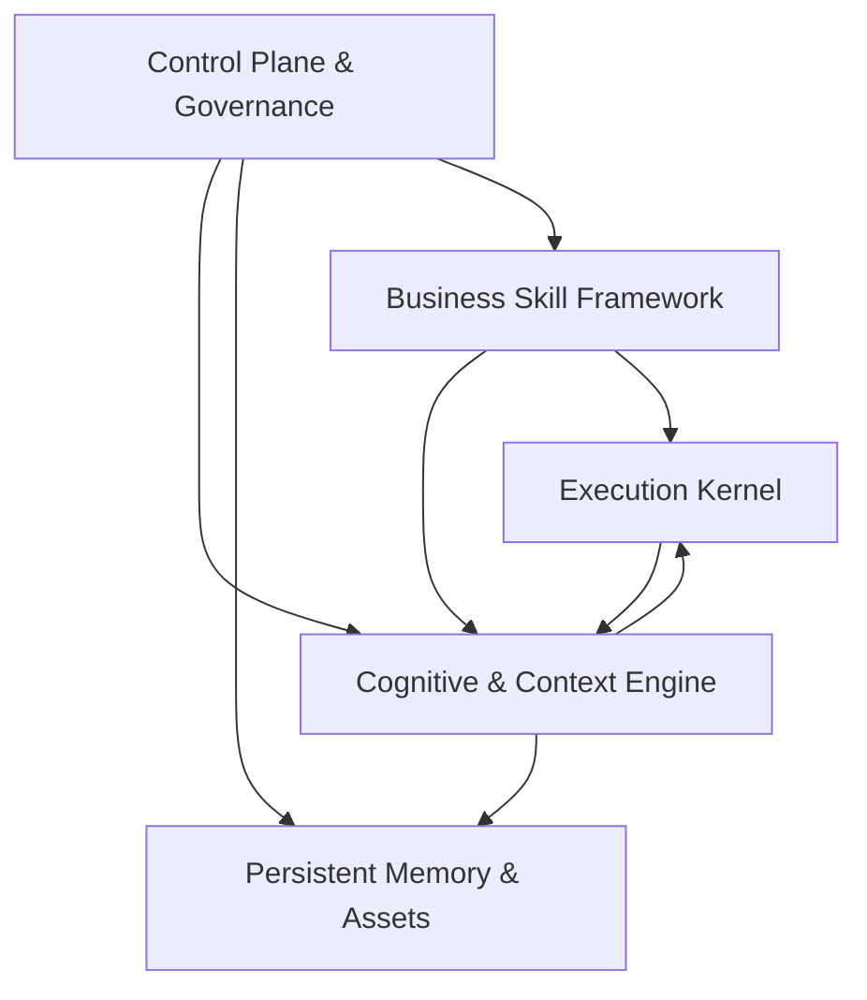
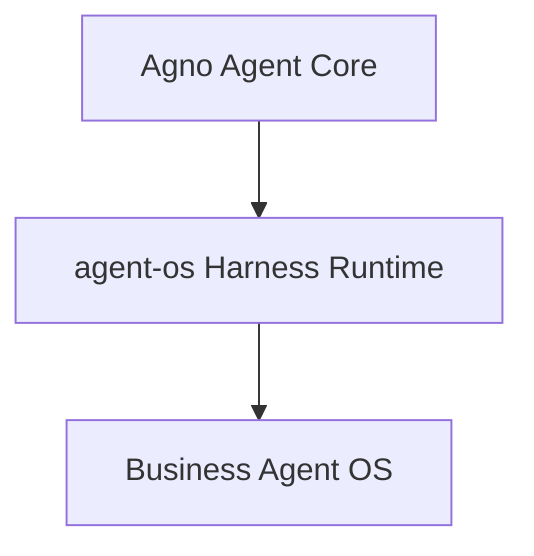

# Claude Code 参考架构规划

本文是 `agent-os-runtime` 的**业务视角 / Harness 参考架构中心文档**。它沉淀以 Claude Code Harness 为参考对象的架构判断、差距矩阵与演进路线，用来回答“系统应该往哪里演进、哪些能力优先、哪些能力暂缓”。

本文不替代工程契约与专项设计：当前实现事实以代码、测试、`CHANGELOG.md`、`ENGINEERING.md` 为准；Memory 与 Context 的专项细节分别以 `MEMORY_SYSTEM_V2.md`、`CONTEXT_MANAGEMENT_V2.md` 为准；Sprint/DoD 级执行拆解见 `SPRINT_IMPLEMENTATION_ROADMAP.md`。本文站在更高一层回答三个问题：

1. `agent-os` 当前基于 Agno 的底座应如何拆成大模块。
2. 哪些 Claude Code 能力值得借鉴，哪些不值得现在借鉴。
3. 在商业、运营、写作、策划等业务场景下，哪些能力需要 `agent-os` 自己发展。

## 1. 背景与边界

`agent-os` 的目标不是复刻 Claude Code，也不是做一个 coding agent。它的目标是实现一个可热插拔 skill 的强 Agent 底层系统，主要服务商业、运营、写作、策划等文科类任务；具体能力由插入的 skill 决定。

Claude Code 的价值在于它是一个成熟的 LLM-native coding harness。它把长会话、工具调用、压缩、恢复、权限、上下文诊断和子代理等运行时能力做成了完整产品。`agent-os` 应借鉴的是这些 Harness 工程能力，而不是它的 coding 外壳、IDE 产品形态或代码工具链。

本文采用三条演进原则：

1. **Claude Code 可借鉴能力优先**：优先吸收已经在 Claude Code 中验证过的 runtime 能力，例如 compact、context usage、tool result budget、transcript recovery。
2. **效果相关能力优先于平台治理能力**：优先提升长任务质量、上下文稳定性、交付物质量；鉴权、计费、多租户、分布式治理后置。
3. **每一阶段都要完整且有 SOTA 感**：每个阶段完成后，即使不进入下一阶段，也应形成可独立使用的能力闭环。

## 2. 核心判断

Claude Code 与 `agent-os` 不能严格同构对标。

Claude Code 更接近 **LLM-native coding harness**：模型承担大量任务策略判断，Harness 负责 query loop、message normalization、tool execution、context compact、transcript recovery、permission 和 UI 控制面。

`agent-os` 更接近 **Agno-based business agent runtime**：Agno 提供 Agent Core 与基础工具调用循环；`agent-os` 在其外侧构建 Memory V2、ContextBuilder、skill manifest、业务记忆和商业交付逻辑。

因此，正确的对标方式不是把 Claude Code 整体搬过来，而是拆出它成熟的运行时治理能力：

- Context Runtime Lifecycle
- compact / auto compact / reactive recovery
- tool result storage / microcompact
- transcript / resume / recovery
- operator commands
- observability / context diagnostics
- subagent sandbox
- hook lifecycle

`agent-os` 应保留自己的主线：

- Memory V2 的长期业务记忆分层。
- 可热插拔的业务 skill。
- 商业产物、品牌语气、brief 抽取、质量尺子等业务能力。

## 3. 代码级参考与差距矩阵

下表只列大模块与关键代码锚点，不把规划拆成实现 TODO。

| 能力 | Claude Code 参考位置 | agent-os 当前位置 | 差距判断 | 规划态度 |
| --- | --- | --- | --- | --- |
| 主 query loop | `src/query.ts`、`src/QueryEngine.ts` | Agno `Agent.run`，`src/agent_os/agent/factory.py` | Claude Code 自管消息循环；`agent-os` 依赖 Agno 高层抽象 | 不急着重写 Agno；先在 Agno 外围补 Harness 层 |
| message normalization | `src/utils/messages.ts` | `src/agent_os/context_builder.py`、Agno session message | Claude Code 有 API-bound message normalization 与 tool invariant；`agent-os` 主要做 prompt 文本装配 | 借鉴思想，建立发送前统一清洗/投影层 |
| ContextBuilder | `src/context.ts`、`src/utils/api.ts`、`src/query.ts` | `src/agent_os/context_builder.py`、`src/agent_os/runtime_context.py` | `agent-os` 四层结构更清晰；Claude Code 生命周期治理更强 | 保留四层，补生命周期 |
| context diagnostics | `src/commands/context/*`、`src/utils/analyzeContext.ts`、`src/utils/contextAnalysis.ts` | `ContextTrace`、`context_trace_log` | `agent-os` 有 trace，但没有面向用户/开发者的 `/context` 诊断 | Stage 1 优先借鉴 |
| compact service | `src/services/compact/*`、`src/commands/compact/*` | TaskSummary / history cap / char budget | `agent-os` 没有完整 conversation compact、compact boundary、post-compact rehydration | Stage 2 核心借鉴 |
| auto compact / blocking limit | `src/services/compact/autoCompact.ts`、`src/query.ts` | `ContextCharBudget`、`context_hard_budget` | Claude Code 有 token 窗口阈值和失败熔断；`agent-os` 主要字符预算 | Stage 1 做探针，Stage 2 做自动 compact |
| tool result budget | `src/utils/toolResultStorage.ts`、`src/services/compact/microCompact.ts` | `clean_history_messages`、tool output fold | `agent-os` 已能折叠历史工具输出，但没有 artifact/digest/replay 生命周期 | Stage 1/2 重点补齐 |
| transcript / resume | `src/utils/sessionStorage.ts`、`src/utils/conversationRecovery.ts` | Agno session DB、CLI/Web session read | Claude Code 对 compact boundary、unresolved tool_use、content replacement 更成熟 | Stage 2 后补 Harness 化恢复 |
| memory system | `CLAUDE.md`、memory files、session memory、auto extract | `src/agent_os/memory/*`、`MEMORY_SYSTEM_V2.md` | `agent-os` 长期业务记忆架构更清晰；Claude Code 产品化接入更成熟 | 保留 Memory V2，借鉴自动接入和解释能力 |
| skill system | `src/skills/*`、plugins、tool discovery | `manifest_loader.py`、`agent/skills/*`、`factory.py` | Claude Code 偏 coding workflow；`agent-os` 应偏业务配方 | Stage 2 强化 output contract / context pack |
| commands | `src/commands/*` | CLI 子命令、Web demo | Claude Code 控制面更成熟 | Stage 1/2 增加 `/context`、`/compact` 等 |
| hooks | `utils/hooks.ts`、compact/session hooks | 暂无完整 lifecycle hook | Claude Code 有 pre/post compact、session start 等扩展点 | Stage 2/3 引入轻量 hook |
| subagent | `AgentTool`、coordinator、task modules | V3 记录项，未实现 | Claude Code 更成熟 | Stage 3，依赖 artifact/compact 稳定后再做 |
| permissions / policy | tool permission hooks、permission modes | Memory Policy、scope、manifest 工具白名单 | `agent-os` 数据 scope 清晰，工具权限弱 | 平台化前轻量补，不抢效果主线 |

## 4. 不建议借鉴或暂缓借鉴的 Claude Code 模块

以下能力属于 Claude Code 的 coding 产品形态或平台外壳，不应进入近期主线：

- LSP、代码编辑、git diff、PR review、shell 安全分类等 coding 专属能力。
- Vim、terminal UI、voice、desktop handoff 等交互外壳。
- 大规模 IDE bridge、远程会话、分享体系，除非未来产品形态明确需要。
- 完整插件市场、组织级策略、计费、复杂权限 UI。
- Claude Code 的 memory file 形态，不应替代 `agent-os` 的 Memory V2。

这些不是没有价值，而是与当前“商业业务 Agent 底座”的效果主线不直接相关。

## 5. agent-os 5 大核心模块

本文采用 5 大模块作为顶层架构。以后新增功能应优先归入这 5 个模块，避免规划发散。

### 5.1 Execution Kernel

定位：系统的执行内核，负责模型调用、工具调用、子任务调度和生命周期事件。它不关心具体业务，只提供稳定的运行时底座。

当前状态：

- Agno 承担 Agent Core、模型接入和基础工具调用循环。
- `get_agent` 已负责组装模型、instructions、tools、session DB、manifest。
- 工具注册已有 `build_memory_tools` 与 incremental skill tools。

与 Claude Code 差距：

- Claude Code 自管 query loop、streaming tool execution、message normalization、tool invariant。
- `agent-os` 当前更依赖 Agno 抽象，对 API-bound message lifecycle 的掌控较弱。

增强方向：

- 保持 Agno 作为底层 Agent Core，不急着重写 query loop。
- 在 Agno 外围增加统一的 pre-run context projection 和 post-run cleanup。
- 后续引入轻量 Hook System，例如 `on_session_start`、`pre_compact`、`post_compact`、`on_finalize`。
- SubAgent Sandbox 暂缓到 Stage 3，在 artifact/compact 成熟后再做。

### 5.2 Cognitive & Context Engine

定位：系统的上下文和认知调度引擎，负责把静态规则、外部召回、工作记忆、最近历史和当前用户目标组装成高质量模型上下文，并在长任务中控制上下文生命周期。

当前状态：

- `ContextBuilder` 已形成四层结构：顶部静止层、外部召回层、动态工作记忆层、注意力锚定层。
- `retrieve_ordered_context` 已输出 XML-like evidence bundle。
- 已有 char budget、history clean、tool output fold、auto retrieve stub、`ContextTrace`。

与 Claude Code 差距：

- 缺少 token 级 context usage 诊断。
- 缺少 manual compact、auto compact、compact boundary。
- 缺少 prompt-too-long 完整自救路径。
- 缺少 post-compact rehydration。
- 缺少面向用户或开发者的 `/context` 控制面。

增强方向：

- Stage 1：token 探针、`/context`、prompt-too-long 自救 v0、tool result budget。
- Stage 2：manual compact、compact boundary、task-level summary、auto compact v1、post-compact rehydration。
- Stage 3：再考虑 model-driven `manage_context`、Rewind、Clear 等元认知工具。

关键判断：

不要过早让模型自驱 compact / rewind。第一版应由 runtime 根据预算触发，由用户命令显式控制；模型自驱属于更高阶能力。

### 5.3 Persistent Memory & Assets

定位：系统的长期记忆、知识、素材和产物资产层。它提供持久化读写接口，不直接承担实时 prompt 调度。

当前状态：

- Memory V2 已形成 Mem0 / Hindsight / Graphiti / Asset Store 四类分工。
- scope、authority、usage_rule、recorded_at、supersedes 降权等语义清晰。
- `ordered_context.py` 已按 Mem0 -> Hindsight -> Graphiti -> Asset Store 组织召回。

与 Claude Code 差距：

- Claude Code 的 session memory、transcript、compact summary 与运行时接入更成熟。
- `agent-os` 的长期记忆本体更适合商业场景，但自动抽取、解释、运行时闭环不足。

增强方向：

- 保留 Memory V2，不退化为 memory file。
- 增加 artifact store v1，用于长工具结果、长素材、长交付物的折叠引用。
- 增加 deliverable current / previous / final 轻量版本语义。
- 后续再做半自动记忆候选、冲突检测、memory governance console。

关键判断：

全自动记忆写入必须后置。近期可以做“候选记忆 + 人工确认”，避免幻觉污染长期记忆。

### 5.4 Business Skill Framework

定位：跑在 Agent OS 上的业务能力装配框架，是 `agent-os` 区别于 Claude Code 的核心护城河。

当前状态：

- 已有 skill manifest、manifest system prompt、enabled tools、default skill、动态 skill package allowlist。
- 当前 skill 更偏工具挂载与 prompt 配置，还未形成完整业务配方 runtime。

与 Claude Code 差距：

- Claude Code 的 skill/plugin/hook 更成熟，但主要服务 coding workflow。
- `agent-os` 需要的是业务配方型 skill：输入需求、输出结构、记忆策略、素材策略、质量标准。

增强方向：

- Stage 2 增加 skill-specific context pack。
- Stage 2 增加 skill output contract，避免所有 skill 都输出自由文本。
- Stage 2 增加 skill quality checklist v0。
- Stage 2 增加 skill memory read/write policy。
- Stage 3 后再考虑 Skill Router、Skill Composition、复杂 evaluator。

业务独有能力：

- Brief Extractor：从用户模糊需求中抽取目标、受众、渠道、约束、素材缺口、成功标准。
- Brand / Voice Engine：管理品牌语气、禁用词、风格案例、客户表达偏好。
- Quality Rubric：针对短视频脚本、营销文案、复盘报告、招商方案等不同 deliverable 建立质量尺子。
- Feedback-to-Learning：把“太虚”“更口语”“方向对”等反馈转成 task signal、Hindsight 候选或 style preference。

### 5.5 Control Plane & Governance

定位：系统的人类控制面、诊断面和治理面。它让开发者、运营者和用户能看到系统为什么这么做，并能在关键点干预。

当前状态：

- 已有 CLI、Web demo、doctor、memory 管理入口、ContextTrace、Memory Policy。
- 控制面还不够系统化，缺少 `/context`、`/compact`、`/artifact`、`/skill`、`/resume` 等统一命令。

与 Claude Code 差距：

- Claude Code slash command 体系成熟，`/context`、`/compact`、`/resume`、`/memory`、`/cost` 等让 Harness 可控。
- `agent-os` 当前更像 runtime API，operator control plane 不够完整。

增强方向：

- Stage 1：`/context` v0、基础 trace、上下文预算诊断。
- Stage 2：`/compact`、`/artifact`、`/skill`、`/memory` v0。
- Stage 3：`/review`、`/finalize`、`/handoff`。
- Stage 4：多租户、计费、复杂权限、审批流等平台能力。

关键判断：

基础 observability 不是“大厂平台能力”，而是开发 SOTA Agent 的眼睛。大型 A/B 平台可冻结，但 context trace、compact metrics、memory hit explainability 应尽早具备。

## 6. 业务场景独有模块

以下能力不是 Agno 自带，也不是 Claude Code 的强项，但对商业、运营、写作、策划类 Agent 很重要。

| 模块 | 价值 | 阶段 |
| --- | --- | --- |
| Business Skill Runtime | 把 skill 从 prompt 配置升级为业务配方 | Stage 2 |
| Brief Extraction | 从模糊需求中抽取任务结构 | Stage 2/3 |
| Brand / Voice Runtime | 管理品牌语气、红线词、风格偏好 | Stage 2/3 |
| Deliverable Version | 管理当前稿、上一版、最终稿和反馈原因 | Stage 2 |
| Feedback-to-Learning | 把用户反馈转成任务信号和记忆候选 | Stage 3 |
| Quality Rubric | 对不同业务产物建立质量尺子 | Stage 2/3 |
| Business Artifact Workspace | 统一管理素材、竞品、访谈、历史方案、最终产物 | Stage 2/3 |
| Memory Governance Console | 查看、确认、废弃、合并业务记忆 | Stage 3/4 |
| Human Approval Workflow | 关键记忆写入、规则变更、最终稿确认需要人类确认 | Stage 4 |

## 7. 阶段路线图

### Stage 1：Context V2 基建期

目标：系统不爆、不乱、不污染。完成后应具备“上下文可控”的 SOTA 感。

优先模块：

- Cognitive & Context Engine
- Tool Runtime
- Control Plane

核心能力：

1. Token 探针与预算器  
   从字符预算升级到 token 估算，至少能按四层输出 token / char 统计。

2. `/context` v0  
   显示 runtime context、external recall、working memory、recent history、attention anchor 的占比、注入状态、裁剪状态。

3. prompt-too-long 自救 v0  
   先做确定性低优先级裁剪：recent history -> external recall -> working memory；永远不裁剪完整 current user message。

4. tool result / artifact 占位符  
   长工具结果不进入 recent history，统一变成 `artifact_id + digest + usage_rule` 的短引用。

5. tool result 类型预算  
   对 Asset、Graphiti、Web、文件、历史案例分别设预算。

6. Context trace 稳定化  
   trace 不只是块大小，还要记录为什么召回、为什么裁剪、哪些证据被注入。

不做：

- 不做模型自驱 Rewind。
- 不做复杂 SubAgent。
- 不做大型评测平台。
- 不做多租户与计费。

### Stage 2：Compact + Artifact + Skill v1

目标：系统能处理长任务、多轮改稿、复杂素材。完成后应具备“商业任务可长程协作”的 SOTA 感。

优先模块：

- Cognitive & Context Engine
- Persistent Memory & Assets
- Business Skill Framework
- Control Plane

核心能力：

1. manual compact  
   先由用户或开发者显式触发，不急着模型自驱。

2. compact boundary  
   记录哪些历史被摘要替代，为 resume 和 diagnostics 提供边界。

3. task-level summary  
   摘要格式保留目标、约束、用户反馈、当前产物、未完成事项，不做泛泛总结。

4. post-compact rehydration  
   压缩后重新注入当前 skill、当前任务摘要、关键 artifact、用户最后目标、必要记忆。

5. auto compact v1  
   manual compact 跑稳后，再由 token 阈值触发自动 compact。

6. artifact store v1  
   保存长素材、长产物、历史版本，prompt 中只放摘要和引用。

7. deliverable lightweight versioning  
   支持 current / previous / final，而不是一开始做复杂版本树。

8. skill-specific context pack  
   不同 skill 走不同上下文模板。

9. skill output contract  
   每个交付类 skill 声明输出结构，减少自由文本漂移。

10. skill quality checklist v0  
   先做 checklist，不做复杂自动评分平台。

11. operator commands v1  
   增加 `/compact`、`/artifact`、`/skill`、`/memory` 的轻量版本。

不做：

- 不做复杂 Skill Router / Composition。
- 不做完整 Deliverable Version Graph。
- 不做全自动记忆写入。
- 不做 SubAgent swarm。

### Stage 3：SubAgent + Semi-Auto Learning

目标：系统开始具备分工、审稿和半自动沉淀能力。完成后应具备“Agent OS”形态，而不只是单 Agent runtime。

优先模块：

- Execution Kernel
- Persistent Memory & Assets
- Business Skill Framework
- Control Plane

核心能力：

1. SubAgent Sandbox  
   子代理有独立上下文、预算、工具边界，结果只通过 artifact / digest 返回主线程。

2. Research Agent  
   专门处理资料搜集、竞品、案例、素材拆解。

3. Reviewer Agent  
   专门审稿、挑问题、检查品牌一致性和质量 checklist。

4. Memory Curator Agent  
   任务结束后提出记忆候选，不直接写入长期记忆。

5. semi-auto memory candidates  
   从最终采纳版本、明确反馈、复盘中生成候选记忆，默认 pending review。

6. simple conflict / stale detection  
   对明显冲突、过期活动信息、被 supersede 的经验做标记。

7. `/review`、`/finalize`、`/handoff`  
   支持审稿、定稿、交接摘要。

8. golden case replay v0  
   按 skill 建立少量金牌案例回放，验证 prompt、recall、compact、artifact 策略没有退化。

不做：

- 不做分布式多 Agent 调度。
- 不做完全自动化记忆治理。
- 不做企业级审批平台。

### Stage 4：商业平台期

目标：面向生产多客户、多用户、多组织和商业化部署。只有真实需求出现后才启动。

能力清单：

- 多租户强隔离。
- 鉴权、限流、配额、计费。
- 复杂 Human Approval Workflow。
- 大规模 MCP / 外部系统集成。
- 分布式并发治理。
- 完整 project workspace。
- Skill Router / Composition 的生产化版本。
- 大型 A/B 实验与质量评测平台。
- Memory Governance Console 的多人协作版本。

这些能力有价值，但不是近期效果主线。提前做会增加系统复杂度，降低迭代速度。

### 阶段完成定义

| 阶段 | 完成后应呈现的状态 | SOTA 感来源 |
| --- | --- | --- |
| Stage 1 | 开发者能解释每轮上下文由什么组成，系统能在上下文过长前预警或裁剪，长工具结果不会污染后续历史 | 上下文可观测、可预算、可防爆 |
| Stage 2 | 长任务可以被压缩、恢复和继续推进，素材与交付物通过 artifact 引用而不是反复塞进 prompt，不同 skill 有明确输出契约 | 长程商业协作能力 |
| Stage 3 | 研究、审稿、记忆整理等脏活可由隔离子代理完成，主 Agent 只吸收结构化结果，用户反馈可以进入候选学习闭环 | Agent OS 分工与半自动学习 |
| Stage 4 | 系统具备生产多客户、多用户、多组织运营能力，并能纳入审批、配额、计费与平台评测 | 商业平台化能力 |

## 8. 推荐优先级总表

| 优先级 | 能力 | 所属模块 | 参考来源 | 原因 |
| --- | --- | --- | --- | --- |
| P0 | token 探针 / `/context` | Cognitive / Control | Claude Code `/context` | 没有诊断就无法安全迭代上下文 |
| P0 | tool result budget | Context / Assets | Claude Code toolResultStorage / microcompact | 防止长结果污染历史 |
| P0 | prompt-too-long 自救 v0 | Cognitive | Claude Code blocking / reactive compact 思路 | 避免长任务直接失败 |
| P1 | manual compact / boundary | Cognitive | Claude Code compact service | 长会话从截断升级为压缩 |
| P1 | artifact store v1 | Assets | Claude Code tool result storage + 业务自创 | 商业素材和产物必须引用化 |
| P1 | task-level summary | Cognitive / Working Memory | Claude Code compact + agent-os TaskMemory | 多轮改稿需要结构化工作记忆 |
| P1 | skill context pack / output contract | Skill | agent-os 业务主线 | 热插拔 skill 的核心骨架 |
| P2 | post-compact rehydration | Cognitive / Assets / Skill | Claude Code post-compact attachments | 压缩后保持任务连续性 |
| P2 | auto compact v1 | Cognitive | Claude Code autoCompact | manual compact 跑稳后自动化 |
| P2 | quality checklist v0 | Skill / Control | 业务自创 | 直接影响交付质量 |
| P3 | SubAgent Sandbox | Kernel | Claude Code AgentTool | 需 artifact/compact 稳定后再做 |
| P3 | memory candidates | Memory / Control | Claude Code auto memory + agent-os Memory V2 | 只做候选，不自动污染 |
| P4 | 多租户 / 计费 / 分布式 | Control | 平台工程 | 后置到真实商业化需求 |

## 9. 冻结清单与反模式

近期不要做：

- 过早 model-driven `manage_context`、Rewind、Clear。
- 在没有 artifact / compact / trace 的情况下做 SubAgent。
- 全自动记忆抽取并直接写入长期记忆。
- 重型 Deliverable Version Graph。
- 大型 project workspace。
- 完整 Skill Router / Composition。
- 大型 A/B 实验平台。
- 多租户、计费、复杂权限 UI、分布式锁。

反模式：

- 把动态记忆重新塞回静态 `instructions`。
- 为了看起来智能，让模型决定不可逆上下文删除。
- 把工具长结果直接写入可回灌历史。
- 把单次用户反馈直接永久化为全局规则。
- 为了平台完整性牺牲当前交付效果。
- 用 Claude Code 的 coding 专属能力污染商业业务主线。

## 10. 与现有文档的关系

阅读顺序建议：

1. `docs/MEMORY_SYSTEM_V2.md`：理解长期记忆分层与治理。
2. `docs/CONTEXT_MANAGEMENT_V2.md`：理解当前四层上下文与已完成的 V2.6 边界。
3. 本文：理解以 Claude Code 为参考对象的下一阶段 Harness 演进路线。
4. `docs/SPRINT_IMPLEMENTATION_ROADMAP.md`：查看已有 Sprint / DoD 级工程执行拆解，注意它可能与当前最新讨论存在时间差。

文档权威关系：

- 本文决定业务架构方向、Claude Code 参考边界、Stage 节奏和冻结清单。
- `docs/ENGINEERING.md` 与 `docs/ARCHITECTURE.md` 决定当前工程契约、模块边界和读写路径。
- `docs/MEMORY_SYSTEM_V2.md`、`docs/CONTEXT_MANAGEMENT_V2.md`、`docs/ASSET_STORE.md` 决定各专项内部语义。
- `docs/SPRINT_IMPLEMENTATION_ROADMAP.md` 只承载可频繁更新的实施拆解与验收口径。
- 若文档与现实冲突，以代码、测试和 `docs/CHANGELOG.md` 校准。

本文不推翻既有结论：

- Memory V2 仍是长期记忆主线。
- ContextBuilder 四层结构仍是当前正确架构。
- P3 / P4+ 能力仍应条件触发，不应为了追求架构完整性提前实现。

本文新增的判断是：

- Claude Code 最值得借鉴的是 Harness runtime，而不是 coding 产品外壳。
- `agent-os` 下一阶段应从 Context 可控进入 Compact / Artifact / Skill 强化。
- 业务型 skill、产物工作流、品牌语气和反馈学习是 `agent-os` 超越 Claude Code 的方向。

## 11. 最终路线总结

`agent-os` 的未来路线可以概括为三层：

第一层保留 Agno，负责模型与基础工具循环。

第二层自建 Harness Runtime，补齐 Claude Code 已验证的上下文生命周期、工具结果管理、compact、resume、commands 和 observability。

第三层发展业务护城河，围绕 skill、memory、artifact、brand、brief、quality rubric 和 feedback learning 做商业场景能力。

阶段节奏应是：

1. **Context 可控**：先知道上下文里有什么，能防爆、防污染。
2. **Compact / Artifact**：再让长任务可压缩、可恢复、可引用。
3. **Skill 强化**：让不同业务能力真正热插拔、有输出契约、有质量标准。
4. **SubAgent / 学习闭环**：在隔离和可观测基础上发展多代理与半自动记忆。
5. **平台化**：最后才做多租户、计费、分布式、审批等商业平台能力。

这条路线同时满足三条原则：优先吸收 Claude Code 可验证能力，优先提升实际效果，并保证每个阶段完成后都形成独立的 SOTA 感。
