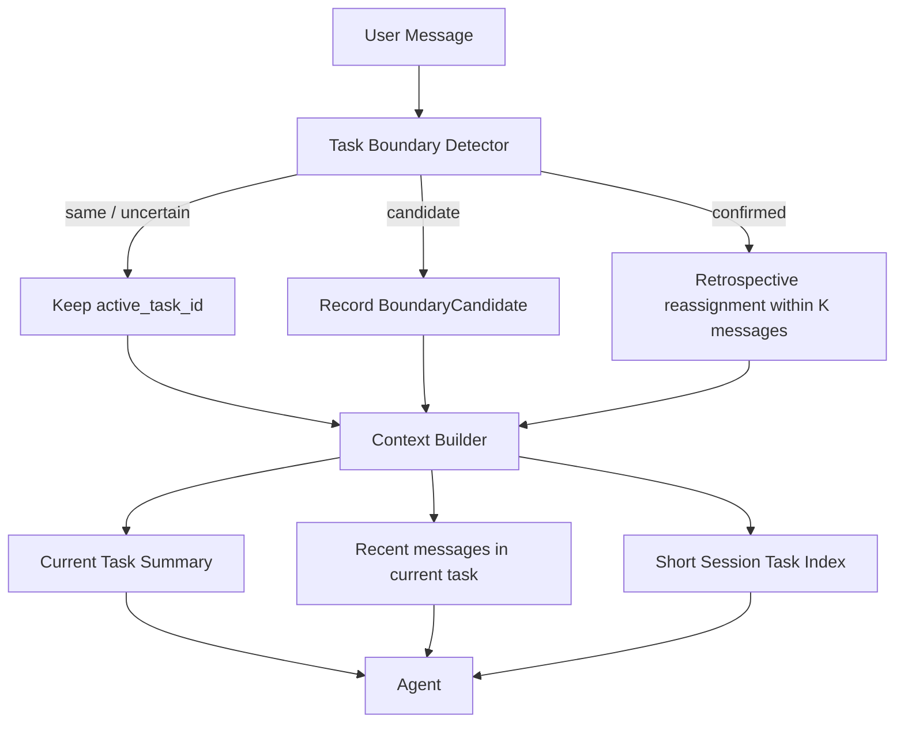

# agent-os-runtime 工程方案依据（长期维护）

本文档为 **agent-os-runtime** 仓库的权威技术说明，与实现代码同步演进。总体产品愿景与多仓库分工见上级产品方案；本仓库覆盖 **阶段 (a)+(b)+(c)：Agno + Mem0 + MemoryController + Graphiti 只读 + Hindsight + AsyncReview** 的实现边界与契约。

---

## 1. 目标与边界

### 1.1 本仓库负责

- 基于 **Agno** 编排可运行的 **通用任务型 Agent**（面向可插拔任务型 Agent）。
- **MemoryController** 作为 **唯一推荐写入入口**，向 **Mem0**（或本地降级后端）写入 **长期事实与稳定偏好**；向 **Hindsight**（`HindsightStore`，JSONL）写入 **任务级反馈**；**AsyncReview** 在会话结束时提炼 **教训** 并追加写入同一存储。
- 提供 CLI 与可导入的 **工厂函数**（`get_agent` / `get_reasoning_agent`），便于调试与后续接入 FastAPI/AgentOS。

### 1.2 本仓库不负责（明确排除）

- **① `video-raw-ingest`**（目录名可在 **`ops-stack.toml`** 配置；PyPI/CLI 名仍为 `video-raw-ingest`）：原始视频转写与合并。
- **DSPy/知识制品项目**：领域知识手册生成与 prompt 制品（独立仓库）；本仓库通过环境变量与后续「手册版本」接入，不在 (a) 强制实现。
- **Graphiti / Neo4j**：阶段 **(b) 已接入只读**（`search_`）；**禁止**在运行时调用 `add_episode` 等写入 API；图谱数据由离线/独立管线写入。
- **MCP 旁路探针**：默认 **fixture 工具** `fetch_probe_context`；可选 **stdio MCP**（`agent-os-runtime mcp-probe-server`，依赖 `[mcp]`）。
- **完整商业化**：鉴权、计费、多租户控制台 UI 不在 (a) 范围。

---

## 2. 总体上下文中的位置

```
video-raw-ingest (①)  →  原始结构化产物
        ↓
ops-knowledge / ops-distiller-forge（②）→  校验、handoff、知识点与 Manifest
        ↓
agent-os-runtime（本仓库，③）→  运行时 Agent + Mem0 + Graphiti 只读
```

**跨仓契约（建议尽早冻结）**

| 字段 | 说明 |
|------|------|
| `client_id` | 租户或工作区隔离键；所有记忆写入与检索必须携带 |
| `user_id` | 可选；终端用户；与 `client_id` 组合成 Mem0 `user_id` |
| 手册版本 | 后续：`AGENT_OS_HANDBOOK_VERSION` 或制品路径，与 prompt 对齐 |

---

## 3. 架构要点

### 3.1 认知分工（与总方案一致）

| 模块 | 行为 |
|------|------|
| **Mem0 / 本地后端** | 存储 **属性（attribute）** 与 **稳定偏好（preference）**；唯一长期记忆主存储 |
| **Hindsight** | **`HindsightStore`**：`data/hindsight.jsonl`（`AGENT_OS_HISTORICAL_PATH`）；含 `feedback` 与 `lesson`；检索 `search_hindsight` / 工具 `search_past_lessons`。支持 **`supersedes_event_id`**：JSONL **append-only**；被取代的 `event_id` 在召回**排序中降权**（`HindsightRetrievalPolicy`，非删行）、**同类正文合并**与 **`weight_count`** 频次权重（可 `AGENT_OS_HISTORICAL_ENABLE_FREQ_MERGE=0` 关闭合并与加分，**仍**对 supersedes 行计降权）。详见 [MEMORY_SYSTEM_V2.md](MEMORY_SYSTEM_V2.md) V2.2 P1 |
| **Asset Store（案例库）** | **整存整取**的参考案例库（Dynamic Few-Shot，语感参考）。运行时仅检索；**清洗/特征抽取在入库阶段完成**。默认落地为本地 **LanceDB**（可选插件）。设计见 `docs/ASSET_STORE.md` |
| **Graphiti** | **只读**：`GraphitiReadService.search_domain_knowledge` → `graphiti.search_`；**新语义**分区键为 **`system_graphiti_group_id(skill_id)`**（仅清洗后的 skill/domain）；**新写入**须与 **`graphiti-ingest`**、JSONL fallback 一致。运行时**默认**在系统分区无结果时**只读兼容**旧分区 **`graphiti_group_id(client_id, skill_id)`**（可用 `AGENT_OS_GRAPHITI_ENABLE_LEGACY_CLIENT_GROUPS=0` 关闭，见 [OPERATIONS.md](OPERATIONS.md)）。BFS 深度默认 **2**（`AGENT_OS_GRAPHITI_BFS_MAX_DEPTH`） |
| **Skill / Manifest** | 主键 **`skill_id`**（如 `default_agent`、`sample_skill`）。`manifest_loader.load_skill_manifest_registry`：先读包内 `data/skill_manifests/*.json`，再合并 **`AGENT_OS_MANIFEST_DIR`** 下同名文件覆盖。`get_agent(..., skill_id=...)` 未传时用 **`AGENT_OS_DEFAULT_SKILL_ID`**。已弃用 **`AGENT_OS_PERSONA`** / **`AGENT_OS_MANIFEST_PATH`**。 |
| **工具合并** | **平台工具**（`build_memory_tools`）常驻 + **`get_incremental_tools(skill_id, settings=...)`** 增量：自 ``agent_os.agent.skills.<skill_id>`` **白名单**动态加载（``AGENT_OS_LOADABLE_SKILL_PACKAGES``）；再按 manifest `enabled_tools` 筛选。测试包见 ``sample_skill``。 |

### 3.2 检索顺序（阶段 c+）

- **工具 `retrieve_ordered_context`**：固定顺序 **① Mem0（`search_profile`）→ ② Hindsight（`search_hindsight`）→ ③ Graphiti（若已挂载）→ ④ Asset Store（若已挂载）**。
- 仍保留单独工具 `search_client_memory`、`search_past_lessons`、`search_domain_knowledge` 供细粒度调用。

### 3.3 领域知识降级

- 若 Neo4j 未配置、检索超时或抛错，则使用 **`AGENT_OS_KNOWLEDGE_FALLBACK_PATH`** 指向的 JSONL（`KnowledgeJsonlFallback`），按 `group_id` 过滤后做简单词重叠排序。
- 若两者皆不可用，工具返回说明字符串，提示配置环境变量。

### 3.4 写入路由（记忆层）

- `MemoryLane.ATTRIBUTE` → Mem0（或本地 JSON）。
- `MemoryLane.TASK_FEEDBACK` → `HindsightStore`（`type=feedback`）。
- **幂等**：`MemoryController` 对 `(client_id, lane, text)` 做指纹去重，防止同句重复刷写。
- **画像检索合并**：`search_profile` 合并 `__client_shared__`、用户私有（及 legacy）桶；**同一正文**在多个桶重复出现时保留 **`recorded_at`/`created_at` 更晚**的命中，与 §3.7.5 Temporal Grounding 的「较新优先」一致。

### 3.5 双轨同步（与总方案对齐）

- **Mem0 轨**：工具调用即时写入；CLI 中每轮对话后 `bump_turn_and_maybe_snapshot`，每 N 轮（默认 5）触发快照钩子（Mem0 托管侧可为 no-op，本地侧打日志）。
- **Hindsight 轨**：工具写入反馈；**AsyncReview**（`review/async_review.py`）在 CLI 退出时调用 LLM 生成 `lesson` 行并写入；`submit_and_wait` 避免进程过早退出。

### 3.6 Agno 集成原则

- **逻辑重于命名**：对外只依赖 `agent_os.agent.factory` 中工厂函数；Agno 类名变更时优先改工厂内实现。
- **推理路由**：`get_agent(..., thought_mode="fast"|"slow")`；`slow` 时启用 Agno `reasoning`。**若模型不支持导致异常**，应优先使用 `fast` 或升级模型（见 OPERATIONS 排障）。

### 3.7 系统宪法（P1-3）与交付物结构（P1-4）

- **宪法**（`agent_os.agent.constitutional`）：在 `get_agent` 的 instructions **最前**注入固定段落「**冲突解决序**」：红线（硬合规/不编造/隐私）→ 当轮显式用户 → Hindsight → 领域 SOP/Graphiti/handoff → Asset 参考语感。与 `retrieve_ordered_context` 的**检索**序（Mem0→…）是**互补**关系（见该工具 description）。可设 **`AGENT_OS_ENABLE_CONSTITUTIONAL=0`** 关闭；配方 JSON 可含 **`constitutional_prompt`** 追加本 skill 的合宪说明。
- **交付物 `structured_v1`**（`agent_os.manifest_output`）：当 manifest 设 **`"output_mode": "structured_v1"`** 与 **`output_schema_version`**（当前 **`"1.0"`** 对应 **`PlanStructuredV1`**）时，工厂为 Agno 设置 **`output_schema` + `structured_outputs`**。提纲、要点与 **`body_markdown`（长文）** 分字段，避免**单段 JSON 过深**；更长的二轮扩写可继续用**普通多轮对话**或独立接口（不在此强制）。

### 3.7.5 认知稳定性增强（P1.5）

- **Ephemeral Metadata**：每轮可注入运行时临时元数据（时间、入口、skill、租户上下文提示）。该信息只用于当轮推理，**不得**自动写入 Mem0 / Hindsight / Asset Store。
- **Memory Policy**：长期记忆写入必须先通过工具触发说明与 `MemoryController` 侧策略 gate。玩笑、一次性任务、模糊假设、临时素材不应沉淀为主体画像；Hindsight 只保留明确反馈、复盘结论与方法论错误。
- **Temporal Grounding**：记忆写入携带 `recorded_at` / `source` 等元数据；检索结果喂给模型时应带 `[记录于 ...]`，冲突时优先较新记录，并保留历史记录的“当时有效”语义。
- **Task-aware Working Memory（规划/实现中）**：摘要升级为 `summary(session_id, task_id)`；`task_id` 由系统在同一 session 内自动生成和维护，不要求用户填写。生产默认保守不切 task，低置信变化只记 boundary candidate，高置信确认后可有限回溯重分配最近消息的 `task_id`，但不改原始消息文本，并写 audit event。跨 session 连续性交给 Mem0/Hindsight；多 skill 协作仍在同一 session/task 内由总控 Agent 调度。
- **Procedural Memory via Forge（待办）**：只能产出 `pending_review` 候选 SOP，默认禁止自动写入 Graphiti / 干净知识库，避免单次会话污染组织知识。



### 3.8 可观测（P2-5）与 `POST /ingest`（P2-6）

- **日志**：`agent_os.observability` 从 Agno **`RunOutput`** 抽取 `model`、`tools`（`ToolExecution.tool_name`）、`metrics` 粗算 token，拼 **`AGENT_OS_OBS`** 稳定行，便于 grep。
- **HTTP**：`examples/web_chat_fastapi.py` 为 **`Starlette` 中间件** 注入/透传 **`X-Request-ID`**；**`/ingest`** 由 **`agent_os.ingest_gateway.run_ingest_v1`** 实现显式 **target** 路由；与 **`/api/memory/ingest`** 并存。生产**鉴权/限流在网关**（见 [OPERATIONS.md](OPERATIONS.md)）。

### 3.9 按 Skill 的评测目录（P3-7）与数据备份（P3-8）

- **Skill 回归**：核心仓只保留 `tests/core/`；外部 skill pack 可在自己的仓库或 `tests/skill_examples/` 下持有独立 fixtures 与 marker。仍仅使用 **`run_e2e_eval_*`** 一套 Golden 引擎。
- **备份**：`agent_os.backup_data_core` + **`python scripts/backup_data.py`** → `backups/*.zip`（**不含** `.env`）；Mem0 云端以官方能力或人工 SOP 为准，见 [DATA_BACKUP.md](DATA_BACKUP.md)。

---

## 4. 代码目录约定

```
agent-os-runtime/
  pyproject.toml
  README.md
  docs/
    CLAUDE_CODE_REFERENCE_ROADMAP.md  # 业务 / Harness 架构中心：方向、模块、Stage、冻结清单
    ENGINEERING.md    ← 本文件（阅读顺序见仓库 README §文档与阅读顺序）
    ARCHITECTURE.md
    OPERATIONS.md
    CHANGELOG.md
    MEMORY_SYSTEM_V2.md
    CONTEXT_MANAGEMENT_V2.md         # 上下文工程专项接手手册
    SPRINT_IMPLEMENTATION_ROADMAP.md # Sprint / DoD 执行计划
    STAGE_EXECUTION_PLAN.md          # 当前 Stage 战役与完成历史
  src/agent_os/
    __init__.py
    __main__.py
    config.py              # 环境配置
    cli.py                 # 命令行入口
    handoff.py             # handbook_handoff.json → 指令摘要
    evaluator/             # Golden rules、e2e 规则门
    mcp/                   # 探针 fixture + 可选 stdio 服务
    memory/
      models.py            # Pydantic：UserFact、MemoryLane 等
      controller.py        # MemoryController
      backends/            # Mem0 / 本地
      hindsight_store.py
    review/
      async_review.py        # AsyncReview 服务
    knowledge/
      graphiti_reader.py   # Graphiti 只读 + JSONL fallback
      graphiti_ingest.py   # 离线 add_episode（CLI，需 Neo4j+LLM）
      jsonl_append.py      # JSONL 降级追加
      fallback.py
      group_id.py
    resources/             # 包内默认 JSON（如 mcp_probe_default.json）
    data/skill_manifests/  # 内置 skill 配方（含 planning_draft 等）
    agent/
      factory.py           # get_agent / get_reasoning_agent
      constitutional.py    # P1-3 系统宪法文本
      tools.py             # Agno 工具（绑定 client_id + skill_id → Graphiti 分区）
      skills/              # loader 白名单动态加载（get_incremental_tools）
    manifest_output.py     # P1-4 结构化输出 Pydantic 与 manifest 解析
    observability.py        # P2-5 从 RunOutput 拼 AGENT_OS_OBS 日志
    ingest_gateway.py         # P2-6 显式 target 摄入
    backup_data_core.py        # P3-8 本地 data/ 打包（zip）
  scripts/
    backup_data.py             # CLI 包装，调用 backup_data_core
  tests/
    skills/                    # P3-7 按 skill 隔离的 e2e fixture
      core/
      skill_examples/      # 可选，外部 skill pack 示例回归
```

---

## 5. 环境与配置

见 [OPERATIONS.md](OPERATIONS.md)。关键变量：

- `OPENAI_API_KEY`：必需（对话与工具）。
- `OPENAI_API_BASE`：可选，兼容中转。
- `MEM0_API_KEY`：可选；未设置则使用本地 `data/local_memory.json`。
- `AGENT_OS_MODEL`：默认 `gpt-4o-mini`。
- `AGENT_OS_SNAPSHOT_EVERY_N_TURNS`：默认 `5`。
- **Graphiti（可选）**：`NEO4J_URI`、`NEO4J_USER`、`NEO4J_PASSWORD`；`AGENT_OS_GRAPHITI_SEARCH_TIMEOUT_SEC`、`AGENT_OS_GRAPHITI_MAX_RESULTS`、`AGENT_OS_GRAPHITI_BFS_MAX_DEPTH`；权限与 legacy 只读分区见 **`AGENT_OS_GRAPHITI_ALLOWED_SKILL_IDS`** / **`AGENT_OS_GRAPHITI_CLIENT_ENTITLEMENTS_JSON`** / **`AGENT_OS_GRAPHITI_ENABLE_LEGACY_CLIENT_GROUPS`**（详表见 [OPERATIONS.md](OPERATIONS.md)「Memory V2」）。
- **降级 JSONL**：`AGENT_OS_KNOWLEDGE_FALLBACK_PATH`（示例见 `docs/examples/knowledge_fallback.example.jsonl`）。
- **Hindsight 路径**：`AGENT_OS_HISTORICAL_PATH`（兼容 `AGENT_OS_HISTORICAL_STUB_PATH`），默认 `data/hindsight.jsonl`。
- **AsyncReview**：`AGENT_OS_ASYNC_REVIEW_ON_EXIT`（默认 `1`）、`AGENT_OS_ASYNC_REVIEW_MODEL`（可选）。
- **Asset Store（可选）**：`AGENT_OS_ENABLE_ASSET_STORE`、`AGENT_OS_ASSET_STORE_PATH`（见 `docs/ASSET_STORE.md`）。

安装 Graphiti 依赖：`pip install -e ".[graphiti]"`。

- **管线自检**：`agent-os-runtime doctor`；可选 **`AGENT_OS_HANDOFF_MANIFEST_PATH`**（`ops-knowledge manifest` 产出；**运行时注入** `get_agent` 指令摘要）、**`VIDEO_RAW_INGEST_ROOT`**（校验 ① schema 路径）。工作区总览见上级 `PIPELINE.md`。
- **交付规则抽检（可选）**：**`AGENT_OS_GOLDEN_RULES_PATH`** → JSON 数组正则规则；Agent 工具 **`check_delivery_text`**；示例见 `data/golden_rules.example.json`。
- **Skill 配方目录（可选）**：**`AGENT_OS_MANIFEST_DIR`** → 扫描其中 **`*.json`**，文件名为 **`skill_id`**；可将 **`export-manifest`** 输出复制为 **`default_agent.json`** 等。未设置时仍使用包内置配方。默认 skill：**`AGENT_OS_DEFAULT_SKILL_ID`**（默认 `default_agent`）。见 **`manifest_loader.py`**。
- **探针 fixture（可选覆盖）**：**`AGENT_OS_MCP_PROBE_FIXTURE_PATH`**；CLI **`agent-os-runtime eval`**、**`knowledge-append-jsonl`**、**`graphiti-ingest`** 见 [OPERATIONS.md](OPERATIONS.md)。

---

## 6. 安全与租户

- 所有记忆操作必须通过 **工具** 或 **MemoryController**，并传入 **`client_id`**。
- Mem0 侧使用 `Mem0MemoryBackend.mem_user_id`：`f"{client_id}::{user_id}"`；公司级共享画像写入 **`user_id="__client_shared__"`**（即 `client_id::__client_shared__`），避免与终端用户桶混淆；仍兼容旧 **`user_id=None`** 的 legacy 桶只读。
- 日志不得打印完整用户输入或交付文本到公共遥测；生产环境需脱敏策略（后续里程碑）。

---

## 7. 阶段路线图（本仓库内）

| 阶段 | 内容 |
|------|------|
| **(a)** | Agno + Mem0 + MemoryController + Hindsight 存储 + CLI |
| **(b)** | Graphiti **只读**（`search_`）+ JSONL 降级 + `group_id` 租户映射 + CLI `--no-knowledge` |
| **(c) 当前** | **`retrieve_ordered_context`**、**AsyncReview**、**handoff**、**Golden rules**、**`suggest_memory_lane`**、**MCP fixture + 可选 MCP 服务**、**`agent-os-runtime eval` 规则门**、**JSONL 离线知识追加**、**Graphiti 离线 ingest（需 Neo4j+LLM）** |

每阶段更新 **CHANGELOG** 与本文件 **§7**。

### 7.1 文档层级与执行计划

- 业务架构方向、Claude Code Harness 参考边界、五大模块、Stage 节奏与冻结清单见 **[CLAUDE_CODE_REFERENCE_ROADMAP.md](CLAUDE_CODE_REFERENCE_ROADMAP.md)**。
- 面向 **CLI + Web/API 对外、持续新增 Skill** 的 Sprint 级实施表、DoD、Mermaid 设计图与实现落点见 **[SPRINT_IMPLEMENTATION_ROADMAP.md](SPRINT_IMPLEMENTATION_ROADMAP.md)**。
- 当前 Stage 的战役拆解与完成历史见 **[STAGE_EXECUTION_PLAN.md](STAGE_EXECUTION_PLAN.md)**。
- 若规划文档与实现冲突，以代码、测试与 **[CHANGELOG.md](CHANGELOG.md)** 校准事实；本文仍负责记录当前工程契约。

---

## 8. 设计决策记录（轻量 ADR）

| ID | 决策 | 原因 |
|----|------|------|
| ADR-001 | 无 Mem0 时落盘本地 JSON | 降低本地与 CI 门槛，避免强依赖云端 |
| ADR-002 | Hindsight 先用 JSONL | 先跑通「任务反馈」数据流，阶段 (c) 再换服务 |
| ADR-003 | 工厂函数集中创建 Agent | 隔离 Agno API 变更面 |
| ADR-004 | Graphiti 仅 `search_`，不写 episode | 运行时只读，与离线建图解耦 |
| ADR-005 | `graphiti-core` 为可选 extra | 无 Neo4j 环境仍可安装核心 Agent |
| ADR-006 | AsyncReview 用独立线程 + `join` | 避免 daemon 线程被进程退出打断 |
| ADR-007 | 案例库采用 Asset Store（整案 few-shot）而非 Graph-RAG | 目标为“语感参考”而非实体关系解释；运行时仅检索，清洗/特征抽取在离线入库阶段完成 |

---

## 9. 变更流程

1. 行为或契约变化 → 更新 **ENGINEERING.md** 相应章节。
2. 用户可见行为 → **CHANGELOG.md** 追加条目并升版本号（`pyproject.toml` / `agent_os.__version__`）。
3. 运维步骤变化 → **OPERATIONS.md**。
4. **独立拷贝 / 跨机器 Cursor 研发**（合回 `ops-stack` 前）→ 遵守仓库根 [**AGENTS.md**](../AGENTS.md) 中的依赖边界与自检清单。

---

## 10. 参考

- Agno 文档：<https://docs.agno.com>
- Mem0 文档：<https://docs.mem0.ai>
- Graphiti：<https://help.getzep.com/graphiti/graphiti/overview>
- 上游数据：**`video-raw-ingest`**（总工程见 `ops-stack/PIPELINE.md` 与 `ops-stack.toml`）
