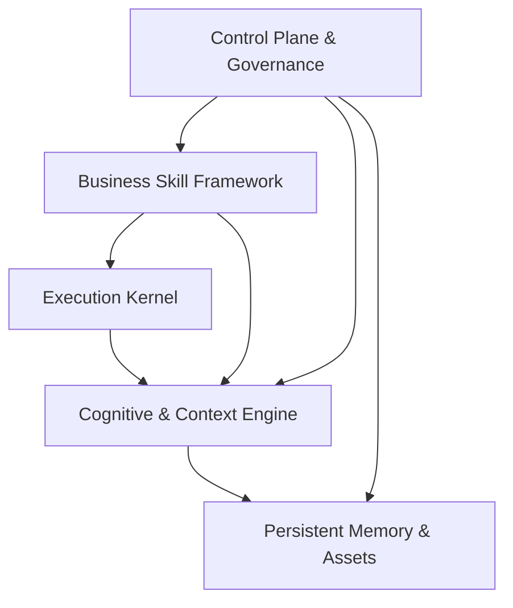

# Effect-First Agent OS Stage Plan

> **状态：已被 [ARCHITECTURE.md](../ARCHITECTURE.md) + [OPEN_DECISIONS.md](../OPEN_DECISIONS.md) 替代**
>
> 本文（V1）保留作历史对照，**不再作为阶段路线的权威来源**。架构总纲与 stage 路线骨架以 [ARCHITECTURE.md](../ARCHITECTURE.md) 为准；待决策项以 [OPEN_DECISIONS.md](../OPEN_DECISIONS.md) 为准。
>
> 中间过渡期 V2 文档（[EFFECT_FIRST_STAGE_PLAN_V2.md](EFFECT_FIRST_STAGE_PLAN_V2.md)）保留作 7 轮迭代过程的完整背景记录，但已被进一步拆分，不再编辑——新人不应通过本文跳到 V2 阅读架构，请直接跳到 [ARCHITECTURE.md](ARCHITECTURE.md)。
>
> **V2 已修正了 V1 的以下关键问题**（清单保留作 V1→V2 演进对照）：
>
> - **架构**：V1 用 5 大模块（含 Control Plane），V2 收敛为 **4 核心模块 + 3 运行 loop + 1 横切 Operator & Observability Surface**。模块名也调整：`Execution & Turn Loop` → `Execution Runtime`，`Context & Task Loop` → `Context & Task Engine`，让模块（空间维度）与 loop（时间维度）在命名上彻底分离。Surface 是横切表达层，不是核心模块、不是独立 stage、不是独立代码包，只规定命令 / 诊断 / trace 的 5 类统一形态，由 5 条红线守住边界。
> - **Memory / Artifact 边界**：V1 把 Asset / Artifact / Memory 打包，导致 artifact 一直被推后。V2 强制区分：Memory 是跨任务、隐式注入；Artifact 是任务级、显式引用，二者**永不互替**。
> - **Stage 总数**：V1 是 9 个 stage（含独立 Control Plane stage 与独立 SubAgent stage），V2 是 **6 个 stage + 1 个可选项**，按依赖顺序递进。
> - **Stage 2 性质**：V1 的 Stage 2 是"治理 stage"（能力矩阵 + 模板）；V2 的 Stage 2 是 **Artifact Reference Foundation**（先解决"长内容不能直接塞 prompt"）。
> - **Stage 3 性质**：V1 的 Stage 3 是抽象 long-task 能力；V2 的 Stage 3 是 **Manual Compact + Rehydration**（站在 Stage 2 artifact 之上）。Auto compact 默认 off，作为 Stage 3 末尾可选阈值化升级，避免"manual 没跑稳就开 auto"。
> - **Stage 4 性质**：V1 没有显式定义；V2 的 Stage 4 是 **Task Summary + Golden Replay**——架构稳健性 stage（不是 V1 治理 stage：task summary 与 golden replay 是真实可观测、可使用的能力，让 Task Loop 可持续演进）。
> - **Stage 5 性质**：V1 的 Stage 4 是单 skill SOTA（与 long-task 解耦）；V2 的 Stage 5 是 **First Skill SOTA Loop**（用 skill 实弹完整 Task Loop，避免"先建工厂再找产品"）。
> - **Stage 6 性质**：V2 的 Stage 6 是 **Memory & Voice Stabilization**，等到 Stage 5 有真实 final delivery 后再做 candidate / voice，不过度自动化。
> - **Stage 7+**：V1 的多个独立 stage（Operator Control Plane / SubAgent / Auto Compact）在 V2 全部归入"按真实痛点决定"的可选项。
> - **能力开关**：V1 用 5 类细颗粒度矩阵（default_on / off / debug_only / do_not_expand / frozen），V2 简化为 5 个核心 boolean，状态归核心模块所有，Surface 只查看 / 转发。
> - **开工门槛**：V1 是 6 问，V2 简化为 3 问。
> - **设计哲学**：V1 是"避免企业级膨胀"（防御性），V2 是"主动追求个人级 SOTA"（进攻性，有明确 SOTA 边界定义）。
>
> 完整 7 轮辩论过程见 [EFFECT_FIRST_STAGE_PLAN_V2.md](EFFECT_FIRST_STAGE_PLAN_V2.md)（已冻结作历史）；最终架构沉淀见 [ARCHITECTURE.md](../ARCHITECTURE.md)。

---

本文是 `agent-os-runtime` 的**效果优先阶段规划草案**，不替代 [CLAUDE_CODE_REFERENCE_ROADMAP.md](CLAUDE_CODE_REFERENCE_ROADMAP.md)。

它用于回答一个更具体的问题：在继续以 Claude Code Harness 为最重要参考对象的同时，如何避免无脑照抄、过度优化、平台化膨胀，以及“架构更聪明但实际更笨”的性能倒退。

## 规划原则

1. 最终目标仍是 SOTA 级 Agent OS，但每个 stage 必须独立形成可感知的效果闭环。
2. Claude Code 仍是最重要参考对象，但只借鉴可迁移的 Harness 机制，不照搬 coding harness 形态。
3. 效果相关能力优先：长任务稳定、上下文不爆、交付质量提升、用户可控。
4. 任何可能导致性能倒退的能力，必须有开关、回退路径和 smoke / golden case 验证。
5. 没有真实失败案例支撑的能力后置，必要时推到 Stage 8 / 9+。
6. 不追求架构完整，追求最小有效闭环。

## 对 Gemini 方案的判断

Gemini 方案的大方向是合理的：Stage 2 收敛为 `Minimum Viable Long-Task Loop`，Stage 3 先做单个真实 skill 的 SOTA 闭环，SubAgent 延后为单点实验，自动化和平台治理继续后置。

本规划吸收其核心判断，并做三点调整：

1. 将“旧代码瘦身与复杂度控制”作为 Stage 2 显式入口，而不是附属说明。
2. 将 `golden case replay v0` 提前到 Stage 2，作为后续 compact / artifact / skill 改动的防退化门槛。
3. 将 SubAgent 继续后移到 Stage 7，除非 Stage 3 / Stage 4 暴露出非常明确的 research / review 痛点。

## 五大架构模块

- `Execution Kernel`：Agno Agent 组装、模型调用、工具调用、后续 SubAgent 生命周期。
- `Cognitive & Context Engine`：ContextBuilder、diagnostics、budget、compact、rehydration、working memory。
- `Persistent Memory & Assets`：Mem0、Hindsight、Graphiti、Asset、Artifact、交付物引用。
- `Business Skill Framework`：skill manifest、context pack、output contract、quality checklist、业务交付逻辑。
- `Control Plane & Governance`：`/context`、`/compact`、trace、smoke / golden case、开关、回退、人工确认。



## Stage 1：Context Foundation

状态：已完成。

目标：上下文可观测、可预算、可防爆。

已完成能力：

- `/context` diagnostics。
- budget guard。
- prompt-too-long self-heal v0。
- tool history budget。
- Claude Code reference-first rule / index。
- Stage 1 final smoke。

SOTA 感：系统已经具备基础 Harness 味道，不再盲跑 prompt。

冻结到后续：

- compact。
- artifact store。
- SubAgent。
- model-driven context management。

## Stage 2：Complexity Control & Golden Baseline

目标：进入长任务能力前，先控制旧代码复杂度，建立防退化基线。

重点模块：

- `Cognitive & Context Engine`
- `Persistent Memory & Assets`
- `Control Plane & Governance`

Claude Code 参考：

- context diagnostics。
- feature flags / kill switches。
- operator visibility。
- compact 前的 context usage 可见性。

要做：

1. 建立旧代码能力矩阵：`default_on` / `default_off` / `debug_only` / `do_not_expand` / `frozen`。
2. 明确高风险能力的开关、回退路径和删除条件。
3. 建立 `golden case replay v0`，数量少但覆盖真实高频失败场景。
4. 为 Stage 2+ 功能建立开工门槛：真实失败案例、效果收益、开关、回退、smoke / golden case、延迟 / token / 状态成本。

旧代码控制：

| 旧能力 | 当前策略 | 原因 |
| --- | --- | --- |
| `TaskMemoryStore` | 只允许复用 `task_summaries`，不启用自动 task boundary | 自动任务切分容易引入状态错误 |
| `ordered_context` synthesis | 默认关闭 | LLM synthesis 可能增加延迟和误摘要 |
| `ordered_context` query plan / JIT hints | 倾向 debug only | 对模型可能是噪声，对开发者有价值 |
| `asset_ingest` | 离线整理工具，不进入主对话路径 | LLM 入库治理成本高，容易过早平台化 |
| `factory.py` | 不继续承载 compact / artifact lifecycle | 避免 Agent 工厂变成长任务状态机 |
| `constitutional.py` | 冻结全局宪法 | 业务质量规则应放 skill 层 |

Stage 2 Golden Case 最小集合：

1. 长历史多轮改稿：验证 context self-heal 和 history budget 不丢当前目标。
2. 长素材输入：验证素材不会直接污染 prompt，后续可通过 artifact reference 接续。
3. 工具结果过长：验证 tool history budget 不让工具结果反复回灌。
4. 业务写作/策划输出：验证后续 compact / artifact 改动不破坏基本交付质量。

Stage 2 重点校验清单：

- `TaskMemoryStore` 是否仍保持默认关闭，且未启用自动 task boundary。
- `ordered_context` 的 LLM synthesis 是否继续默认关闭。
- `asset_ingest` 是否仍只作为离线工具，而非每轮主对话必经路径。
- `factory.py` 是否没有新增 compact / artifact / command lifecycle 分支。
- golden case 是否能在无外部 SaaS 的本地环境下跑通基础回放。
- 新增任何开关时，是否同时说明默认值、关闭路径和删除/转正条件。

完成 DoD：

- 存在旧代码能力矩阵，并明确默认状态。
- 高风险能力都有关闭方式或明确默认关闭。
- 至少 4 个 golden case 可本地回放。
- 新功能开工模板包含收益、风险、开关、回退和验证项。
- Stage 3 开工前，Stage 2 golden case 必须作为回归门禁通过。

不做：

- manual compact。
- artifact registry。
- SubAgent。
- auto compact。
- 自动记忆候选。

SOTA 感：系统复杂度开始可控，不是靠堆功能变强，而是靠可验证、可回退变稳。

## Stage 3：Minimum Viable Long-Task Loop

目标：稳定处理长任务、多轮改稿、长素材，不追求平台完整。

重点模块：

- `Cognitive & Context Engine`
- `Persistent Memory & Assets`
- `Control Plane & Governance`

Claude Code 参考：

- manual compact。
- compact boundary。
- transcript recovery。
- tool result externalization 思想。

只做：

- manual compact。
- compact boundary。
- task-level summary。
- post-compact rehydration v0。
- minimal artifact reference。
- `/compact`。
- compact 前后 diagnostics。
- golden case 防退化验证。

`post-compact rehydration v0` 只恢复：

- 当前目标。
- 关键约束。
- 当前产物摘要。
- 必要 artifact 引用。
- 最近用户指令。

明确不做：

- auto compact。
- 完整 artifact store。
- deliverable version graph。
- 全 skill context pack。
- 自动评分器。
- `/skill`。
- 完整 `/memory` 控制面。
- 自动记忆候选。

回退保障：

- compact 必须可手动触发，不默认自动执行。
- compact 结果必须有 boundary，可诊断、可解释。
- compact 后如果 golden case 退化，必须能关闭 compact 路径回到 Stage 1 行为。

SOTA 感：用户能感知长任务不再因为上下文变长而失忆、变慢、变乱。

## Stage 4：Single Skill SOTA Loop

目标：不做全局 skill 平台，只把一个真实高频 skill 做出专业协作者感。

重点模块：

- `Business Skill Framework`
- `Cognitive & Context Engine`
- `Persistent Memory & Assets`

候选 skill：

- 写作策划。
- 营销方案。
- 短视频脚本。
- 复盘报告。

默认建议候选：`写作策划` 或 `营销方案`。如果两者都有真实使用场景，优先选择“长任务、多轮改稿、素材引用、质量标准”最稳定的一项；不要因为某个 skill 听起来更商业化就优先。

首个 skill 选择标准：

1. 使用频率高，能产生真实失败案例。
2. 长任务或多轮改稿明显受益于 compact / artifact。
3. 输出质量可以通过少量 golden case 判断。
4. 业务结构足够稳定，适合做 context pack 和 checklist。
5. 不依赖复杂外部系统，避免把集成问题误判为 agent 能力问题。

Stage 4 开工前必须形成一条选择记录：

```markdown
### First Skill SOTA Candidate

- 选定 skill：
- 选择理由：
- 真实失败案例：
- golden cases：
- 不选择其它候选的理由：
- 可关闭 / 可回退路径：
```

只做：

- 1 个 skill-specific context pack。
- output contract，仅限结构化元数据 / 提纲。
- 提示型 quality checklist。
- current / previous / final 三槽交付物状态。
- 该 skill 的 golden cases。
- 与 Stage 3 compact / artifact reference 联动。

明确不做：

- 全 skill 模板系统。
- Skill Router。
- Skill Composition。
- 复杂 evaluator。
- deliverable version tree。
- 自动评分器。

回退保障：

- skill-specific context pack 必须可关闭。
- output contract 只约束结构化元数据，长正文仍保留 Markdown / 自由文本。
- checklist 不作为自动评分器，不阻断正常输出。

SOTA 感：至少一个真实业务场景的输出质量、稳定性、可改稿能力明显超过普通 agent。

## Stage 5：Minimal Artifact & Memory Stabilization

目标：让 artifact 和长期记忆更可靠，但不做治理平台。

重点模块：

- `Persistent Memory & Assets`
- `Control Plane & Governance`
- `Business Skill Framework`

只做：

- artifact registry v1。
- artifact explainability：为什么引用、用于什么、是否进入 prompt。
- manual memory candidates。
- pending review。
- simple supersede。
- simple stale 标记。
- memory / artifact retrieval explainability。

明确不做：

- 全自动记忆写入。
- Memory Curator Agent。
- 复杂冲突推理。
- 多人治理台。
- 知识图谱一致性治理。

旧代码控制：

- `asset_ingest` 继续作为离线整理工具。
- `enable_hindsight_synthesis` / `enable_asset_synthesis` 继续默认关闭。
- Hindsight vector recall 仅在真实收益明确后打开。

回退保障：

- memory candidates 默认 pending review。
- artifact 引用失败时应降级为摘要文本或显式缺失提示。
- 不允许自动把 compact summary 写入长期记忆。

SOTA 感：系统开始形成可追溯的业务素材和经验底座，但不会污染长期记忆。

## Stage 6：Operator Control Plane v1

目标：让高级用户和开发者能看懂、干预、恢复长任务，而不是做完整平台。

重点模块：

- `Control Plane & Governance`
- `Cognitive & Context Engine`

只做：

- `/context`。
- `/compact`。
- `/artifact`。
- `/review` 或 review preview。
- 最小 `/memory candidates`。
- debug trace / smoke suite。

明确不做：

- command marketplace。
- `/skill` 管理台。
- 复杂权限 UI。
- 多租户治理。
- 计费 / 配额。

回退保障：

- operator commands 不改变默认 Agent 行为，除非用户显式触发。
- 每个 command 都必须有 dry-run 或 diagnostics 输出。

SOTA 感：长任务出问题时，人能看见系统状态、能干预、能恢复。

## Stage 7：Single SubAgent Experiment

目标：只验证一个 SubAgent 是否真的提升效果。

重点模块：

- `Execution Kernel`
- `Cognitive & Context Engine`
- `Business Skill Framework`

二选一：

- `Reviewer Agent`：如果主要痛点是成稿质量不稳。
- `Research Agent`：如果主要痛点是资料搜集污染主上下文。

只做：

- 单一 SubAgent。
- 独立上下文预算。
- 输出只以 summary / artifact reference 回主线程。
- 与主 agent 单独完成效果对比。
- golden case 对比验证。

明确不做：

- Agent swarm。
- Coordinator。
- Memory Curator Agent。
- 多 SubAgent 并行。
- 远程 agent。
- 自动任务分派。

回退保障：

- SubAgent 默认关闭。
- 若 golden case 没有明显提升，删除或冻结。
- SubAgent 不得直接写长期记忆。

SOTA 感：某一个具体环节被子代理明显增强；如果无收益，删除或冻结。

## Stage 8：Controlled Automation

目标：只把已经被验证有效的人工能力自动化。

候选能力：

- auto compact v1。
- model-driven context management。
- Rewind / Clear。
- semi-auto memory learning。
- multi-skill context packs。
- conflict detection v2。

进入条件：

- Stage 3-7 中有真实失败案例。
- 有 golden case 验证。
- 有关闭开关。
- 能证明收益大于延迟、成本、状态复杂度。

回退保障：

- 自动化能力默认 suggestion mode。
- 自动执行必须可关闭。
- 失败后必须能回到人工命令路径。

SOTA 感：系统开始更自动，但不静默牺牲效果。

## Stage 9+：Platform & Research Frontier

目标：只有真实生产需求出现后才启动。

候选能力：

- SubAgent swarm。
- distributed multi-agent orchestration。
- full project workspace。
- Memory Governance Console。
- Human Approval Workflow。
- A/B evaluation platform。
- billing / quota / enterprise auth。
- complex deliverable graph。
- full plugin ecosystem。

默认不进入近期研发。

## 旧代码瘦身策略

| 分类 | 能力 | 策略 |
| --- | --- | --- |
| `keep_default_on` | Stage 1 context foundation、基础 memory、基础 manifest、基础 session persistence | 主路径保留 |
| `keep_default_off` | task memory、asset store、hindsight synthesis、asset synthesis、hindsight vector recall | 有真实 case 再开 |
| `debug_only` | query plan、JIT hints、hindsight debug scores、复杂 trace | 默认不污染 prompt |
| `do_not_expand` | Task boundary、Asset ingest LLM 治理、factory 聚合逻辑、structured output schema | 不继续扩大 |
| `candidate_for_refactor` | `factory.py` | 若 Stage 3 后继续膨胀，拆 runtime harness / long-task lifecycle service |

## 每个功能开工门槛

Stage 2 以后，每个功能必须回答：

1. 是否解决真实失败案例？
2. 是否直接提高交付质量或长任务稳定性？
3. 是否减少 prompt 污染？
4. 是否有开关可关闭？
5. 是否有 smoke / golden case？
6. 是否增加明显延迟、token、状态复杂度？
7. 如果效果不好，是否容易删除或冻结？

如果答不上来，推迟到 Stage 8 / 9。

## 关键变化

新版路线从“架构功能递进”改为“效果闭环递进”：

1. 先控复杂度。
2. 再做长任务最小闭环。
3. 再做单 skill SOTA。
4. 再做 memory / artifact 稳定化。
5. 再做控制面。
6. 最后才做 SubAgent、自动化和平台化。

这能保留最终 SOTA 目标，同时最大限度避免过度优化造成效果和性能倒退。
