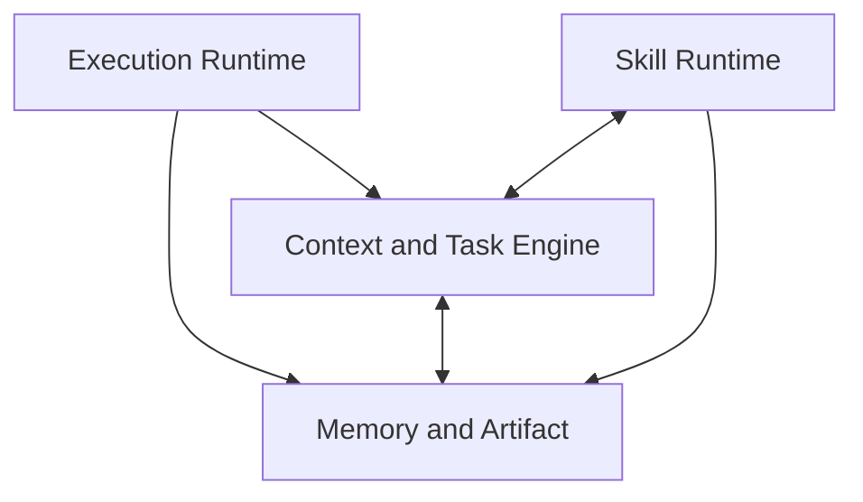
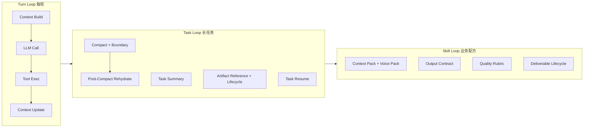
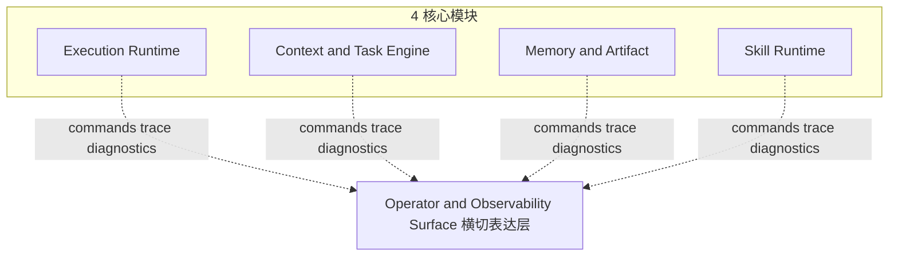
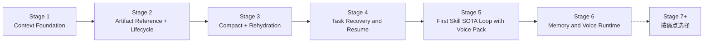

# Personal SOTA Agent OS Stage Plan V2

> **状态：已拆分**
>
> 本文已被拆分为两份新文档：
>
> - **稳定层**：[ARCHITECTURE.md](../ARCHITECTURE.md) ——25+ 轮挑刺仍屹立的核心架构总纲（4 视图 + 不变量 + 工程规则 + 6+1 stage 路线 + 反模式 + challenge 姿态）。
> - **决策层**：[OPEN_DECISIONS.md](../OPEN_DECISIONS.md) ——工程验证待回答（A 类）+ 总设计师待决策（B 类）+ 已暂答但保留挑刺空间（C 类）。
>
> **本文（V2）保留作历史**：是 7 轮迭代过程的完整记录与上下文背景，**不再作为权威架构来源**。后续 stage 节奏、架构判断、待决策项均以新文档为准。
>
> 拆分动机：本文 1100+ 行长度反映了过程性辩论被全部沉淀的事实——稳定层与决策层混在一起，导致每次 GPT 挑刺都要"读完整本"再判断，且容易陷入对架构稳定层的反复修订。拆分后稳定层独立可读，决策层独立可演进，过程性辩论冻结作历史。
>
> ⚠️ **不要再编辑本文**——架构修订请编辑 [ARCHITECTURE.md](../ARCHITECTURE.md)，决策回答请更新 [OPEN_DECISIONS.md](../OPEN_DECISIONS.md)。

---

本文是 `agent-os-runtime` 的**效果优先阶段规划 V2**，替代 [EFFECT_FIRST_STAGE_PLAN.md](EFFECT_FIRST_STAGE_PLAN.md)（V1）作为新一轮 stage 节奏与架构判断的权威来源。

它继承 V1 的核心动机（不无脑照抄、不过度优化、不平台化膨胀），但针对 V1 中暴露出的"治理 stage"、"compact 与 artifact 解耦"、"skill 与 long-task 解耦"等问题做了根本性重整。

V2 的核心定位是：**个人级 SOTA Agent OS，服务商业 / 运营 / 写作 / 策划 / 关键业务洞察类文档任务**。

它仍然以 [CLAUDE_CODE_REFERENCE_ROADMAP.md](CLAUDE_CODE_REFERENCE_ROADMAP.md) 为业务方向中心文档与 Claude Code 参考边界来源；本文只决定阶段节奏与架构反思，不决定业务方向。

## 0. 核心判断与方向调整

### 0.1 对 V1 的具体批评

V1 在能力枚举上较完整，但仍带有"企业级治理路线图"的惯性。具体问题如下：

- **Stage 2 是治理 stage 而不是能力 stage**：整个 stage 投入"旧代码能力矩阵 + golden case + 开工门槛模板"，对个人用户感知效果零提升。个人级 Agent OS 不需要用一整个 stage 做企业治理动作。
- **compact 与 artifact 被强行拆到不同 stage**：V1 把 compact 放在 Stage 3，artifact registry 推到 Stage 5。但 compact 没有 artifact 配套就是"半残"——长素材摘要后还是会被反复塞回 prompt，rehydration 也无法引用真实产物。Claude Code 中这两件事是同一条流水线（参考 [`compact.ts`](../../../claude_code/cc-recovered-main/src/services/compact/compact.ts) 中 `buildPostCompactMessages` 与 [`toolResultStorage.ts`](../../../claude_code/cc-recovered-main/src/utils/toolResultStorage.ts) 的 `<persisted-output>` 引用）。
- **Skill SOTA 与 long-task 能力解耦**：V1 是 Stage 3 做 long-task 抽象能力，Stage 4 才单独做"第一个 skill"。等于"先建工厂再找产品"，没有真实业务靶子去验证抽象设计是否对。
- **Operator Control Plane 单独成 stage（Stage 6）**：slash command 应该跟着能力一起诞生（做 compact 时出 `/compact`），而不是攒一个"控制面 stage"。
- **5 大模块边界模糊**：V1 的 `Cognitive & Context Engine` 与 `Persistent Memory & Assets` 中 Asset 部分边界不清；`Control Plane & Governance` 在个人级场景下不足以构成独立模块。
- **缺少个人级设计哲学**：V1 用 `default_on / default_off / debug_only / do_not_expand / frozen` 五分类做能力治理，这是企业用语。个人级 SOTA 用户要的是"开箱稳定、少操心、可解释"，不是"细颗粒度开关矩阵"。

### 0.2 三条不可妥协的设计原则

1. **个人级 SOTA 定义**：开箱可用、长任务稳定、产出有专业感、关键时刻可干预；不要求多租户、计费、审批、平台治理。
2. **能力咬合优先于路线图美学**：每个 stage 的能力必须直接搭载到下一 stage 的真实业务靶子上，不允许"先做抽象再找应用"。
3. **可观测、可关闭、可回退是质量基线，不是单独 stage**：golden case、能力开关、回退路径嵌入每个 stage，不再做"治理 stage"。

### 0.3 SOTA 定义的边界

- **算 SOTA 的事**：长任务不失忆、不爆上下文、能 compact + 续写、能引用历史产物、改稿不丢前版精华、第一个 skill 表现出"懂业务搭档"感。
- **不算 SOTA 的事**：能跑多租户、能并发多 agent、能做大型 A/B 实验、能在 Web UI 上拖拽 skill、能审批工作流。这些是企业级特征，与个人级 SOTA 正交，且强行追求会拖累效果。

## 1. 新架构：4 模块 + 3 loop

### 1.1 4 大模块（取代 V1 的 5 大模块）

下图聚焦 4 核心模块的数据流关系。完整架构（含横切 Operator & Observability Surface）见 [1.5 节](#15-横切控制面operator--observability-surface)。



数据流读法：

- `ER → CTE`：每轮 pre-run hook 由 ER 调用 CTE 完成 context build。
- `ER → MA`：tool 长结果在 post-tool-exec 直接写入 artifact registry（Stage 2 起）。
- `CTE ↔ MA`：CTE 拉取 memory recall 与 artifact 引用进入 prompt；rehydration 与 compact 摘要也由 CTE 装配 MA 数据回填。双向是数据流双向，**实现层仍是 CTE 调 MA 接口**——MA 不主动推送。
- `SR ↔ CTE`：SR 决定 context pack 与 skill 状态注入 CTE；CTE 反过来在 trace 中反映当前 skill 与 brief（让 `/context` 可见 skill 状态）。
- `SR → MA`：Stage 5 起 deliverable lifecycle 由 SR 写入 artifact registry。

- **Execution Runtime**：系统的执行底座，承载 Turn Loop。包含 Agno `Agent.run` 的封装层、pre-run hook（context build、runtime context、skill check）、tool exec、tool result lifecycle（外置 / 预算 / microcompact）、post-run hook（task summary update、candidate memory mark）。命名上去掉 "Loop"，强调它是空间维度的运行时，而不是时间维度的循环。
- **Context & Task Engine**：上下文与任务调度引擎，承载 Task Loop。包含 4 层上下文（runtime / external recall / working memory / attention anchor）+ compact + boundary + rehydration + task summary + diagnostics + budget + self-heal。`/context`、`/compact` 等命令归属此层。
- **Memory & Artifact**：持久化底座。长期记忆（Mem0 / Hindsight / Graphiti，沿用 V2）+ 任务级资产（artifact registry：长素材 / 长产物 / 版本 / 引用）。两者职责严格区分。
- **Skill Runtime**：业务配方层，承载 Skill Loop。包含 manifest + tools + context pack + output contract + quality rubric + brief extractor + brand / voice + feedback-to-signal。

> Control Plane 不再是单独模块，也不是单独 stage。slash command 与 diagnostics 跟随能力诞生，归属其能力所在的核心模块，但**共享一个统一的横切表达层**——Operator & Observability Surface（1.5 节）。这避免了"控制面 stage"的人为延迟，也避免了归属歧义。

### 1.2 3 个咬合的 loop（架构灵魂）



- **Turn Loop**：Stage 1 已完成（context diagnostics、budget guard、tool history budget、prompt-too-long self-heal v0）。本 V2 中不重复展开。
- **Task Loop**：Stage 2-4 主战场。Task Loop 不是一次到位，而是按"先 artifact + lifecycle、再 compact + schema、再 resume"的依赖顺序在 3 个 stage 中递进建立。Stage 4 完成后 Task Loop 才真正成为"跨会话稳定容器"。
- **Skill Loop**：Stage 5 主战场，用第一个高频 skill 站在 Task Loop 上做出"专业协作者感"，Battle 1 含 Voice Pack 手挂层。
- **Memory & Artifact**：贯穿 Task / Skill loop。Artifact 在 Stage 2 先行（因为 compact 摘要必须能引用 artifact），Voice Pack 在 Stage 5（核心配方），Memory candidate 与 Voice Runtime 在 Stage 6 集中处理（在 Pack 之上叠加自动学习层，永不替用户做不可逆决策）。

### 1.3 Memory / Asset / Artifact 三层职责严格区分（概念分层 + 底层统一存储）

V1 的最大模糊就是 Asset / Artifact / Memory 边界不清，导致 artifact registry 一直被当成"另一个 memory"推迟。V2 一度走到另一个极端——**只保留 Memory 与 Artifact 两层，把 Asset 一并吸进 Artifact**，结果违背了商业常理：用户上传一份 5 万字《品牌 VI 指南》，写春季方案要用、写朋友圈要用、写脚本也要用，**不该每开一个新 task 都重新上传**。

V2 修正后用 **"概念三层 + 底层两池"** 的方式收敛——三个层在 prompt 标签 / 召回策略 / 用户体感上严格区分；存储上 Memory 自成一池（沿用 Mem0 / Hindsight，避免短规则与长文档混存的多态反模式），Asset 与 Artifact 共享池 2（共享 `asset_store.py` 后端，让 promote 通道工程上自然成立）：

#### 1.3.1 三层概念边界（用户体感 + prompt 形态 + 召回策略不同）

| 层 | 范围 | 写入触发 | 默认召回范围 | prompt 形态 | 典型例子 |
| --- | --- | --- | --- | --- | --- |
| **Memory** | 跨任务**经验**（教训、偏好、画像、领域知识） | candidate review 后人工 pin | 跨 task | 隐式 `<memory>` 注入 | "该客户偏好简洁开头"、"避免 X 表达" |
| **Asset** | 跨任务**资产**（用户长期资料库） | 用户**显式入库**（`/asset ingest`）或 artifact promote | 跨 task | 显式 `<asset ref="..." digest="..."/>` | 品牌手册、客户画像、风格指南、竞品库 |
| **Artifact** | 任务级**素材与产物** | 任务内自动（tool 长结果）/ 用户本任务上传 / agent 产出 | 默认本 task；显式查询可穿透 | 显式 `<artifact ref="..." digest="..."/>` | tool 长结果、本任务一次性参考材料、产物草稿、版本（previous / current / final） |

**边界判定准则**："这份资料用户希望它跟随多个未来任务一起活下去，还是只服务于当前任务？"——前者 Asset，后者 Artifact。

#### 1.3.2 底层两池（**不是一池**——避免多态反模式）

V2 早期版本曾错误地写过"Memory / Asset / Artifact 底层一池"。这是工程上的多态反模式：

- Memory 是短文本规则（教训 / 偏好 / 画像），数据量小、需高频更新、需双时态、需合并 / 升降权——其存储与 vector 空间需求与长文档完全不兼容；
- Asset / Artifact 是长文档（5 万字品牌手册 / 30 轮改稿稿件），需 chunking、全文检索、文件路径追踪；
- 把 50 字的 Memory 与 5 万字的 Asset chunk 塞进同一个 vector 空间，会让"召回品牌红线"返回一坨 50 字教训和 5 万字长文混排的结果，权重无法统一计算。

V2 修正为**两池**——这与现状一致（V2 现在 Mem0 / Hindsight 早就是 Memory 池，`asset_store.py` 是另一池），不是新引入的复杂度，而是对错误承诺的纠正：

| 池 | 内容 | 存储后端（建议） | 与 prompt 标签的对应 |
| --- | --- | --- | --- |
| **池 1：Memory 池** | 短规则 / 教训 / 偏好 / 画像 | 沿用 [Mem0](../src/agent_os/memory/) + [HindsightStore](../src/agent_os/memory/hindsight_store.py)，SQLite + 轻量向量；强 schema 校验 | `<memory>` |
| **池 2：Asset / Artifact 池** | 长文档（用户上传素材、tool 长结果、agent 产出版本） | 沿用 / 扩展 [`asset_store.py`](../src/agent_os/knowledge/asset_store.py)（LanceDB chunk + SQLite 元信息）；artifact 子模块复用同一后端 | `<asset ref>` / `<artifact ref>` |

**池 2 内部仍是同池**——这是 promote 通道（见 1.3.3）的工程基础：Asset 与 Artifact 数据形态相同（都是长文本 / chunk），promote 是同池字段更新；而 Memory 与 Asset / Artifact **不互通**，没有 promote 路径。

**池 2 schema 关键字段**：
- `kind`: `asset | artifact`
- `task_id`: 对 Asset 为空（workspace 级），对 Artifact 为该 task 的 session_id
- `pinned_for_workspace`: bool（artifact promote 后置 true，跨 task 可见）
- `subkind`: `source | deliverable | tool_result`（Artifact 用）/ `brand_manual | persona | competitor | reference | voice`（Asset 用 category）
- `status`: `active | archived | deleted`（见 Stage 2 子项 6 lifecycle）
- `tags`、`digest`、`last_accessed_at`、`created_at`

**召回不物理隔离（仍只适用于池 2 内）**：默认 artifact 召回限当前 task；但**用户显式查询可穿透**（如用户问"昨天那份竞品分析" → LanceDB 跨 task 召回，权重略低）。这避免"昨天 task 的内容今天彻底消失"的反人类体感。**Memory 池的召回策略由 Mem0 / Hindsight 自有机制决定，与池 2 无关**。

#### 1.3.3 两条提升通道（避免边界僵化）

- **Artifact → Asset（池 2 内同池字段更新）**：用户对某 artifact（如 final delivery）显式 promote，该行的 `kind` 从 `artifact` 改为 `asset`、`pinned_for_workspace=true`，进入主动召回范围。**这是给同一条记录打标签，不是复制数据**。Stage 5 Battle 4 提供 `/artifact promote --to-asset` 命令。
- **任意 → Memory candidate（跨池路径，需用户确认）**：Asset 或 Artifact 在使用过程中产生的"经验"（"这条品牌红线写春季方案时容易忘"）由 Stage 6 的 candidate extractor 抽取为 Memory candidate，**写入 Memory 池**，人工确认后入召回。**资料本身不会变 memory**——这是从池 2 的"使用日志"中提炼一条短规则进池 1，原始资料留在池 2 不动。

#### 1.3.4 三者在 prompt 中永不互替

prompt 中三者**仍以不同标签出现**（`<memory>` / `<asset ref>` / `<artifact ref>`）。这是 attention 管理与诊断回溯的需要——agent 看到 `<asset ref>` 应当作长期资料对待，看到 `<artifact ref>` 应当作任务级素材对待，召回失败时也能在 trace 中分别归因。

**落地说明**：
- Memory 池**不需要新建模块**，沿用 Mem0 / Hindsight。
- Asset / Artifact 池**不需要新建独立包**——已有的 [`asset_store.py`](../src/agent_os/knowledge/asset_store.py) 是该池的代码归属，artifact 子模块复用同一后端（`src/agent_os/artifact/` 或并入 `knowledge/`）。
- V2 只规范 kind / subkind / status 字段语义，不引入新存储层。

### 1.4 4 模块与 V1 5 模块的关键差异

- V1 把 "Persistent Memory & Assets" 打包，导致 Asset / Artifact 一直被推后到 Stage 5。
- V2 在同一模块下把 **Memory / Asset / Artifact 三层**职责严格区分，让 artifact 能在 Stage 2 与 compact 同步出现，同时为 asset 留出跨任务通道（避免"换任务就要重新上传 5 万字"的灾难）。
- V1 "Control Plane" 独立成模块，导致 slash command 攒到 Stage 6 才出。
- V2 commands 跟随能力诞生，避免人为延迟，并由"横切控制面"统一形态约束（见 1.5）。

### 1.5 横切控制面：Operator & Observability Surface

V2 的完整架构语言是 **4 核心模块 + 3 运行 loop + 1 横切 Operator & Observability Surface**。Surface 不是第五个核心模块，也不是独立 stage，而是 4 核心模块对外的**统一形态层**。



> **代码上的 Surface 是什么？澄清"形态约定" vs "实现位置"**
>
> 经常被问到："Surface 既然不是模块，那用户输入的 `/compact` 在代码上谁来解析、谁来路由？" 回答：
>
> **在工程语义上，Surface 等价于一层极薄的 Controller / Dispatcher**。它的**实现位置**就是已有的 [`cli.py`](../src/agent_os/cli.py)（CLI 命令分发，基于 click）与 Web 层的 [`/api/chat` 路由](../src/agent_os/web)（基于 FastAPI）。**不需要新建 `surface/` 包，也不需要新建 `controller/` 包**——薄 dispatcher 该在哪就在哪。
>
> 那为什么不直接把它叫做"第五个 Controller 模块"？因为 V1 Control Plane 的退化路径就是这样开始的：一旦给它"模块"身份，就会有自己的 stage、自己的 DoD、自己的 golden case，然后慢慢长出权限、计费、治理。V2 用 "**形态约定 + 5 条红线**" 的措辞守住边界——**承认它在代码上是 Controller / Dispatcher，否认它在架构上是第五个核心模块**。
>
> 简言之：
>
> - **形态约定**（5 类）：1.5.1 节描述的 dispatcher **写法规则**（命令命名、双格式输出、trace 命名空间、dry-run、开关可见性）。
> - **实现位置**：`cli.py` + `web/api`，命令解析与转发的薄 dispatcher 层，不持有跨模块状态、不做业务编排。
> - **5 条红线**（1.5.4 节）：守住 dispatcher 不变胖的判定准则。

#### 1.5.1 Surface 是什么（正面定义）

Surface 只规定五类东西的**统一形态**：

1. **Slash Command**：命名规则、参数约定、`--dry-run` 支持、输出格式（结构化 + 人读双轨）。
2. **Diagnostics**：JSON + Markdown 双格式，结构化字段优先。
3. **Trace**：字段命名空间、可查询性、与能力模块对应。
4. **Smoke / Golden Case 入口**：每个 stage 的验证入口在此统一暴露（CLI subcommand + Web API 等价）。
5. **开关与回退可见性**：5 个核心 boolean 开关（`artifact_enabled`、`asset_enabled`、`compact_enabled`、`rehydration_enabled`、`auto_compact_enabled`，详见 3.5 节）在 surface 层可被查看、可被修改、状态可被诊断。**但开关的状态所有权归各核心模块**——surface 只提供查看入口与修改通道，**不持有任何配置态**。例如 `compact_enabled` 的真实状态归 Context & Task Engine 拥有；surface 只负责展示与转发用户的修改意图到该模块。

#### 1.5.2 归属规则（实现位置永远在核心模块）

Surface 只规定"如何被看见和调用"，**实现归属其能力所在的核心模块**：

- `/context`、`/compact` 的实现归 **Context & Task Engine**。
- `/artifact list|show|diff`、`/memory candidates|pin|drop` 的实现归 **Memory & Artifact**。
- `/skill list|switch`、`/brief`、`/rubric`、`/deliverable`、`/voice` 的实现归 **Skill Runtime**。
- 跨模块命令归"主导模块"（即用户触发该命令时的主要意图所在模块），跨模块影响通过模块间正常接口流动，**surface 不做特殊协调、不持有跨模块协调状态**。例：`/skill switch` 归 Skill Runtime；它对 context pack 的影响通过 Context & Task Engine 正常订阅 skill 变更接口完成，surface 层无任何中间状态。

#### 1.5.3 形态约定（统一规则）

- **Trace 命名空间必须与核心模块对应**：`context.*` / `compact.*` / `artifact.*` / `skill.*` / `memory.*` / `task.*`。**禁止 `surface.*` 这种 surface 自有字段**——surface 不该有自己的状态。
- **CLI / Web 等价性（分级）**：完全硬等价会拖慢早期交付，本约定按观察 / 操作两类分级：
  - **L1（必须等价，硬约束）**：状态、trace、diagnostics 必须在 CLI 与 Web `/api/chat` trace 中等价可见。任何能在 CLI 看到的诊断字段、boundary、artifact 引用、boolean 开关状态、`task_id`，都必须能在 Web trace 中看到等同信息。
  - **L2（允许 CLI-first，软约束）**：交互命令（如 `/artifact diff`、`/voice ingest <file>`、`/task new`）允许 CLI 先行实现。Web 上必须满足两条：（a）可见同等状态（如 Web 上能看到 artifact id 与"可 diff"标记），（b）若该通道暂不支持操作，必须显式标注（如"该操作暂仅 CLI 可用，请在终端执行 `/artifact diff <id1> <id2>`"），不得静默缺失。
  - **L3（永不允许）**：任一通道有该命令的状态副作用，但另一通道**完全看不见状态变化**。这会让 surface 的"统一形态"承诺破裂。
- **双格式输出**：所有 diagnostics 命令同时支持结构化 JSON（`--json`）与人读 Markdown（默认）。Trace 字段在 JSON 中暴露，便于程序消费。
- **dry-run 优先**：会改变状态的命令（`/compact`、`/memory pin`、`/voice switch`、`/task new`）默认提供 `--dry-run` 输出预期效果不入库。

#### 1.5.4 五条红线（防止退化为 V1 的 Control Plane）

- **不设 Operator Surface Stage**：surface 不拥有自己的 stage、自己的 DoD。它的内容完全继承自 4 核心模块在每个 stage 的产出。
- **不新增独立 `control_plane/` 包**：surface 是形态约定，不是代码模块。底层实现仍在 [`cli.py`](../src/agent_os/cli.py)、Web `/api/chat` trace、[`context_diagnostics.py`](../src/agent_os/context_diagnostics.py) 等已有位置。
- **不为 surface 单独设计 golden case**：golden case 归核心模块（Stage 4 集中收口的 GC 全集合验证 artifact / asset / lifecycle / cross-task / compact schema / task resume），surface 只复用。
- **不把权限、计费、多租户、审批流塞进 surface**：这些是企业级 control plane 的内容，与个人级 SOTA 定位冲突。
- **不把 dispatcher 长成"上帝服务"**：CLI / Web 实现上必然存在一层薄 command dispatcher（如 click / FastAPI 路由表），这是**允许**的。但 dispatcher 必须保持"薄"——只做命令解析与转发，**禁止承载业务编排、状态协调、跨模块生命周期管理、缓存策略、权限决策**。一旦 dispatcher 开始持有跨模块状态或代替核心模块做决策，surface 就会反向变成第五个核心模块。判定标准：dispatcher 中不应出现"如果 X 则调 Y 模块再调 Z 模块"的多步编排；如有，必须下沉到核心模块。

> Surface 的本质：**观察与干预的统一形态，不是系统的第五个业务模块。**

## 2. 新阶段路线

### 2.0 贯穿全局的原则：Skill 作为测试载体

> V2 警惕"先建工厂再找产品"——但 V2 自己也容易掉进同样的坑：Stage 2-4 是 Task Loop 工厂，如果用闲聊式长会话作为 GC，到 Stage 5 一接入 `business_writing` 就崩溃。

**原则**：`business_writing` 不是 Stage 5 才出场的角色，而是 **Stage 2-4 的测试载体**。所有 golden case 必须用 business_writing 真实业务场景设计，禁止用闲聊场景。Stage 5 是该 skill 的**实现 stage**（context pack / brief extractor / lifecycle 等业务配方），不是它的**首次出场 stage**。

**落地约束**：

- **Stage 5 的 skill 选择记录前置到 Stage 2 开工前**：原 5.1 节的"开工前必须形成选择记录"必须在 Stage 2 入口完成，**不能等到 Stage 5**——因为 Stage 2-4 的 GC 设计依赖这个选择。
- **Stage 2 / 3 / 4 的所有 GC 必须使用 business_writing 真实业务场景**：长素材必须是商业资料（品牌手册、竞品文档、客户画像、运营方案）；长会话必须是改稿 / 策划 / 文案场景；tool 长结果必须是真实业务调研返回；compact 后续写必须验证品牌红线、目标受众、关键约束不丢失。
- **Stage 5 的 7 个 battle 仍按原顺序串行交付**：测试场景前置 ≠ skill 实现前置。Battle 1（context pack）依赖 Stage 4 task summary 接口，Battle 4（lifecycle）依赖 Stage 2 artifact 索引，Battle 6（feedback-to-signal）依赖 Stage 3 rehydration——**实现层面**仍按依赖顺序，**测试层面**全程使用 business_writing。

**关键边界（避免"测试假象"）：输入用业务场景、断言用结构化字段**：

  Stage 2-4 容易陷入的陷阱是——用了 business_writing 场景，就开始按"写得好不好"评判 GC。这会让 voice / output contract / rubric 还没建起来时（Stage 5 才有），底层基建陷入"调 prompt 语气"的泥潭，归因不清（compact 错？还是 LLM 弱？）。

  V2 强制把"输入"与"断言"严格切开：

  | | 输入语料 | PASS / FAIL 断言维度 |
  | --- | --- | --- |
  | **Stage 2-4 GC** | business_writing 真实商业场景（坚持） | **只看结构化字段命中**（schema 字段是否齐全 / artifact ref 是否丢失 / cross_task_hit 是否成立 / brief 5 字段是否复述 / `resume.budget` 是否达成 / `current_artifact_refs` 是否非空）。**不看业务美感**。 |
  | **Stage 5 SGC** | business_writing 真实商业场景 | 业务美感（语气、品牌感、读起来像不像专业稿）作为评判维度——**这是 voice pack / output contract / rubric 真正生效后才能评判**，提前评判会归因不清。 |

  **不允许的偷懒形态**（任何 Stage 2-4 GC 都不允许）：
  - 用"看起来还行 / 写得不错 / 比不开 compact 强"作为通过条件——这些是**人主观印象**，不是字段级断言。
  - 用"agent 没报错"代替"字段是否齐全"——错误路径与字段缺失是两件事。
  - 通过条件含糊到 reviewer 之间会有分歧——必须能写成 boolean 断言（"goal 字段非空 = true / false"）。

  **唯一例外**：GC-Resume 子项 (b) "续写连贯性"是 Stage 4 唯一允许人评判的子项，但仍要求**具体证据**（agent 必须显式引用前段词句作为衔接证据）——不是"读起来感觉连贯"。这是因为 resume 体感本身就是 Stage 4 的卖点，不能完全去主观化；但其他 Stage 2-4 GC 不允许这种例外。

**Stage 2 开工前的 skill 选择记录**（提前到此处）：

```markdown
### First Skill SOTA Candidate

- 选定 skill：（推荐 business_writing）
- 选择理由：
  - 高频，能产生真实失败案例
  - 多轮改稿场景天然多，明显受益于 Stage 3 compact + Stage 2 artifact
  - 长素材引用场景天然多（品牌手册、竞品案例、客户画像）
  - 输出质量可由少量 golden case 判断（开头三段、结构、品牌一致性）
  - 不依赖外部系统
- 真实失败案例（来自当前手写或 Stage 1 实验中的真实需求）：
- Stage 2-4 GC 必须复现的 5 个 business_writing 真实场景：
- Stage 5 SGC1-SGC3 的初步设想：
- 不选择其它候选（如 script_drafting）的理由：
- 可关闭 / 可回退路径：
```

> 该选择记录在 Stage 5.1 节会被引用，但**必须在 Stage 2 开工前完成**——这是 V2 整条路线的真正起点。

### Stage 1（已完成）：Context Foundation

保持原状。已完成能力：

- `/context` diagnostics（结构化 + Markdown）
- budget guard（warning / danger / over_budget / current user 高占比提示）
- tool history budget（单条 + 聚合预算 + trace 统计）
- prompt-too-long self-heal v0（确定性低优先级裁切，永不裁 current user）
- Stage 1 final smoke

实现位置：[`context_builder.py`](../src/agent_os/context_builder.py)、[`context_diagnostics.py`](../src/agent_os/context_diagnostics.py)、[`runtime_context.py`](../src/agent_os/runtime_context.py)。

SOTA 感：系统已经具备基础 Harness 味道，不再盲跑 prompt。

### Stage 路线总览

V2 把 Task Loop 拆成 3 个递进 stage（Stage 2 / 3 / 4），让"先 artifact、再 compact、再 task recovery"的依赖顺序成为 stage 顺序，而不是 stage 内部子序号。这避免了原 V2 把 Task Loop 全部塞进一个 stage 的"milestone 而非 stage"问题。Stage 4 同步把 Golden Case 收口为贯穿全栈的工程基线（不是产品交付）。



每个 stage 的架构不变量（一句话承诺）：

- Stage 1：Turn Loop 稳定，不爆上下文。
- Stage 2：长内容必须 artifact 化，不再直接塞 prompt；artifact 生命周期闭环（archive / clean / 孤儿盘点），但永不 TTL。
- Stage 3：长会话可被 compact 并以结构化 schema 恢复目标，Task Loop 核心闭环成立。
- Stage 4：用户离开后 `/task resume` 两轮内复现工作面，Task Loop 成为跨会话稳定容器；Golden Case 同步收口为贯穿基线。
- Stage 5：skill 是业务配方（含 Voice Pack 手挂层）而非 prompt，Skill Loop 站在 Task Loop 之上。
- Stage 6：经验沉淀显式可解释，Memory 候选与 Voice Runtime（在 Pack 之上叠加自动学习层）都需用户确认才生效。
- Stage 7+：自动化与扩展，按真实痛点决定。

### Stage 2：Artifact Reference Foundation

**核心目标**：先解决"长东西不能直接塞 prompt"。compact、task summary、skill 都需要"引用什么"，所以 artifact 语义必须先于 compact 落地。

**架构不变量**：长内容（长素材、长产物、工具长结果）必须以 artifact 形式入库，prompt 中只保留短引用。

**重点模块**：`Memory & Artifact`（主：artifact + asset，底层共享存储池）+ `Context & Task Engine`（task ≡ session 约定，封装 agno session）+ `Execution Runtime`（tool result lifecycle 联动）。

> **Skill 作为测试载体**：本 stage 起，所有 golden case 必须用 `business_writing` 真实业务场景设计（长篇商业素材、品牌手册、竞品文档、运营方案、改稿流程），**禁止用闲聊式长会话设计 GC**。这避免 V2 的 Task Loop 在 S5 之前长在真空里。详见第 2 节顶部"Skill 作为测试载体"原则。

**Claude Code 参考**：

- [`src/utils/toolResultStorage.ts`](../../../claude_code/cc-recovered-main/src/utils/toolResultStorage.ts)：`maybePersistLargeToolResult`、`<persisted-output>`、`enforceToolResultBudget` 的"超阈值持久化 + 预览 + 路径"三段式与"已决策 ID 冻结"。

#### 2.1 做的事

0. **Task ≡ Session 约定**（`Context & Task Engine`，Task Loop 入口锚点）

   - **核心约定**：V2 不引入独立 Task 实体——`task_id` 在工程上**就是** `session_id` 的逻辑别名。agno 框架的 session DB 已经承担 task 锚点职责（`session_id`、`created_at`、`status`），**不再单独建 `data/tasks/index.jsonl`**。这避免 V2 早期"幽灵 Task 模块"导致的多端同步脑裂风险。
   - **范围严格限定**：本子项只承诺"用户在业务语境里说的 task 与工程语境里的 session 一一对应"。`task_id` 作为别名出现在：artifact 外键、`/context` 显示、Stage 4 task summary 字段。**不承诺**任务内容理解、自动 task boundary 检测、跨 session 任务延续。
   - **归属说明**：Task 是 Task Loop 的业务概念，承载者是 Context & Task Engine（CTE）——CTE 通过封装 agno session 来表达 task 语义，**不重新发明持久化层**。Memory & Artifact 按 `task_id`（即 `session_id`）外键索引 artifact。
   - **代码形态**：CTE 暴露 `current_task_id() -> str` 接口，实现就是 `return current_session_id()`；`/task new` = agno 开新 session；`/task show` = 显示当前 session 的元信息（叠加业务语境如"已 N 轮"、"使用 skill X"）。
   - 与 Stage 4 的关系：Stage 4 task summary 在物理上**就是 session summary 的高阶业务字段**（存在 session DB 的 summary 字段或 SessionState 的扩展中）。schema 在 Stage 3 Compact Summary 处定义并由 Stage 4 复用，详见 Stage 3 子项 3 与 Stage 4 子项 1。
   - **未来路径**：如果有一天真的出现"一 session 多 task"或"一 task 跨 session"的真实需求（例如用户反馈"我想在同一对话里切换 task"），届时再升级为独立 task_id。**当前 V2 不预先做这个抽象**——大道至简。

1. **Artifact Registry v0**（`Memory & Artifact`，**池 2**——见 1.3.2）

   - 落地位置：新增 `src/agent_os/artifact/` 模块（或合并入 `knowledge/`），与已有 [`asset_store.py`](../src/agent_os/knowledge/asset_store.py) **共享池 2 同一底层存储**（LanceDB chunk + SQLite 元信息）。
   - 索引形态：池 2 索引每行含 `blob_id`、`kind=artifact`、`task_id`（即 session_id）、`source`、`subkind=source|deliverable|tool_result`、`digest`、`created_at`、`usage_rule`、`pinned_for_workspace=false`、`tags=[]`、`status=active|archived|deleted`、`last_accessed_at`。
   - 文件形态：池 2 长文档 + chunk 存于 `asset_store.py` 后端目录（不再按 task 分目录——task_id 是字段而非路径）。
   - prompt 形态：`<artifact ref="art_xxx" subkind="source|deliverable|tool_result" digest="..." usage="evidence_only"/>`。
   - **召回不物理隔离（仅池 2 内）**：
     - 默认召回：当前 `task_id` 的 artifact + workspace 级 asset；
     - **显式查询可穿透**：用户问"昨天那份竞品分析"或召回打分高于阈值时，可跨 task 召回（trace 中明示 `cross_task_hit=true`，权重略低）；
     - `/artifact list --all-tasks` 命令可显式列出全部 task 的 artifact。
   - **不与 Memory 池混存**：Memory 沿用 Mem0 / Hindsight 池 1，与本 registry 之间没有 promote 路径，仅通过 Stage 6 的 candidate extractor 跨池抽取经验（详见 1.3.3）。

2. **Asset Store v0**（`Memory & Artifact`，跨任务资产层，**池 2 内 `kind=asset`**）

   - **为什么作为独立概念**：用户长期沉淀的资料（品牌手册、客户画像、风格指南、竞品库）在 prompt 中以 `<asset ref>` 出现、召回策略主动而非被动、用户意图明确"以后多个任务都用"。这些**用户体感差异**不是 tag 能区分的，因此保留 Asset 概念。
   - **与 artifact 同池（池 2）**：复用 [`asset_store.py`](../src/agent_os/knowledge/asset_store.py) 的 LanceDB + SQLite 后端，与 artifact 同表区分字段。`kind=asset` 的 blob 没有 `task_id`（workspace 级）。**不需要新建模块**，[`asset_store.py`](../src/agent_os/knowledge/asset_store.py) 在本 stage 被正名为池 2 的代码归属。
   - 索引形态：池 2 同一索引中以 `kind=asset` 与 artifact 区分，并具备 `category`（如 `brand_manual|persona|competitor|reference|voice`）与 `tags`。
   - prompt 形态：`<asset ref="ast_xxx" category="brand_manual|persona|competitor|reference|voice" digest="..." usage="evidence_only"/>`。
   - 写入触发：**用户显式入库**，不自动入库。`/asset ingest <file>` 或 `/asset ingest --paste` 显式触发。
   - 召回：在 ContextBuilder 中按当前 brief / skill 的 `recall_strategy` 主动召回相关 asset；本 stage 提供最小召回（关键词 + tag），Stage 6 的 explainability 适用于 asset。
   - 不做：自动相似性合并、自动 asset 升级、跨 workspace 共享、asset 自动学习。

3. **Tool 长结果 Artifact 化**（`Execution Runtime` 与 `Memory & Artifact` 联动）

   - 在 post-tool-exec 钩子中检测 tool result 长度，超阈值自动入库为 `kind=artifact, subkind=tool_result` 的 blob（写入当前 `task_id` 下），prompt 中替换为短引用。
   - 借鉴 `maybePersistLargeToolResult` 的"超阈值持久化 + 预览 + 路径"三段式。

4. **长素材入库的默认行为**（避免反人类交互）

   用户上传或粘贴长文时，系统**默认入 Artifact，不强迫用户提前判断**：

   - **默认行为**：用户在对话中粘贴或上传 → 自动入 Artifact（subkind=source），归当前 task。
   - **显式入 Asset**：用户用 `/asset ingest <file|--paste>` 命令时才入 Asset。
   - **跨 task 引用不需要先 promote**：因为池 2 内底层共享 + 召回不物理隔离，用户在新 task 里直接问"昨天那份会议纪要"也能召回（cross_task_hit），即使没有 promote。
   - **Promote 通道**（Stage 5 Battle 4 引入）：用户对某 artifact 显式 `/artifact promote --to-asset` 后，该 blob 的 `kind` 从 artifact 变成 asset、`pinned_for_workspace=true`，进入主动召回范围。**这只是给同一条记录打标签，不复制数据，不跨平行宇宙**。

5. **Artifact / Asset Trace / Diagnostics**

   - 在现有 `ContextTrace` 中增加 `artifact.*` 与 `asset.*` 命名空间字段：本轮被引用的 artifact id 与 asset id 列表、引用占用的 prompt 字符数、是否有召回失败、当前 `task_id`、是否有 `cross_task_hit`。
   - `/context --json` 中可查询该轮 artifact 与 asset 引用全貌，二者分别统计；cross_task_hit 显式标注。
   - 每次召回命中会更新对应 blob 的 `last_accessed_at`，作为后续孤儿盘点的输入（见子项 6）。

6. **Artifact Lifecycle 补全：archive / clean / 孤儿盘点**（`Memory & Artifact`）

   - **背景**：Stage 2 早期版本只规定了 artifact 的"写入 + 召回 + promote"，没有"删除"路径。在 50 轮长 task 中，过程草稿、检索结果、tool 长返回会持续累积成 zombie blob，硬盘与 LanceDB 索引会膨胀。本子项补齐这一闭环。
   - **设计原则（关键）**：**绝不做 TTL 自动删除**——个人级 SOTA 的核心是"系统不替用户做不可逆决策"。所有删除路径必须有用户显式触发或显式确认。
   - 三个动作（按破坏性递增排列）：
     1. `/task archive <id>`（软删除，可恢复）：把指定 task 下所有 `kind=artifact AND pinned_for_workspace=false` 的 blob 的 `status` 置为 `archived`。archived blob 不参与默认召回与 cross_task 召回，但仍占磁盘、仍可查询。`/task unarchive <id>` 反向恢复。Web 与 CLI 等价（按 1.5.3 L2 要求）。
     2. `/task clean <id>`（硬删除，不可恢复）：删除指定 task 下所有 `kind=artifact AND pinned_for_workspace=false` 的 blob 的文件与索引行（不动 promote 过的 asset、不动其他 task）。**默认 dry-run，先列出将删除的 blob 数与体积，二次确认后才真删**。失败时 atomic rollback。
     3. `/blob gc --orphan [--days N]`（只列不删）：列出 N 天（默认 30）内 `last_accessed_at` 未更新且未 promote 的 blob，作为用户决策输入。**该命令永远不删除**——只把候选清单交给用户，用户自行用 `/task archive` 或 `/task clean` 处理。
   - 状态字段语义：`active` 为参与召回；`archived` 为不参与召回但保留；`deleted` 为已物理删除（索引行可保留作 audit，文件已删）。
   - 召回管道在每条 blob 检查 `status=active`，archived / deleted 自动跳过。

7. **Slash Commands 同步出**

   以下命令构成本 stage 在 Operator & Observability Surface 上的扩展，归属对应能力模块，统一遵循 1.5 节的形态约定。

   - `/task new` / `/task show`（归 **Context & Task Engine**，物理上即 agno 开新 session / 显示当前 session 元信息）：开新 task / 显示当前 `task_id`（即 session_id）。
   - `/task archive <id>` / `/task unarchive <id>` / `/task clean <id>`（归 **Memory & Artifact**，归属说明：lifecycle 是"对 blob 的批量操作"，task_id 只是范围筛选条件）：见子项 6。
   - `/artifact list [--all-tasks] [--include-archived]`（归 Memory & Artifact）：默认列出当前 task 的 active artifact；`--all-tasks` 列全部；`--include-archived` 包含 archived。
   - `/artifact show <id>`（归 Memory & Artifact）：查看单条 artifact 内容（archived 也可查）。
   - `/asset list` / `/asset show <id>` / `/asset ingest <file|--paste>`（归 Memory & Artifact）：列出 / 查看 / 显式入库 asset。
   - `/blob gc --orphan [--days N]`（归 Memory & Artifact）：列出孤儿候选，**只列不删**。
   - `/context`（已有，归 Context & Task Engine）：本 stage 扩展显示当前 `task_id`、artifact 引用占用、asset 引用占用（分别统计）、是否有 cross_task_hit。
   - 落地位置：扩展现有 [`cli.py`](../src/agent_os/cli.py) 与 Web `/api/chat` trace。surface 层不新增独立包。

#### 2.2 明确不做

- **不做 compact**（推到 Stage 3）。
- **不做 task summary / 自动 task boundary / 跨 session 任务延续**（全部推到 Stage 4；本 stage 的 task 与 session 严格一一对应）。
- **不做独立 Task 实体表**（`data/tasks/index.jsonl` 不存在；task 全部依附 agno session DB）。
- 不做 deliverable lifecycle（current / previous / final，推到 Stage 5 与 skill 联动）。
- 不做 `/artifact diff`、`/artifact promote`（推到 Stage 5 Battle 4，需要 lifecycle 支撑）。
- 不做 asset 自动相似性合并、asset 自动学习、跨 workspace 共享、artifact 治理 UI。
- 不做 asset 召回的高级 explainability（推到 Stage 6 与 memory recall explainability 一起做）。
- **不做 TTL 自动删除**——所有删除都必须用户显式触发（`/task clean` 仍要二次确认）。`/blob gc` 只列不删。

#### 2.3 SOTA 感

- 用户在 Task A 用 `/asset ingest` 入库一份 5 万字品牌手册，**Task B 开工时该手册仍可被自动召回**，无需重新上传。
- 用户在 Task A 中聊到一份调研结果（自动入 artifact），第二天开 Task B 直接问"昨天那份调研"，**系统跨 task 召回成功**——artifact 不会"消失在另一个平行宇宙"。
- 用户在对话中粘贴本任务一次性参考材料，agent 不再把原文塞进每轮 prompt，而是入 artifact、引用一次、digest 进入上下文。
- 工具调用返回大块结果，自动入 artifact，不污染下一轮历史。
- 任务结束后用户可一键 `/task archive <id>` 把过程草稿打包封存（不参与召回但保留可恢复）；想彻底清空时 `/task clean` 二次确认即清——**硬盘干净度由用户掌控，系统不偷偷删数据**。
- `/context` 中能看到本轮引用了哪些 artifact 与 asset、各占多少预算、属于哪个 `task_id`、是否有 cross_task_hit。

#### 2.4 Stage 2 完成 DoD

- 至少 5 个 golden case（输入：business_writing 真实商业场景；断言：见 2.0 节"输入用业务场景、断言用结构化字段"原则）：
  - **GC2（长素材输入·商业场景）**：输入：用户上传 50k+ 字符的真实商业素材（品牌 VI 指南 / 竞品方案）。**字段级断言**：(i) 该素材入 artifact 而非进入对话历史；(ii) prompt 中 `<artifact ref>` 占用 ≤ 配置上限；(iii) 原文 chunk 在 asset_store 后端可检索；(iv) ContextTrace 的 `artifact.referenced_ids` 含该 artifact id。
  - **GC3（工具长结果·商业场景）**：输入：触发联网检索 + 长文档读取等工具返回真实业务调研结果。**字段级断言**：(i) 超阈值的 tool result 入 `kind=artifact, subkind=tool_result`；(ii) prompt 中替换为 `<artifact ref>`；(iii) `artifact.tool_result_count` ≥ 触发数；(iv) 多个 tool result 合计超预算时仍不爆 prompt。
  - **GC-Asset（跨任务资产复用）**：输入：Task A `/asset ingest` 入库品牌手册 → Task B 开新 session。**字段级断言**：(i) Task B 的 ContextTrace 含 `<asset ref>` 指向该手册；(ii) 召回到的 chunk 在数据上与原文一致；(iii) `task_id` 字段确认 Task B 的 session_id ≠ Task A。
  - **GC-CrossTask（跨 task artifact 召回·验证 1.3.2 不物理隔离承诺）**：输入：Task A 中 agent 自动入库竞品分析 artifact → Task B 中用户问"上次那份竞品分析"。**字段级断言**：(i) Task B 的 ContextTrace 含 `cross_task_hit=true`；(ii) 召回的 artifact id 与 Task A 入库的一致；(iii) 召回 chunk 内容与原文一致；(iv) `<artifact ref>`（不是 `<asset ref>`，因未 promote）形态正确。
  - **GC-Lifecycle（artifact 生命周期闭环）**：输入：单 task 内跑 50 轮 business_writing 流程（含联网检索 + 多版改稿）。**字段级断言**（按命令分段）：
    - **archive**：执行 `/task archive <id>` 后，召回查询结果中该 task 的 active artifact 数 = 0；该 task 的 artifact `status=archived`；执行 `/task unarchive <id>` 后 active 数恢复。
    - **clean**：执行 `/task clean <id>`（二次确认通过）后，被清的 blob 文件不存在 / 索引行 `status=deleted` 或物理删除；promote 过的 asset 数量不变；其他 task 的 artifact 数量不变。
    - **gc**：`/blob gc --orphan` 输出非空候选清单时，**实际 blob 数量与 status 不变**（grep 校验：该命令的实现路径不能调用任何写操作）。
    - **TTL 校验**：grep 整个 src 目录无 `ttl|expire|auto_delete` 等 TTL 相关代码路径。
- Task ≡ Session 约定跑通：`/task new` 直接调 agno 开新 session；artifact 外键 `task_id` 即新 session_id；底层无 `data/tasks/index.jsonl`。
- `/task show`、`/task archive|unarchive|clean`、`/artifact list [--all-tasks][--include-archived]|show`、`/asset list|show|ingest`、`/blob gc --orphan` 在 CLI 可用（Web 等价性见 1.5.3 分级要求；`/task clean` 默认 dry-run + 二次确认）。
- artifact 与 asset 在**池 2**（[`asset_store.py`](../src/agent_os/knowledge/asset_store.py) 后端：LanceDB chunk + SQLite 元信息）共享底层，通过 `kind` 字段区分；索引可按 `kind` / `task_id` / `pinned_for_workspace` / `status` 检索；blob schema 含 `status: active|archived|deleted` 与 `last_accessed_at`。Memory 沿用 Mem0 / Hindsight 池 1，与池 2 不混存。
- prompt 中 artifact 与 asset 引用占比、cross_task_hit 在 trace 中可查；archived blob 不进 trace 引用。
- 不存在任何形式的 TTL / 自动清理代码路径（grep 校验）。
- Stage 1 已完成能力无回归。
- **Surface 形态校验**：本 stage 新增的命令与诊断符合 1.5 节约定——命名空间归属 `artifact.*`、`asset.*`、`task.*`、`blob.*`、`context.*`、JSON+Markdown 双格式、按 1.5.3 分级满足 CLI/Web 等价、无 surface 自有状态。

### Stage 3：Manual Compact + Rehydration

**核心目标**：在 Stage 2 artifact 基础上做 compact，让长会话可被压缩并恢复目标。Stage 3 完成后，Task Loop 的核心闭环成立。

**架构不变量**：长会话可被 compact，compact 后系统能恢复"当前目标 + 关键约束 + 当前产物 artifact 引用 + 最近用户指令"，且不漂移。

**重点模块**：`Context & Task Engine`（主）+ `Memory & Artifact`（联动，compact 摘要中引用 artifact）。

**Claude Code 参考**：

- [`src/services/compact/compact.ts`](../../../claude_code/cc-recovered-main/src/services/compact/compact.ts)：`compactConversation`、`buildPostCompactMessages`、`createCompactBoundaryMessage`。
- [`src/services/compact/autoCompact.ts`](../../../claude_code/cc-recovered-main/src/services/compact/autoCompact.ts)：`shouldAutoCompact`、`calculateTokenWarningState` 三阶梯（仅作为 3.6 末尾的可选阈值化升级参考）。

#### 3.1 做的事

1. **Manual Compact**（`Context & Task Engine`）

   - 落地位置：新增 `src/agent_os/compact/` 模块，提供 `compact_conversation()`。
   - 用户通过 `/compact` 显式触发；不默认自动执行。
   - 借鉴 `compactConversation` 的"摘要 → 边界 → 保留段 → attachments → hooks"五段式。

2. **Compact Boundary**

   - 形态：在 session DB 中插入 `subtype="compact_boundary"` 的 system 消息，含 `compact_metadata`（trigger、pre_tokens、messages_summarized、artifact_refs）。
   - 借鉴 `createCompactBoundaryMessage` 的 metadata 结构。
   - boundary 之前的对话作为"已被摘要替代"，diagnostics 中可见、可查询。

3. **Compact Summary**（强制结构化，禁止自由发挥）

   - **强制 schema**：compact 摘要必须以下述 `CompactSummary` 结构化对象产出，**禁止散文式自由总结**。这是为了让 compact 不再是"大模型即兴发挥"，并让 Stage 4 的 task summary 可以无缝复用同一 schema。

     ```text
     CompactSummary:
       schema_version: "v1"
       goal:                 str           # 当前任务目标（一句话）
       constraints:          list[str]     # 关键约束（品牌红线、风格、字数、deadline 等）
       progress:             list[str]     # 已完成的关键节点
       pending:              list[str]     # 未完成事项 / 决策点
       last_user_instruction:str           # 用户最近一次明确指令
       current_artifact_refs:list[str]     # 当前产物 / 关键素材的 artifact id（不重写原文）
       brand_voice:          dict | null   # 若已捕捉到目标受众 / 语气 / 行业，记录之；否则 null
       open_questions:       list[str]     # 仍需用户回答的问题
     ```

   - **schema 落地位置**：`src/agent_os/compact/schema.py` 提供 Pydantic 模型；compact LLM 调用使用 structured output / JSON mode 强约束输出格式。
   - **schema 复用**：Stage 4 的 task summary 必须复用本 schema（详见 4.1 子项 1），并在此基础上扩展 `task_history` / `cross_run_lessons` 两个 task 级字段。**这是把 Stage 4 的"提炼标准"提前到 Stage 3 用结构化 schema 表达**——回应"先有提炼标准、再做压缩动作"的依赖直觉，但仍保持 stage 串行交付。
   - **不做泛泛总结**——任何输出 `goal="我们讨论了 X 话题"` 的 compact 视为退化，必须由 Stage 3 的 GC4/GC5 在 CI 拦截。
   - 摘要中对长产物 / 长素材一律以 `<artifact ref=...>` 引用，不重写原文（这是 Stage 2 artifact 的复用）。
   - **质量约束**：`current_artifact_refs` 必须非空（否则说明 compact 丢了产物）；`constraints` 在 business_writing 场景下必须包含品牌红线 / 目标受众。GC4 强制校验。

4. **Post-Compact Rehydration v0**

   - 固定补水包**直接从 `CompactSummary` 字段映射**：goal → attention anchor；constraints → working memory 顶部硬约束；current_artifact_refs → artifact ref 注入；last_user_instruction → 最近指令保留段；brand_voice → skill context pack 占位（Stage 5 填充）。
   - 实现复用 `ContextBuilder` 已有的 attention anchor 与 working memory 装配能力。
   - 借鉴 `buildPostCompactMessages` 的"摘要 → 保留段 → attachments → hook"四段式。
   - **Schema-driven 是关键**：因为补水内容直接来自 `CompactSummary` 的字段名，调试 / 排错时可定位到具体字段（"goal 字段丢了" vs "我们discussed X"含糊指责）。

5. **Compact 失败 Fallback**

   - compact 调用失败（LLM 错误、超时）时降级为 history truncate（裁掉最旧 N 条），不静默失败、不阻塞主流程。
   - 失败信息进入 `compact.*` trace。

6. **Slash Commands 同步出**

   以下命令构成本 stage 在 Operator & Observability Surface 上的扩展，归属对应能力模块，统一遵循 1.5 节形态约定。

   - `/compact`（归 Context & Task Engine）：手动触发 compact。
   - `/compact --dry-run`：输出预期摘要不入库，便于校验。
   - `/context`（已有）：本 stage 扩展显示 boundary 状态、compact 前后对比。

#### 3.2 明确不做

- **不做 auto compact 默认开启**（默认 off，作为 3.6 末尾的可选阈值化升级，且默认开启时也只到 warning 阶梯——不主动 compact）。
- 不做 partial compact（V2 简化为只做全量 compact）。
- 不做服务端 context management（与 Anthropic API 强绑定）。
- 不做 model-driven compact（推到 Stage 7+，且建议永远后置）。

#### 3.3 SOTA 感

- 用户跑 30+ 轮的长任务，主动 `/compact` 一次后系统不忘记目标。
- compact 后续写不漂移：当前产物、用户最后指令、关键约束依然准确。
- compact 失败有可观测错误，不会让用户莫名其妙阻塞。

#### 3.4 Stage 3 完成 DoD

- 至少 2 个 golden case：长篇业务写作 compact 后续写（GC4）、compact 后 N 轮不漂移（GC5）。GC4 必须额外校验 `CompactSummary` 的 `goal / constraints / current_artifact_refs` 三个关键字段非空且语义正确（business_writing 场景下含品牌红线）。
- `CompactSummary` 结构化输出在 `/compact --dry-run` 中可见（JSON 形态），任何回退到自由散文的 compact 都视为退化。
- `/compact`、`/compact --dry-run` 在 CLI 可用，Web 可见 boundary 状态与 trace（按 1.5.3 分级要求）。
- compact 失败时有 trace 与 fallback 路径。
- compact boundary 可在 session DB 中查询，前后字符 / token 对比可见。
- Stage 2 artifact 引用在 compact 摘要中正确传递（`current_artifact_refs` 非空且与 Stage 2 artifact registry 一致）。
- Stage 1-2 已完成能力无回归。
- **Surface 形态校验**：本 stage 新增的命令与诊断符合 1.5 节约定——命名空间归属 `compact.*` 与 `context.*`、JSON+Markdown 双格式、按 1.5.3 分级满足 CLI/Web 等价、`/compact` 支持 `--dry-run`、无 surface 自有状态。

#### 3.5 关键能力开关（核心 boolean）

V2 不做 V1 的五分类能力矩阵，到本 stage 末尾共有 5 个核心 boolean。状态归各核心模块拥有（见括号），surface 层只查看 / 转发：

- `artifact_enabled`（Stage 2 引入，归 Memory & Artifact，默认 on）
- `asset_enabled`（Stage 2 引入，归 Memory & Artifact，默认 on；off 时 Asset Store 不参与召回，已入库 asset 不丢失）
- `compact_enabled`（归 Context & Task Engine，默认 on）
- `rehydration_enabled`（归 Context & Task Engine，默认 on，跟随 compact）
- `auto_compact_enabled`（归 Context & Task Engine，默认 **off**，见 3.6）

> **为什么没有 `task_identity_enabled`**：V2 已将 task 收敛为 session 的逻辑别名（见 Stage 2 子项 0），session 一定存在、不可关闭，因此该 boolean 没有意义。任何"不要 task 概念"的退化路径都等价于"不要 session"，已被 agno 框架本身排除。

#### 3.6 Stage 3 末尾：Auto Compact Suggestion Mode（可选）

> **Stage 3 严格只做 warning / suggestion mode**——即"何时该 compact 的判断 + 提示"，**不做主动 / 强制 compact**。error / blocking 阶梯（主动 compact、强制 compact）的实现明确推到 Stage 7+。这避免 manual compact 还没跑稳就被 auto 行为污染。

**前置条件**：manual compact 已经被用户在真实长任务中使用至少 3-5 次，且 trace 显示 compact 不会破坏当前产物质量、不漂移。

**做什么（严格限定为"判断与提示"）**：

- **可以做**：阈值计算与三阶梯判断逻辑。借鉴 [`autoCompact.ts`](../../../claude_code/cc-recovered-main/src/services/compact/autoCompact.ts) 的 `calculateTokenWarningState`，三阶梯判断接口可以预留（warning / error / blocking 的状态字段），但**Stage 3 只消费 warning 状态**。
- **可以做**：阈值配置化（默认参考 Claude Code：`auto_compact = window - 13k`、`warning_buffer = 20k`、`blocking_buffer = 3k`），**字符基预算与 token 估算同时支持**，避免对单一 token 估算的过度依赖。
- **可以做**：当判断进入 warning 阶梯，在 `/context` 中提示 "可考虑 `/compact`"，并在下一轮 system note 中插入轻量 hint（如"上下文接近预算上限，建议在合适节点运行 `/compact`"）。
- **必须不做**：error / blocking 阶梯的任何**实际 compact 行为**——不在下一轮开始前主动 compact、不强制 compact、不拒绝调用。这些行为推到 Stage 7+。
- `auto_compact_enabled` 默认 off；用户在 manual compact 用熟后显式打开，打开后也只生效到 suggestion mode。

**Stage 7+ 升级路径（不在 Stage 3 实现）**：

- 当 suggestion mode 在真实使用中被验证为"提示准确、不噪声、用户接受度高"后，再考虑升级到 error 阶梯（主动 compact + 通知）或 blocking 阶梯（强制 compact 阻塞调用）。
- 升级时新增配置 `auto_compact_action_level=warning|error|blocking`，默认仍为 warning，由用户显式调高。
- 见 7.1 节 Stage 7+ 候选能力 "Auto Compact 升级到 error / blocking 阶梯"。

**为什么放在 Stage 3 末尾而不是直接到 Stage 7+**：

- 阈值计算与 warning 提示是 manual compact 跑稳后的**自然延伸**：阈值逻辑必须共用 token / 字符预算的基础设施，与其在 Stage 7+ 重新搭建，不如在 Stage 3 一次到位。
- 但 suggestion mode 与 actor mode（主动 compact）有明确边界：前者只是观察 + 提示，仍由用户决定何时 compact；后者改变 compact 触发权。Stage 3 只迈一步——把"是否该 compact"的判断显式化，**不抢夺触发权**。

### Stage 4：Task Recovery & Resume

> **重要措辞**：本 stage 的核心交付是**用户可感知的"隔天接续"体感**——`/task resume` 让用户关闭终端 / 第二天回来后，agent 立即基于 task summary 复现状态、用户两句话即可续写。Task Summary 是这件事的**地基**而非交付物本身。Golden Case Replay 在本 stage 同步集中收口，但**诚实定位为工程基线（CI 脚手架）而非产品特性**——它贯穿 Stage 2-6 每次 commit。

**核心目标**：在 Stage 2 artifact 与 Stage 3 compact 基础上，让 task 状态可恢复——用户在任意时点离开（关 CLI、关浏览器、几天后回来），通过 `/task resume <session_id>` 一键复现"当前目标 + 关键约束 + 当前产物 + 最近指令 + 待办"，立刻能续写。Stage 4 完成后，Task Loop 真正成为"跨会话的稳定容器"。

**架构不变量**：

- 任意 task 在任意时点都可被外力中断；恢复后用户**两轮以内**能让 agent 回到中断时的工作面。
- 任何后续 stage（Stage 5 / 6 / 7+）改动不退化已验证的 golden case 全集合（GC1 / GC2 / GC3 / GC-Asset / GC-CrossTask / GC-Lifecycle / GC4 / GC5 / GC-Resume）。

**重点模块**：`Context & Task Engine`（task summary 持久化 + resume 装配）+ `Execution Runtime`（resume 时复用 ContextBuilder 与 rehydration 路径）+ `Memory & Artifact`（resume 时按 task_id 召回 artifact + 显示活跃 asset）。

#### 4.1 做的事

1. **Task Resume v0**（`Context & Task Engine` 主，杀手级体感能力）

   - **核心动作**：`/task resume <session_id>` 在 CLI / Web 任一端调用，agent 在 session history 已断的前提下，通过装配 task summary + **当前产物全文 inline** + artifact refs + 最近用户指令，立即给出一句"我们停在了 X，下一步是 Y，你想继续 / 调整哪一段"——用户能用自然语言两句话续写。

   - **数据来源（按 inline 强度分级）**：

     | 数据 | inline 强度 | 说明 |
     | --- | --- | --- |
     | `CompactSummary`（task summary 全字段） | **必 inline 全字段** | goal / constraints / progress / pending / current_artifact_refs / brand_voice / last_user_instruction / open_questions 全部直接进 working memory，不退化为摘要 |
     | `current_deliverable`（subkind=deliverable 且最新版的 active artifact 全文） | **必 inline 全文（核心修正）** | 没有当前正在写的稿件全文，agent 续写时会把"前三段"丢掉 → 续写漂移。**这是 Resume 的工程关键**——冷启动时 session history 已断，不能像 Stage 3 in-session rehydration 那样靠最近 history 段补全。 |
     | `last_user_instruction` | **必 inline** | 用户最近一次明确指令原文，不只是 ref |
     | `voice_pack`（若 Stage 5 已挂载） | **必 inline** | dos / donts / description 全字段 |
     | 其他 active artifact（subkind=source / tool_result） | **ref 即可** | 短引用 + digest，agent 需要时再读全文 |
     | 已 archived artifact | **不 inline、不 ref** | 仅在 `/artifact list --include-archived` 中可见 |

   - **超预算降级策略（必须显式实现，不可"出问题再说"）**：
     - 当 `current_deliverable` 全文超过 prompt 预算时，按以下顺序降级：
       1. **保留全文大纲**（标题 + 段落首句列表）+ **最后 N 段全文**（默认 N=3）+ 早期段落以 `<deliverable-section ref="seg_xxx" title="..." digest="..."/>` 占位；
       2. 若仍超预算，进一步缩减"最后 N 段"为 N=2、N=1，但**绝不裁剪 task summary 字段**（它体积小、价值最高）；
       3. 若仍超预算，整体退化为"全大纲 + 最后 1 段全文 + 警告日志 + 提示用户 `/artifact show <id>` 手动读取早期段落"——但**仍不静默成功**，必须在 trace / 用户提示中显式报告降级层级。
     - 降级层级用 `resume.budget` trace 字段记录：`resume.budget.deliverable_inline_level = full | tail_3 | tail_2 | tail_1 | outline_only`；用户可在 `/context --json` 中查询本次 resume 的降级情况。

   - **装配复用**：直接调用 Stage 3 的 post-compact rehydration 路径——schema 一致（CompactSummary 字段映射到 attention anchor / working memory / artifact ref），但 resume 路径**额外承担 deliverable 全文 inline 的责任**（Stage 3 in-session rehydration 不需要，因为最近 history 段还在）。
   - **能力边界**：
     - **能恢复**：当前目标、关键约束、当前产物 deliverable **全文**、最近用户指令、待办事项、品牌 / 受众等 voice 字段（若 Stage 5 已挂载）。
     - **不能恢复**：原始对话逐字内容（如需要查看，用户走 `/artifact list --include-archived`）；跨 task 的隐式关联（Stage 6 memory candidate 之后才有）；超预算降级时的早期段落（用户需手动 `/artifact show`）。
   - **错误路径**：
     - session_id 不存在 → 明确报错；
     - session 存在但 task summary 空 → 降级为"显示原始最近 N 轮 + 警告 task summary 未生成"，不静默失败；
     - 超预算降级触发 → trace 显式记录 `resume.budget.deliverable_inline_level`，用户可见。
   - **这是真实能力**：用户能感知"昨天的事 agent 真的记得"，是 Stage 4 唯一的产品体感卖点。

2. **Task Summary 持久化（复用并扩展 Stage 3 Compact Summary Schema）**

   - **前置依赖**：Stage 2 的"task ≡ session"约定（提供稳定的 `task_id` = `session_id`）+ Stage 3 的 Compact Summary Schema（提供结构化字段定义）。本 stage**不重新发明** task identity，也**不重新发明** summary 字段。
   - **数据归属**：task summary 物理上**就是 session summary 的高阶业务字段**——存在 agno session DB 的 summary 字段或 SessionState 的扩展属性中（具体路径在落地时确定，但坚持"无独立 task 表"原则）。
   - **schema 复用**：直接复用 Stage 3 定义的 `CompactSummary` 字段（goal / constraints / progress / pending / current_artifact_refs / brand_voice / last_user_instruction / open_questions），并在此基础上扩展两个 task 级字段：
     - `task_history`：本 task 的关键节点序列（每节点含一个 `CompactSummary` 快照 + 时间戳），供 `/task resume --at <timestamp>` 在未来 stage 拓展时回到任意节点。
     - `cross_run_lessons`：本 task 内 agent 自己总结的经验（如"用户在改稿环节强调过 X"），供 Stage 6 candidate extractor 提炼为 memory。
   - 开启已有但默认关闭的 [`TaskMemoryStore`](../src/agent_os/agent/task_memory.py)（`AGENT_OS_ENABLE_TASK_MEMORY=1`），其 `task_id` 来源即当前 session_id，summary 字段直接采用上述扩展 schema。
   - **只启用**：当前 task 的 summary + index 注入到 working memory + 供 resume 装配。
   - **不启用**：自动 task boundary 检测、跨 task summary 检索（仍由 Mem0 / Hindsight 承担）。
   - task summary 的更新由 post-run hook 触发，每 N 轮（默认 5）或 compact 后必触发；任何 `/task` 离开类命令（如 `/exit`、`/task new`）前再触发一次，确保 resume 时不丢最后一段。
   - 用户在 `/context` 中能看到当前 task summary；compact 摘要会复用 task summary（schema 一致，可直接互为初稿）。

3. **Golden Case Replay v0（工程基线，非产品特性）**

   > **诚实定位**：Golden Case 是 CI 脚手架，**对最终用户隐形**。它贯穿 Stage 2-6 每次 commit，本 stage 只做一次集中收口（统一目录、统一脚本、统一报告格式），不再被包装成"Stage 4 的产品交付"。Stage 4 的产品交付是子项 1 的 `/task resume`。

   - 6 个真实场景作为回归门禁，**输入用 business_writing 商业语境，断言用结构化字段**（详见 2.0 节边界条款）：
     - **GC1（长历史多轮改稿，business_writing 场景）**：输入：30+ 轮真实改稿（如"春季宣发方案"从初稿到定稿）。**字段级断言**：(i) 第 30 轮的 task summary 中 `constraints` 字段含初始 brief 的目标受众、品牌红线（机器匹配 ≥ 4/5）；(ii) 让 agent"复述当前 task 的 brief"，输出含 5 个核心字段（goal / audience / channel / constraints / success_criteria）的命中率 ≥ 90%；(iii) `current_artifact_refs` 全程指向同一 deliverable 序列。
     - **GC2 / GC3 / GC-Asset / GC-CrossTask / GC-Lifecycle**：复用 Stage 2 已验证场景与字段级断言，本 stage 只确认无回归。
     - **GC4（长篇业务写作 compact 后续写）**：输入：完整业务写作策划流程（brief 抽取 → 大纲 → 初稿 → 改稿）跑到触发 compact。**字段级断言**（断言对象是 `CompactSummary` 输出 JSON）：(i) `goal` 非空且包含原 brief 的核心目标；(ii) `constraints` 非空且必须含品牌红线、目标受众；(iii) `current_artifact_refs` 非空且与 Stage 2 artifact registry 一致；(iv) `last_user_instruction` 非空；(v) `goal` 字段不出现"我们讨论了 X 话题"式空话（grep 黑名单校验）。复用 Stage 3 GC4。
     - **GC5（compact 后 N 轮不漂移，business_writing 场景）**：输入：business_writing 长任务中 compact 后继续写 10 轮。**字段级断言**：(i) 这 10 轮中 agent 输出含初始 brief 的 5 个核心字段命中率 ≥ 90%；(ii) `current_artifact_refs` 在每轮 trace 中持续指向同一组 deliverable（不漂移）；(iii) 每轮 prompt 中 `<voice>` 段（若挂载）持续在场，未被 compact 删除；(iv) 不出现"调 prompt 语气"式人评判作为通过条件。复用 Stage 3 GC5。
     - **GC-Resume（隔天接续，本 stage 新增、为子项 1 服务）**：在 GC1 跑到第 20 轮且当前 deliverable 已写到第 3 段时，模拟用户关闭进程；冷启重连后执行 `/task resume <session_id>`。验证两段：
       - **(a) 结构断言（机器判定）**：agent 输出的恢复总结**字段级断言**：brief 5 字段命中率 ≥ 95%（受众 / 品牌红线 / 关键约束 / 当前产物 ref / 最近用户指令）；`current_deliverable` 全文 inline 触发，`resume.budget.deliverable_inline_level` 不低于 `tail_2`；`voice_pack` 字段（若挂载）完整。
       - **(b) 续写连贯性（人评判，但有具体证据要求）**：用户发出"接着写第四段"，agent 写出的第四段必须**显式引用前三段的具体词句、人物、场景**作为衔接证据（不允许"我们继续吧"式空话过关）。盲测让外人对比"resume 后续写"与"原 session 直接续写"，**应当无明显断层感**。
     - 这条 GC 直接验证 Stage 4 体感承诺，是 Stage 4 唯一与"用户体感"挂钩的核心 GC。
   - 落地位置：扩展现有 [`evaluator/`](../src/agent_os/evaluator/) 模块，新增 `evaluator/golden_cases/business_writing/` 目录承载素材与脚本。
   - **不允许的偷懒形态**：用 "30 轮闲聊" 替代 GC1；用 "随便贴一段长文" 替代 GC2 / GC4；用 "随便调一个 tool" 替代 GC3；用 "resume 命令不报错" 替代 GC-Resume（必须验证语义恢复）。
   - **GC 不只属于 Stage 4**：每个 stage 的 commit 都跑全量 GC；Stage 4 只是首次集中确立 GC 目录结构与 CI 接入点。

4. **Stage 2/3 Regression Gate**

   - Stage 2 artifact / lifecycle / cross-task 与 Stage 3 compact 的 golden case 在 Stage 4 形成稳定基线，后续 stage 任何改动必须不退化。

#### 4.2 Slash Commands 同步出

以下命令构成本 stage 在 Operator & Observability Surface 上的扩展，归属对应能力模块。

- `/task resume <session_id>`（归 **Context & Task Engine**，本 stage 新增、核心体感入口）：装配 task summary 全字段 + **current_deliverable 全文 inline（带超预算分级降级）** + voice pack（若挂载）+ 最近指令，立即让 agent 复现状态。装配的预算分级在 `resume.budget` trace 中可见。CLI / Web 必须等价（按 1.5.3 L1 要求，因属用户回归路径首选动作，Web 缺失会直接破坏体感）。
- `/task summary show`（归 Context & Task Engine）：单独显示当前 task summary（与 `/context` 重叠但更聚焦）。注意 `/task new`、`/task show`、`/task archive|unarchive|clean` 已在 Stage 2 引入。
- `/context`（已有，归 Context & Task Engine）：本 stage 扩展显示当前 task summary、task_id（即 session_id）、turn count。
- `agent-os-runtime eval golden`（归 evaluator，CLI subcommand，本 stage 集中收口、不再增量加命令）：本地跑全部 golden case。

#### 4.3 明确不做

- **不做 V1 治理 stage 的任何动作**：不做"旧代码能力矩阵 + 五分类"；不做"开工门槛 6 问模板"；不做"细颗粒度开关治理"。
- 不做自动 task boundary 检测（仍由用户隐式切话题决定，task summary 跟随）。
- 不做跨 task summary 检索（推到 Stage 6 与 memory candidate 联动）。
- 不做 task 状态自动可视化 UI（个人级 SOTA 不需要）。
- 不做 `/task resume --at <timestamp>` 的时点回滚（task_history 字段已存好，作为 Stage 7+ 的可选拓展）。
- 不把 GC 包装成"产品特性"——它是工程基线，公开承认即可。

#### 4.4 SOTA 感

- 用户关闭 CLI / 浏览器，两天后回来执行 `/task resume <session_id>`，agent 立即输出"我们停在了 X，下一步是 Y"，用户两句话即可续写——**这是 Stage 4 唯一对外承诺的杀手级体感**。
- 用户在 `/context` 中能看到"当前 task：X，目标：Y，已 N 轮"。
- 后续 stage 引入 skill / memory 改动时，golden case 提供明确的"动了之后还行不行"判断（开发者侧体感）。

#### 4.5 Stage 4 完成 DoD

- **GC-Resume 通过**（双段验证）：
  - **结构断言**：brief 5 字段命中率 ≥ 95%；`current_deliverable` 全文 inline 触发；`resume.budget.deliverable_inline_level` 不低于 `tail_2`；voice_pack 字段完整（若挂载）。
  - **续写连贯性**：resume 后续写"第四段"时，agent 必须显式引用前三段的具体词句 / 人物 / 场景作为衔接证据；盲测对比"resume 续写"与"原 session 续写"无明显断层感。
- 6+1 个 golden case（GC1 / GC2 / GC3 / GC-Asset / GC-CrossTask / GC-Lifecycle / GC4 / GC5 / **GC-Resume**）全部本地可回放且通过，**全部使用 business_writing 真实商业场景**。
- `/task resume` 在 CLI 与 Web **完全等价（L1）**——任一端可触发并显示恢复总结、`resume.budget` trace 可查；resume 是用户回归路径首选动作，Web 缺失直接破坏体感，因此提级到 L1。
- Task summary 在 30+ 轮 business_writing 改稿长会话中稳定（GC1）。
- 跨任务 asset 复用链路通畅（GC-Asset）；跨 task artifact 召回与 lifecycle 命令无回归（GC-CrossTask / GC-Lifecycle）。
- 后续 stage 改动门禁机制建立：CI 或本地脚本可一键跑 golden case 并阻断退化；GC 报告格式统一为 JSON + Markdown 双产出。
- `/context` 中可见 task summary、turn count、最近一次 resume 的 `resume.budget` 字段。
- Stage 1-3 已完成能力无回归。
- **Surface 形态校验**：本 stage 新增的命令与诊断符合 1.5 节约定——命名空间归属 `task.*`、`context.*`、`resume.*`、JSON+Markdown 双格式、`/task resume` 在 CLI / Web **L1 完全等价**（因属用户回归路径首选动作）、无 surface 自有 golden case（GC 归核心模块）、无 surface 自有状态。

### Stage 5：First Skill SOTA Loop

**核心目标**：在 Stage 2-4 Task Loop 完整闭环基础上，把第一个 skill 做出"专业协作者感"。**这是 Skill Loop 第一次站在稳定的 Task Loop 上**，验证业务能力是否真的能脱颖而出。

**架构不变量**：skill 是业务配方（context pack + output contract + quality rubric + brief + lifecycle + feedback signal），而不仅仅是 prompt + tools。

**重点模块**：`Skill Runtime`（主）+ `Context & Task Engine`（context pack 注入 rehydration）+ `Memory & Artifact`（deliverable lifecycle 与 artifact 联动 + Battle 4 的 artifact → asset promote 通道）。

#### 5.1 第一个 skill 选择（选择记录已在 Stage 2 开工前完成）

> **重要**：第一个 skill 的选择记录**已在 Stage 2 开工前完成**（见 2.0 节"Skill 作为测试载体"）。Stage 2-4 的 GC 已经按 business_writing 真实场景设计并通过。本 stage **不重新选择**，只是站在已选 skill 上做完整业务配方实现。
>
> 如果 Stage 2-4 期间真实使用揭示了 business_writing 不是最高频 skill（例如实际更多是 script_drafting），可在本 stage 入口做一次**显式重选**——但必须重写 Stage 2-4 的 GC 并重跑回归。这是有代价的决定，不要轻易做。

本 stage 沿用 Stage 2 选择记录中的 skill（默认 `business_writing`）。回顾选择理由：

1. 高频，能产生真实失败案例
2. 多轮改稿场景天然多，明显受益于 Stage 3 compact + Stage 2 artifact
3. 长素材引用场景天然多（品牌手册、竞品案例、客户画像）
4. 输出质量可由少量 golden case 判断（开头三段、结构、品牌一致性）
5. 不依赖外部系统

#### 5.2 做的事（按 7 个 battle 串行交付）

> **Stage 5 必须按以下 7 个 battle 串行交付，不可一次性合并发布**。Stage 5 是 V2 中**唯一一个会被业务广度撑大**的 stage——如果不拆 battle，它会再次退化成"另一个大 milestone"。每个 battle 必须独立 PR、独立 smoke、独立可观测、可单独 revert。前一个 battle 没跑稳，不允许进入下一个。
>
> battle 顺序背后的架构链是 "**先让产物可被产生 → 再让产出可被评判 → 再让反馈可被吸收 → 再用 golden case 锁住基线**"——lifecycle 必须在 rubric 之前，因为有产物才有评判对象。

1. **Battle 1：Skill Identity + Context Pack（含 Voice Pack 手挂层）**

   - 在 [`manifest_loader.py`](../src/agent_os/manifest_loader.py) 现有 `AgentManifestV1` 基础上增加 `context_pack` 字段：
     - `recall_strategy`：哪些 Mem0 桶 / Hindsight 类型 / Graphiti 子图 / Asset 类目优先
     - `attention_anchors`：该 skill 必须强调的注意力锚点（如"始终回到 brief 中的目标受众"）
     - `working_memory_template`：该 skill 在 working memory 中需要长期保持的字段（如"当前 brief"、"当前 voice"）
     - `voice_pack`：该 skill 的语气 / 风格手挂层（见下条）
   - **Voice Pack（手挂层，雷打不动注入 prompt）**：
     - **为什么 Stage 5 必须做**：商业文案的核心是品牌腔调。没有 voice，business_writing 输出永远是 AI 八股，"专业协作者感"无从谈起。这是 Stage 5 的硬约束，不是 Stage 6 的锦上添花。
     - **Pack vs Runtime 的边界（关键）**：本 stage 只做 **Voice Pack（轻量手挂）**——用户在 skill 配置或对话中显式声明 / 挂载语气描述（自由文本 + 可选结构化字段）。**不做 Voice Runtime（自动学习 / 自动候选化 / 跨任务自动复用）**——后者依赖 Stage 5 沉淀出 final delivery 与 feedback signal 后才有学习语料，归 Stage 6。
     - **数据形态**：`voice_pack` 是一个轻量结构：
       - `description`：自由文本描述（300-1000 字，例如"杜蕾斯式年轻、机灵、玩双关；避免说教；避免使用感叹号超过一次"）
       - `dos`：明确风格规则列表（"用第二人称对话感"、"段落不超过 4 行"）
       - `donts`：禁忌列表（"不要说'让我们'"、"不要总结句"）
       - `reference_samples`：可选，用户提供的几段参考文案 artifact id（让 agent 风格对齐时引用）
       - `voice_id`：可选，用户给该 voice 起的名字（"BrandX_2025"），便于复用
     - **挂载方式**：
       - skill manifest 的 `context_pack.voice_pack` 字段写默认 voice；
       - 用户运行时可用 `/voice load <voice_id>` 切换、`/voice show` 查看、`/voice edit` 修改本 task 内的 voice；
       - voice 在 prompt 中以 `<voice>` 段固定注入 attention anchor 区，**不被 compact 摘要丢弃**（compact summary 的 `brand_voice` 字段保留它）。
     - **存储**：voice 本质是一种特殊 asset（`kind=asset, category=voice`），复用 1.3.2 池 2，没有新模块。
   - 同步定义 `business_writing` skill 的 manifest：skill id、入口 prompt、初始 context pack（**含一个示例 default voice pack**，便于用户 fork 修改）、关闭路径。
   - Stage 3 的 rehydration 补水包预留的 `skill context pack` 接口在此被填充；voice 字段直接映射到 `CompactSummary.brand_voice`，resume / compact 时不丢。
   - DoD：
     - `/skill list` 看到 `business_writing`，`/skill switch business_writing` 后 `/context` 能看到 context pack 注入；
     - `/voice show` 显示当前挂载的 voice；`/voice load BrandX` 能切换；
     - **盲测可辨识**：同一 brief 用两个差异显著的 voice 各跑一次（如"杜蕾斯式" vs "苹果发布会式"），输出能让人快速区分品牌归属（人评判即可，不要自动评分）。

2. **Battle 2：Brief Extractor**

   - 从用户模糊需求中抽取 `goal / audience / channel / constraints / success_criteria`。
   - 实现：作为该 skill 的内置工具 `extract_brief(user_text)`，输出结构化 brief。
   - brief 作为 attention anchor 的核心输入，每轮 prompt 都强提醒。
   - 用户可通过 `/brief show|edit` 查看 / 修改当前 brief。
   - DoD：在 3 条真实模糊需求上 brief extractor 抽取的 5 个字段大部分准确（人评判即可，不需要自动评分）。

3. **Battle 3：Output Contract**

   - 结构化产物 schema：`title`、`outline`、`key_messages`、`body_markdown`、`change_log`。
   - 借鉴现有 [`PlanStructuredV1`](../src/agent_os/manifest_output.py) 模式，扩展为 `BusinessWritingV1`。
   - `output_mode=structured_v1` + `output_schema_version=1.0` 沿用现有机制。
   - 长正文仍走 `body_markdown`，避免对自由文本的过度结构化约束。
   - DoD：跑通 brief → 初稿全流程，初稿满足 `BusinessWritingV1` 结构。

4. **Battle 4：Deliverable Lifecycle（current / previous / final）+ Artifact → Asset 提升通道**

   - **顺序关键**：lifecycle 必须先于 rubric，因为 rubric 是"对产物的评判"，没有 lifecycle 就没有稳定的产物对象。
   - 三槽，与 Stage 2 的 artifact 联动：
     - 每次产出新版 → 旧 current 自动归为 previous，新版为 current
     - 用户标记 final → 该版本被 pin 为 final（仍可继续改稿）
   - 改稿时 previous 自动作为对照 artifact 引用进入 prompt，让 agent 知道"上版的好句子是什么"。
   - 落地位置：扩展 Stage 2 的 artifact 索引，增加 `lifecycle` 字段。
   - `/deliverable current|previous|final`、`/artifact diff <id1> <id2>` 在本 battle 引入。
   - **Artifact → Asset 提升通道**（用户主动收藏的"打标签"而非数据迁移）：
     - 用户在 final delivery 上可执行 `/artifact promote <id> --to-asset --category <X>`，把该 artifact 标记为 asset。
     - 典型场景：用户跑完一个项目后觉得"这份方案以后都可以参考"，promote 后该方案进入 asset 召回主动池，`category=reference` 类目，未来任意 task 可召回。
     - **实现层（关键）**：根据 1.3.2 节，Asset 与 Artifact 同处池 2，promote 是**池内就地更新**——把 blob 的 `kind` 从 `artifact` 改为 `asset`、`pinned_for_workspace=true`、补上 `category` 与可选 `tags`。**不复制数据、不新建文件、不维护反向索引**。这是"给同一条记录贴标签"，工程上自然成立。
     - **与 cross_task_hit 的区别**：promote 让 artifact 进入"主动召回"范围（asset 召回策略主动、显式 `<asset ref>`）；不 promote 但跨 task 提到该 artifact 时仍可被动召回（cross_task_hit，权重低、`<artifact ref>` 形态）。两条路径互不冲突。
     - 退路：用户后悔可 `/asset drop <asset_id>` 把 kind 改回 artifact、清除 pin 标签（数据未动）。
   - DoD：跑通"初稿 → 改稿 → 标 final → 显式 promote 为 asset → 新 task 可引用"完整链路；previous 在改稿 prompt 中可见。

5. **Battle 5：Quality Rubric**（不是被动 checklist）

   - 作为"改稿向导"的 prompt 模板，定义"如何评判 + 如何修复"。
   - 例：
     - 是否回应了 brief 中的核心受众？若否，重写开头三段。
     - 关键论点是否有具体支撑（数据、案例、引用）？若否，标注待补充位置。
     - 品牌语气一致性？若漂移，列出漂移句并提供改写建议。
   - **不做自动评分器**；rubric 只作为提示词，不阻断输出。
   - 用户通过 `/rubric` 查看当前 skill 的质量标准。
   - DoD：在改稿场景下，rubric 触发的修改建议比无 rubric 状态明显更具体（人评判）。

6. **Battle 6：Feedback-to-Signal**

   - 用户反馈"太虚"、"更口语"、"方向对" → 转成结构化 task signal 注入下一轮。
   - 实现：监听用户消息中的反馈关键词（轻量规则 + 可选 LLM classifier），生成 `task_signals`：
     - `style_adjustment`: `more_concrete` / `more_colloquial`
     - `direction_confirmation`: `keep_current_direction`
     - `scope_change`: `narrow_to_X` / `expand_to_Y`
   - signal 进入 working memory，本任务有效；**不直接写入长期记忆**（Stage 6 才做候选记忆）。
   - DoD：在 5 条真实反馈短语上能正确生成 signal 并影响下一轮改稿方向。

7. **Battle 7：Skill Golden Cases（退出门禁）**

   - 为 `business_writing` skill 编写至少 4 个 skill 专属的 golden case，扩展 Stage 4 的 evaluator：
     - **SGC1**：模糊需求 → brief 抽取准确（覆盖 Battle 2）
     - **SGC2**：初稿 → 多轮改稿 → final，previous 在改稿中被复用（覆盖 Battle 4 + 5）
     - **SGC3**：用户反馈短语正确转成 signal 并影响下一轮（覆盖 Battle 6）
     - **SGC-Voice**：同一 brief 挂两个差异显著的 voice pack 各跑一次，输出在风格 / 措辞 / 句式上可辨识地不同（人评判：盲测让外人猜品牌归属，命中率明显高于乱猜）。**这条 SGC 直接验证 Stage 5 不再产出 AI 八股**（覆盖 Battle 1 voice pack）。
   - golden case 进入 `agent-os-runtime eval golden`，与 Stage 4 收口的 GC 全集合（GC1 / GC2 / GC3 / GC-Asset / GC-CrossTask / GC-Lifecycle / GC4 / GC5 / GC-Resume）一并跑。
   - DoD：4 个 SGC 全部通过；Stage 4 的 GC 在该 skill 下不退化。

#### 5.3 Slash Commands 同步出

以下命令构成本 stage 在 Operator & Observability Surface 上的扩展，全部归属 Skill Runtime（跨模块影响通过正常接口流动，surface 层不做协调），统一遵循 1.5 节的形态约定。

- `/skill list|switch <id>`：列出可用 skill / 切换当前 skill。
- `/brief show|edit`：查看 / 修改当前 brief。
- `/voice show|edit|load <voice_id>`（归 Skill Runtime，物理上读写 `kind=asset, category=voice` 的 blob）：查看 / 修改 / 切换当前 voice pack；本 stage 引入。
- `/rubric`：显示当前 skill 的质量标准（让用户知道 agent 在用什么尺子）。
- `/deliverable current|previous|final`：查看产物历史。
- `/artifact diff <id1> <id2>`（归 Memory & Artifact）：对比两版 artifact（依赖 lifecycle，本 stage 引入）。
- `/artifact promote <id> --to-asset --category <X>`（归 Memory & Artifact）：把 task-scoped artifact 升级为 workspace-level asset，跨任务可引用。
- `/asset drop <asset_id>`（归 Memory & Artifact）：移除 asset（artifact 仍在 task 下），用户后悔通道。

#### 5.4 明确不做

- 不做全 skill 模板系统（V2 中只为 `business_writing` 做完整 loop，第二个 skill 复用框架时再泛化）。
- 不做 Skill Router（多 skill 自动选择推到 Stage 7+）。
- 不做 Skill Composition（skill 之间数据传递推到 Stage 7+）。
- 不做复杂 evaluator / 自动评分平台。
- 不做 deliverable version graph（current / previous / final 三槽足够）。

#### 5.5 SOTA 感

在 `business_writing` skill 下，agent 表现明显超越普通 chat：

- 能从模糊需求里复述用户的真实意图（brief extractor 的产出）
- 能给出有结构的产物（outline + key_messages + body_markdown）
- 能基于"太虚"反馈准确改稿（feedback-to-signal）
- 不丢前两版的好句子（deliverable lifecycle + artifact reference）
- 始终回到 brief 中的目标受众（context pack 的 attention anchors）
- **挂上不同 voice pack 后，输出能让人一眼分辨品牌归属**——不再是无差别 AI 八股，是真正"为这个品牌写"的稿子（voice pack）
- 用户在某次 final 上 promote 到 asset 后，下一个 task 开工时 agent 自动召回这份范例（artifact → asset 提升通道）

#### 5.6 Stage 5 完成 DoD

- 7 个 battle 全部串行交付，每个 battle 的 DoD 单独通过。
- `business_writing` skill 跑通完整流程：brief 抽取 → voice 挂载 → 初稿 → 多轮改稿 → 定稿。
- Battle 7 的 4 个 skill 专属 golden case（SGC1 / SGC2 / SGC3 / **SGC-Voice**）通过；SGC-Voice 的盲测可辨识度需达成"两个差异显著的 voice 输出能让人快速区分品牌归属"。
- Voice pack 的 prompt 注入在 compact 与 `/task resume` 后均不丢失（CompactSummary.brand_voice 字段稳定）。
- Stage 2-4 Task Loop 能力在该 skill 下无回归（Stage 4 的 GC 全部通过，含 GC-Resume）。
- `/skill`、`/brief`、`/voice`、`/rubric`、`/deliverable`、`/artifact diff` 均可用。
- **Surface 形态校验**：本 stage 新增的命令与诊断符合 1.5 节约定——命名空间归属 `skill.*`、`voice.*`、`artifact.*`、JSON+Markdown 双格式、按 1.5.3 分级满足 CLI/Web 等价、`/skill switch` 与 `/brief edit` 支持 `--dry-run`；跨模块影响（如切 skill 触发 context pack 重装、voice 切换写入 SessionState）通过模块间正常接口完成，surface 层无协调代码。

### Stage 6：Memory & Voice Stabilization

**核心目标**：在 Stage 5 已经有真实 final delivery 后，再做长期沉淀。让长期记忆与品牌语气真正生效，但不过度自动化。

**架构不变量**：经验沉淀显式可解释；候选记忆人确认后才入召回，voice 切换显式可控。

**重点模块**：`Memory & Artifact`（主）+ `Skill Runtime`（voice 联动）。

**前置条件**：Stage 5 完成后，用户已经有 N 次 `business_writing` 的 final delivery，可以从中提候选记忆与 voice profile。

#### 6.1 做的事

1. **Manual Memory Candidates**

   - 从 final delivery 中提取候选（"该客户偏好简洁开头"、"避免使用 X 表达"、"该品牌惯用 Y 节奏"）。
   - 实现：在 Stage 5 的 final 触发器中调用 candidate extractor，候选默认 `pending review` 进入 [`HindsightStore`](../src/agent_os/memory/hindsight_store.py) 但**不入召回**。
   - 用户通过 `/memory candidates` 查看，`/memory pin <id>` 接受，`/memory drop <id>` 拒绝。
   - 借鉴 Claude Code 的 candidates 模式，但严格"人确认才入库召回"。

2. **Voice Runtime（自动学习层，不重做 Voice Pack）**

   > **职责切分**：Voice Pack（用户手挂层）已在 Stage 5 Battle 1 落地——本 stage **不重做** Pack，只在 Pack 之上叠加"自动学习 / 候选化 / explainability"层。任何对 Pack 的人工编辑路径仍走 Stage 5 的 `/voice show|edit|load`。

   - **新增能力（依赖 Stage 5 final delivery + feedback signal）**：
     1. **Voice Candidate Extractor**：从 Stage 5 的 final delivery + Stage 5 Battle 6 的 feedback signal 中抽取风格倾向（"该客户偏好短句"、"该品牌惯用反问开头"），生成 voice candidate（结构与 Stage 5 voice pack 字段对齐：建议 `dos` / `donts` 的增量项 + `description` 补丁），**默认 `pending review` 不入召回**。
     2. **Voice Diff & Pin**：用户通过 `/voice candidates` 查看候选；`/voice pin <id> --to <voice_id>` 把候选合并到指定 voice pack（更新 dos / donts / description）；`/voice drop <id>` 拒绝。**所有合并都需用户确认**——不做全自动 voice 漂移。
     3. **Voice Explainability**：voice 注入 prompt 的字段（dos / donts / 引用样本）在 trace 中带 `voice.applied_rules` 与 `voice.source_voice_id`，用户在 `/context` 中能看到"这一轮 agent 为什么写成这样"。
     4. **Multi-Voice 切换沿用 Stage 5**：本 stage 不新增切换机制——`/voice load <voice_id>` 已在 Stage 5 提供。
   - **数据形态**：voice candidate 走**池 1（Memory 池）**——它是短规则增量（dos / donts 增量项 + description 补丁），属于 candidate 性质而非长文档；记录 `kind=memory_candidate, subkind=voice_diff`，与 memory candidate 走同一 review 通道。user pin 后**跨池写回到池 2 中对应 voice pack**（更新 `kind=asset, category=voice` 的 blob，不新建 voice 表）——这是 candidate 提炼跨池写回的标准路径。
   - **不做**：voice 全自动漂移、voice 自动 A/B 测试、voice 跨 workspace 共享、voice 评分器。
   - **实现位置**：candidate 走 [`HindsightStore`](../src/agent_os/memory/hindsight_store.py)（池 1），合并写回 `asset_store.py`（池 2），**不新增 `src/agent_os/voice/` 包**——Voice Pack 在 Stage 5 已经是 asset_store 上的 category=voice，本 stage 的 Runtime 层只是"候选 → 跨池合并"的轻量逻辑。

3. **Memory Recall Explainability**

   - 在 `<ordered_context>` 输出中，每条记忆带 `recall_reason`：被哪个 query / keyword 命中、相关度、为什么这条值得用。
   - 利用现有 [`ordered_context.py`](../src/agent_os/memory/ordered_context.py) 的 trace 能力扩展。
   - 用户在 `/context` 中能看到"这一轮为什么召回了这 5 条 lesson"。
   - 这是个人级 SOTA 的关键体感：**不是黑盒**。

4. **Artifact Registry Stability v1.1**

   - 升级 Stage 2 的 v0：增加引用解释性（这条 artifact 为什么被引用、引用的是哪部分、是否进入 prompt 还是仅作为 reference）。
   - 引用失败时降级为摘要文本或显式缺失提示，不静默丢失。
   - 不做：跨 task 的 artifact 全局共享、artifact 自动合并。

#### 6.2 Slash Commands 同步出

以下命令构成本 stage 在 Operator & Observability Surface 上的扩展，归属其对应能力模块，统一遵循 1.5 节的形态约定。`/memory pin` 与 `/voice switch` 默认提供 `--dry-run`。

- `/memory candidates`（归 Memory & Artifact）：列出待审 memory candidate。
- `/memory pin <id>` / `/memory drop <id>`（归 Memory & Artifact）：人工确认 memory。
- `/voice candidates`（归 Skill Runtime）：列出待审 voice candidate（本 stage 新增，不与 `/memory candidates` 混用）。
- `/voice pin <id> --to <voice_id>` / `/voice drop <id>`（归 Skill Runtime）：把 voice candidate 合并到指定 voice pack 或拒绝。
- `/voice ingest <file> --to <voice_id>`（归 Skill Runtime）：从范例文件中**生成新的 voice candidate**（仍是离线 + 人工确认后再合并到 voice pack；不做"摄入即生效"）。
- 注意：`/voice show|edit|load <voice_id>` 已在 Stage 5 引入，本 stage 不重复。

#### 6.3 明确不做

- 不做全自动记忆写入。
- 不做 Memory Curator Agent（推到 Stage 7+，且未必做）。
- 不做复杂冲突推理（保留 Hindsight 的 supersedes 降权机制即可）。
- 不做多人治理台。
- 不做知识图谱一致性治理。
- 不做 voice 自动漂移：每次 voice 变更都需用户确认（pin / drop 通道）。
- **不重做 Voice Pack 本身**——Pack 在 Stage 5 已落地，本 stage 只在其上叠加候选 / 合并 / explainability 层。

#### 6.4 SOTA 感

经过几轮使用，agent 开始"懂你的偏好"：

- 主动避开你历史标注过的禁用词
- 用你常用的开头节奏
- 不会因为某次"再口语点"就永远口语化（candidate 机制保证风格漂移需要人确认）
- 用户在 `/context` 中能看到"为什么 agent 这么写"——召回的 memory 与生效的 voice 规则都有 explainability
- 跑了几个项目后，每个品牌的 voice pack 自然地累积出"该品牌专属的 dos / donts"，而不是每次手动重写

#### 6.5 Stage 6 完成 DoD

- memory candidate 从生成 → review → 入召回的完整链路通畅。
- voice candidate 从生成 → review → 合并入 voice pack 的完整链路通畅；至少 1 个 voice pack 通过本 stage 的候选机制累积过 ≥ 3 条 dos / donts。
- `/context` 中每条 memory 都有 `recall_reason`；voice 注入带 `voice.applied_rules` 与 `voice.source_voice_id`。
- artifact 引用失败有显式 fallback。
- Stage 1-5 已完成能力无回归（特别是 Stage 4 的 GC 全集合 + Stage 5 的 4 个 SGC，含 SGC-Voice）。
- **Surface 形态校验**：本 stage 新增的命令与诊断符合 1.5 节约定——命名空间归属 `memory.*` 与 `voice.*`（candidate / pin / drop 归 Skill Runtime；与 Stage 5 的 `/voice show|edit|load` 同命名空间但不同子命令，无冲突）、JSON+Markdown 双格式、按 1.5.3 分级满足 CLI/Web 等价、`/memory pin` 与 `/voice pin` 支持 `--dry-run`；`recall_reason`、`voice.applied_rules` 进入 `<ordered_context>` trace，可被 `/context --json` 查询。

### Stage 7+：可选项（按需取用，不预设顺序）

**进入条件**：在 Stage 2-6 中出现真实痛点 + 有 golden case 验证收益 + 有关闭开关 + 能证明收益大于延迟、成本、状态复杂度。

**不在路线图上预设顺序**——按真实痛点决定下一步。

#### 7.1 候选能力（无优先级排序）

- **SubAgent ContextSandbox**

  - 仅当主 loop 在某个环节明显被脏数据污染（最常见是 research 资料搜集污染主上下文）时启动。
  - 借鉴 [`runAgent.ts`](../../../claude_code/cc-recovered-main/src/tools/AgentTool/runAgent.ts) 的 `createSubagentContext` 隔离机制：独立 context、独立预算、结果以 artifact reference 回主线程。
  - **先做 Reviewer 或 Research，二选一**，不做 swarm。
  - 默认关闭；若 golden case 没有明显提升，删除或冻结。

- **Auto Compact 升级到 error / blocking 阶梯**

  - Stage 3 末尾只实现了 suggestion mode（warning 阶梯：判断 + 提示，不主动动作）。
  - 当 suggestion mode 在真实使用中被验证为"提示准确、不噪声、用户接受度高"后，可升级到 error 阶梯（主动 compact + 通知）或 blocking 阶梯（强制 compact 阻塞调用）。
  - 配置：`auto_compact_action_level=warning|error|blocking`，默认仍为 warning，由用户显式调高。
  - 实施前置：必须先在 trace 中验证 suggestion 准确率与用户接受度，否则不允许升级。

- **Auto Memory Governance**

  - 候选记忆自动接受 / 拒绝阈值（基于使用频率、用户反馈一致性）。
  - 仍保留人工 override。

- **Multi-Skill Composition**

  - skill router、skill 间数据传递。
  - 仅当出现"一个任务跨多个 skill"的真实场景时启动。

- **Model-Driven Context Management**

  - 让模型自驱 compact / rewind（高阶能力，建议永远后置）。
  - V2 倾向不做：增加状态复杂度，调试困难，与"个人级开箱稳定"哲学冲突。

- **Hindsight Vector Recall 默认开启**

  - 仅当 Stage 6 的 hindsight 有明显量级（>500 条）时。
  - 当前已实现但默认关闭（`enable_hindsight_vector_recall=False`）。

- **Hook Lifecycle 系统化**

  - 借鉴 Claude Code 的 [`hooks.ts`](../../../claude_code/cc-recovered-main/src/utils/hooks.ts) 的 `PreCompact` / `PostCompact` / `SessionStart` / `Stop` 等事件。
  - 仅当出现"多个能力都需要在同一生命周期点扩展"时启动。

- **Task Resume 时点回滚 `/task resume --at <timestamp>`**

  - Stage 4 已经持久化 `task_history`（CompactSummary 快照序列）字段，本能力提供 UI / 命令让用户回滚到任意快照时点重新分叉。
  - 仅当用户出现"想退回 5 轮前的方向重写"的真实需求时启动。

#### 7.2 永远不做（与个人级 SOTA 定位冲突）

- 多租户、计费、配额。
- Agent swarm、distributed orchestration。
- 完整 plugin marketplace。
- 大型 A/B 评测平台。
- 复杂权限 UI、企业审批流。
- LSP、git diff、shell 安全分级、PR review 等 coding 专属能力。
- Vim、terminal UI、voice IO、IDE bridge 等交互外壳。

## 3. 旧代码处理策略（替代 V1 的"旧代码瘦身"章节）

V1 用一个完整章节做"旧代码能力矩阵 + 五分类"，本质是企业治理动作。V2 简化为：**只列与新 stage 直接相关的旧代码处理决定**，其余保持现状由代码事实决定。

- **`TaskMemoryStore`**（[`task_memory.py`](../src/agent_os/agent/task_memory.py)）：Stage 4 启用 task summary + index，但不启用自动 task boundary。
- **`asset_ingest`**（[`asset_ingest.py`](../src/agent_os/knowledge/asset_ingest.py)）：保持离线工具定位，Stage 6 的 voice ingest 借用其管道但走独立 CLI。
- **`hindsight_synthesizer` / `asset_synthesizer`**：保持默认关闭。Stage 6 不打开（解释性优先于摘要）。
- **`hindsight_vector_recall`**：保持默认关闭。Stage 7+ 候选项。
- **`ordered_context.py` 的 query plan / JIT hints**：保持当前状态（query_plan 默认 on）。Stage 6 增加 recall explainability 时一并清理。
- **`constitutional.py`**：保持默认开启（与 V1 不同——V2 认为冲突解决序是 SOTA 的基础设施，不是 skill 层的事）。Skill 层用 `constitutional_prompt` 做补充即可。
- **`factory.py` 的 `get_agent`**：Stage 2-5 不要继续在此堆叠 artifact / compact / skill lifecycle 分支。新模块（artifact、compact）落到独立位置，`get_agent` 只挂接接口。

## 4. 每个新能力的开工门槛（替代 V1 的 6 问模板）

V2 把 6 问简化为 3 问，避免开工门槛本身成为治理负担：

1. **真实痛点是什么？** 必须能引用至少 1 个真实失败案例或具体效果不足的描述。
2. **关闭开关在哪？** 默认值 + 关闭路径 + 关闭后回到哪个 Stage 的行为。
3. **怎么验证不退化？** 至少 1 个 golden case 或 smoke test。

如果答不上来，推迟到 Stage 7+。

## 5. 新旧方案差异对照

### 5.1 架构维度

| 维度 | V1（原 EFFECT_FIRST_STAGE_PLAN） | V2（本文） |
| --- | --- | --- |
| 核心模块 | 5 模块（含 Control Plane） | **4 核心模块 + 1 横切 Operator & Observability Surface** |
| 模块命名 | 含 Control Plane | Execution Runtime / Context & Task Engine / Memory & Artifact / Skill Runtime |
| Control Plane 形态 | 独立核心模块 + 独立 stage | 横切表达层（5 类形态约定 + 5 条红线，无独立 stage / 无独立包） |
| Memory / Asset / Artifact 边界 | 模糊（Asset / Artifact 不分） | **三层概念区分 + 底层两池存储**：Memory / Asset / Artifact 在 prompt 形态、召回策略、用户体感上严格分层；Memory 池（Mem0 / Hindsight）与 Asset+Artifact 池（`asset_store.py` 后端）分立，避免短规则与长文档混存的多态反模式；池 2 内 artifact 召回不物理隔离（cross_task 命中可穿透），promote 是池内打标签而非数据迁移 |
| Task 实体 | 隐含在 V1 治理 stage / Stage 4 中，归属模糊 | **task ≡ session 的逻辑别名**，无独立 task 表（不存在 `data/tasks/index.jsonl`）；归 Context & Task Engine 封装；Stage 4 task summary 物理上即 session summary 的高阶字段 |
| 能力开关 | 5 类细矩阵（default_on / off / debug_only / do_not_expand / frozen） | 5 个核心 boolean，状态归核心模块，Surface 只查看 / 转发 |
| 设计哲学 | 避免企业级膨胀（防御性） | 主动追求个人级 SOTA（进攻性） |

### 5.2 Stage 路线维度

| 维度 | V1 | V2 |
| --- | --- | --- |
| Stage 总数 | 9 个（含可选项） | **6 个 + 1 个可选项** |
| Stage 2 性质 | 治理 stage（能力矩阵 + 模板） | **能力 stage**：Artifact Reference + Lifecycle（含 archive / clean / 孤儿盘点，但永不 TTL） |
| Stage 3 性质 | 抽象 long-task 能力（manual compact） | Manual Compact + Rehydration（站在 artifact 上，强制 CompactSummary 结构化 schema） |
| Stage 4 性质 | （未定义） | **用户体感 stage**：Task Recovery & Resume（核心是 `/task resume`；Golden Case 同步收口为贯穿基线，诚实定位为工程脚手架） |
| Stage 5 性质 | 单 skill SOTA（脱离 long-task） | First Skill SOTA Loop（用 skill 实弹完整 Task Loop；Battle 1 含 Voice Pack 手挂层，盲测可辨识品牌） |
| Stage 6 性质 | （未明确） | Memory Candidates + Voice Runtime（在 Stage 5 Pack 上叠加候选 / 合并 / explainability，不重做 Pack） |
| Stage 7+ | 多个独立 stage（control plane / subagent） | 可选项，按真实痛点决定 |
| Artifact 出现时机 | Stage 5 | **Stage 2（最先出现，因为 compact 必须能引用 artifact）** |
| Compact 出现时机 | Stage 3 | Stage 3（站在 Stage 2 artifact 之上） |
| Auto Compact 默认 | Stage 3 默认 on | **Stage 3 默认 off**，作为 Stage 3 末尾可选阈值化升级 |
| Skill SOTA 时机 | Stage 4（与 long-task 解耦） | Stage 5（站在 Stage 2-4 完整 Task Loop 之上） |
| Operator Commands | Stage 6 单独成 stage | 跟随能力诞生，由横切 Surface 统一形态 |
| SubAgent | Stage 7 单独成 stage | Stage 7+ 可选项 |
| 质量基线 | Stage 2 整 stage 做 | **嵌入每个 stage + Stage 4 集中防退化基线** |
| 开工门槛 | 6 问 | 3 问 |

### 5.3 Stage 拆分逻辑

V1 是"按主题集中（治理 / long-task / skill / memory / control / subagent）"。

V2 是"**按依赖顺序递进**"——artifact 是 compact 的前提，compact 是 task summary 的前提，task summary 是 golden replay 的前提，Task Loop 完整闭环是 Skill Loop 的前提，Skill Loop 提供真实 final delivery 才能做 memory candidate。每个 stage 完成后都能独立停下、独立交付、独立体感升级，且后续 stage 不需要推倒前面的 stage 重做。

## 6. 与现有文档的关系

- **保留**：[CLAUDE_CODE_REFERENCE_ROADMAP.md](CLAUDE_CODE_REFERENCE_ROADMAP.md) 仍作为 Claude Code 参考的中心文档；本方案不替代它，而是替代 `EFFECT_FIRST_STAGE_PLAN.md`。
- **保留**：[STAGE_EXECUTION_PLAN.md](STAGE_EXECUTION_PLAN.md) 作为可频繁更新的 stage 战役细节，本方案确定方向，战役细节继续在该文档迭代。Stage 2 的"当前战役"待 V2 被确认后切换到 `Artifact Reference Foundation`。
- **保留**：[MEMORY_SYSTEM_V2.md](MEMORY_SYSTEM_V2.md) 与 [CONTEXT_MANAGEMENT_V2.md](CONTEXT_MANAGEMENT_V2.md) 作为专项设计权威。
- **保留**：[CLAUDE_CODE_REFERENCE_INDEX.md](CLAUDE_CODE_REFERENCE_INDEX.md) 作为 Claude Code 源码导航。
- **替代**：本文替代 [EFFECT_FIRST_STAGE_PLAN.md](EFFECT_FIRST_STAGE_PLAN.md)（V1）。V1 顶部已加引用提示，原文保留供对照。
- **后续同步**：Stage 2 开工时，[ENGINEERING.md](ENGINEERING.md) 与 [ARCHITECTURE.md](ARCHITECTURE.md) 中的模块边界与读写路径补充 artifact / compact 模块说明；[CHANGELOG.md](CHANGELOG.md) 按实际交付追加。

## 7. 关键判断总结

### 7.1 架构语言：4 + 3 + 1

V2 的完整架构表达由三个维度构成，缺一不可：

- **4 核心模块**（空间维度）：Execution Runtime / Context & Task Engine / Memory & Artifact / Skill Runtime —— 回答"系统分几块"。
- **3 运行 loop**（时间维度）：Turn Loop / Task Loop / Skill Loop —— 回答"能力怎么咬合"。
- **1 横切 Operator & Observability Surface**（观察/控制维度）：5 类形态约定 + 归属规则 + 5 条红线 —— 回答"用户/开发者从哪里看见和干预"。

三个维度合起来才是完整的架构语言。少了任何一个：

- 只有 4 模块 → 缺乏能力咬合的时间表达，容易堆模块不出闭环。
- 只有 4 模块 + 3 loop → 缺乏统一的观察/控制维度，命令归属与诊断形态会出现内部分歧。
- 加成"5 模块"（把 surface 提为核心模块） → 退化为 V1 的 Control Plane，必然滑向独立 stage 与企业级膨胀。

### 7.2 核心信念

V2 的核心信念可以浓缩为一句话：

> **个人级 SOTA Agent OS 的本质，是让用户用一个 skill 在一个长任务里感受到"懂业务的搭档"，而不是让架构师在 5 个模块里感受到"完整的平台"。**

围绕这个信念，V2 的 6 个 stage + 1 个可选项以"依赖顺序递进"展开：

1. **Stage 2 先让长内容有家**（artifact 必须先于 compact，并补齐 lifecycle 让硬盘干净度由用户掌控）
2. **Stage 3 再让长会话能续**（compact + rehydration 站在 artifact 上，强制 CompactSummary 结构化 schema）
3. **Stage 4 再让 task 跨会话不死**（`/task resume` 让用户离开后两轮内回到工作面；Golden Case 同步收口为贯穿基线）
4. **Stage 5 再让一个 skill 做到 SOTA**（用 skill 实弹完整 Task Loop；Battle 1 含 Voice Pack，盲测可辨识品牌）
5. **Stage 6 再让经验沉淀有意义**（memory candidate + voice candidate / runtime / explainability，全部需用户确认）
6. **Stage 7+ 其他能力按真实痛点决定**（subagent / auto compact 升级 / multi-skill / auto governance）

整条路线由横切的 Operator & Observability Surface 提供统一的"看见与干预"形态——但 surface 永远不拥有自己的 stage、自己的代码包、自己的 golden case。

### 7.3 取舍

这条路线做了 4 个明确的取舍：

- **放弃"路线图美学"，换来"能力咬合"**：6 个 stage 不是按主题排列，而是按依赖顺序递进，让每一步都有真实的架构靶子。
- **放弃"企业级治理矩阵"，换来"个人级开箱 SOTA"**：5 类细颗粒度开关 → 5 个核心 boolean；6 问开工模板 → 3 问；治理 stage → 嵌入每个 stage 的质量基线 + Stage 4 集中防退化。
- **放弃"独立 Control Plane 模块"，换来"4 模块 + 横切 Surface"**：surface 是观察 / 干预的统一形态，不是第五个核心模块，由 5 类形态约定 + 5 条红线守住边界。
- **放弃"先抽象后具体"的工程惯性，换来"用真实场景验证抽象"的效果导向**：Stage 2-4 把 long-task 能力按依赖拆开建立，Stage 5 让第一个 skill 站在完整 Task Loop 上实弹验证，避免"建好工厂再找产品"。

它仍然以 Claude Code 为参考，但只借鉴**已被验证有效的 Harness 机制**（compact 流水线、tool result lifecycle、context diagnostics、subagent context sandbox、hook lifecycle），不照搬它的 coding 外壳、IDE 形态、企业平台能力。

最终目标仍是 SOTA 级 Agent OS，但定语从"企业级"明确改为"**个人级**"——这不是降级，而是更精确的定位。
