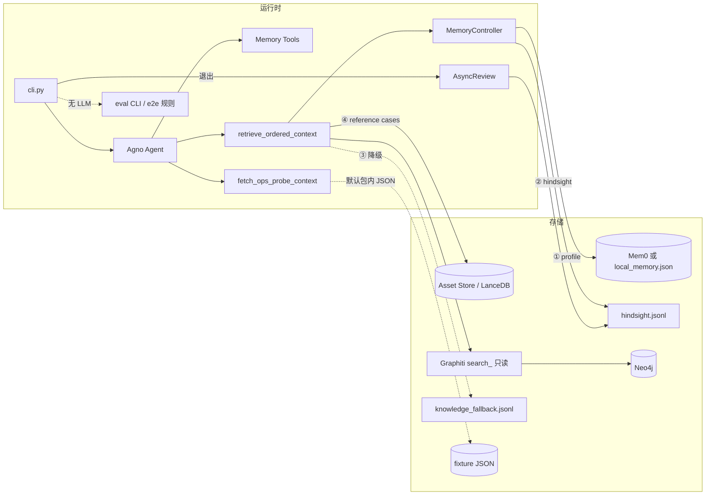

# 架构总览（ops-agent）

## 逻辑组件

## 读路径

1. **推荐**：`retrieve_ordered_context` → ① Mem0 → ② Hindsight → ③ Graphiti（或降级）→ ④ Asset Store（参考案例，可选）。
2. **客户画像**：`search_client_memory`。
3. **历史教训**：`search_past_lessons`。
4. **领域知识**：`search_domain_knowledge`。
5. **探针（fixture）**：`fetch_ops_probe_context`（可选覆盖 `OPS_MCP_PROBE_FIXTURE_PATH`）；可选 **stdio MCP** 见 `ops-agent mcp-probe-server`（依赖 `[mcp]`）。

## 写路径

- 记忆：**MemoryController**；**不向 Neo4j 写入**（运行时 Graphiti 只读）。
- Hindsight：`record_task_feedback` + **AsyncReview** 会话结束写 `lesson`。
- **离线 Graphiti 入库**：独立 CLI `ops-agent graphiti-ingest`（需 Neo4j + OpenAI），与运行时只读解耦。

## 质量与旁路

- **端到端规则门**：`ops-agent eval <case.json>`（Golden rules，无 LLM）；库入口 `ops_agent.evaluator.e2e`。
- **交付前正则抽检**：`check_delivery_text`（`OPS_GOLDEN_RULES_PATH`）。
- **无 Neo4j 的领域知识追加**：`ops-agent knowledge-append-jsonl` → 与 `OPS_KNOWLEDGE_FALLBACK_PATH` 同格式。

## Skill 与知识分区

- 运行时主键为 **`skill_id`**（与 `OPS_AGENT_DEFAULT_SKILL_ID`、各 manifest 文件名一致）。
- **Graphiti / JSONL 领域知识**使用 **`graphiti_group_id(client_id, skill_id)`** 作为 `group_id`，与 **`ops-agent graphiti-ingest`** 默认推导一致；**存量仅含旧 `sanitize_group_id(client_id)` 的数据需重新入库或迁移**。

详细契约见 [ENGINEERING.md](ENGINEERING.md)。
